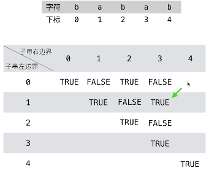

# Coding Interview
This is a brand-new repository which record the whole process of my full-time job hunting, which might include some resources that I collect, leetcode questions and interview questions from some top tech companies


## Source Links
- [Leetcode Java source code](https://github.com/weilingao/coding_interview_ft/tree/master/Leetcode/java_src)
## Categories
- [Array](#Array)
- [Dynamic Programming](#Dynamic_Programming)
- [Hash Table](#Hash_Table)
## Array
[Leetcode Q1](https://github.com/weilingao/coding_interview_ft/blob/master/Leetcode/java_src/1.%E4%B8%A4%E6%95%B0%E4%B9%8B%E5%92%8C.java) Two Sum (两数之和)
> ByteDance
```
1. Brute force: loop twice the given array, find two number sum equals to the target, then return index pairs 
O(n^2):63 ms
```
```
2. Hash table: key: array element, value: index, loop the array only once, for each element, check whether the complement exists in the hashtable. if yes, just return the index pairs, the cons of this solution the cost of finding the complemnt is nearly constant time
O(n):2 ms
```

## Dynamic_Programming
[Leetcode Q5](https://github.com/weilingao/coding_interview_ft/blob/master/Leetcode/java_src/5.%E6%9C%80%E9%95%BF%E5%9B%9E%E6%96%87%E5%AD%90%E4%B8%B2.java) Longest Palindromic Substring (最长回文子串) 
> ByteDance, Huawei
```
1. Dynamic programming: dp[i][j] = (s[i] == s[j]) and (dp[i + 1][j - 1]), when traverse the dp matrix, you should consider that the result dp[i][j] always relies on the leftdown dp element(dp[i + 1][j - 1]), so we need to traverse column first then row, since j always > i, consider the pic below.
You should always consider the edge case, that is the length of substring[i + 1, j - 1] is 0 or 1, when meet with this situtation, dp[i][j] will be true, no need to rely on the value of dp[i + 1][j - 1]

```


## Hash_Table
[Leetcode Q3]() Longest Substring Without Repeating Characters (无重复字符的最长子串)
```
Using sliding window and hashset to find substring without repeating characters starting from each index, find the largest length
```

## Daily Log
### [My leetcode submission record](https://leetcode-cn.com/u/weilin_g/)

## Job search record
2020/05: [Huawei SDE](http://career.huawei.com/reccampportal/portal5/campus-recruitment-detail.html?jobId=96297) (in-process)

2020/07/03: [Bytedance backend-tiktok](https://job.bytedance.com/campus/position/detail/6835619069605972237) (in-process)