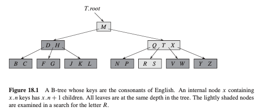
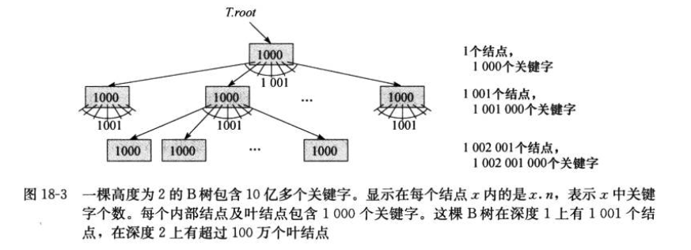

# 高级数据结构 Advanced Data Structures
>[B树](#B树),
>[B树的磁盘读写应用](#B树的磁盘读写应用),
>[B树上的操作](#B树上的操作)未完成,

注：带*为没理解的知识点

## B树
---
B树是平衡搜索树，旨在为磁盘或其他直接访问的辅助存储设备而设计的。 B树类似于红黑树（第13章），但它们在减少磁盘I/O操作方面更好。

B树与红黑树的区别在于B树节点可能有许多孩子，从几个到几千个。 也就是说，B树的“分支因子”可能很大，尽管它通常取决于所用的磁盘单元的特性。B树类似于红黑树，因为每棵含有n个节点的B树的高度均为O(lgn)。

如果B树的一个内部节点x包含x.n个关键字，则x具有x.n+1个孩子。 节点x中的关键字就是分隔点，它把结点x中所处理的关键字的属性分隔为x.n+1个子域，每个子域由x的一个孩子处理。 在B树中搜索关键字时，基于对存储在节点x上的x.n个关键字的比较来做出x.n+1路的选择。



在B树上，人们为每个关键字存储一个指向存放该关键字的卫星数据的磁盘页的指针。B树上的一个常见变体（称为B+树）将所有卫星信息存储在叶结点中，并且仅将关键字和子指针存储在内部节点中，从而使内部节点的分支因子最大化。

## B树的磁盘读写应用
---
处理的数据量太大，以至于所有数据都无法立即放入主存储器中。 B树算法根据需要将选定的页面从磁盘复制到主内存，然后将已修改过的页面写回到磁盘。 B树算法在任何时候都只需在主内存中保留恒定数量的页面； 因此，主存储器的大小不会限制可以处理的B树的大小。

#### 磁盘操作的建模伪代码
设x为指向对象的指针。如果该对象当前位于计算机的主内存中，那么我们可以照常引用该对象的属性：例如x.key。但是，如果x引用的对象驻留在磁盘上，则必须执行DISK-READ(x)操作才能将对象x读入主内存，然后才能引用其属性。同样，操作DISK-WRITE(x)用于保存对对象x的属性所做的任何更改。

```bash
x = a pointer to some object
DISK-READ(x)
operations that access and/or modify the attributes of x 
DISK-WRITE(x) //omitted if no attributes of x were changed 
other operations that access but do not modify attributes of x
```

由于在大多数系统中，B树算法的运行时间主要取决于其执行的DISK-READ和DISK-WRITE操作的数量，我们通常希望每个操作都读取或写入尽可能多的信息。 因此，B树节点通常与整个磁盘页面一样大，并且磁盘页面的大小限制了B树节点可以具有的孩子个数。

对于存储在磁盘上的大型B树，我们经常看到分支因子在50到2000之间，这取决于关键字相对于页面的大小。 较大的分支因子极大地降低了树的高度和找到任何密钥所需的磁盘访问次数。 下图显示了一个B树，其分支因子为1001，高度为2，可以存储超过十亿个关键字。但是，由于我们可以将根节点永久保留在主内存中，因此最多只需进行两次磁盘访问，就可以在该树中找到任何关键字。



#### B树的一些性质
1. x.n是结点x的关键字个数
2. x.n个关键字本身以非降序存放
3. x.leaf为true当x为叶结点，否则为false
4. 每个内部结点x包含x.n+1个指向其孩子的指针
5. 关键字x.key对存储在各子树中的关键字范围加以分割
6. 每个叶结点具有相同的深度，即树的高度h
7. 每个结点可以包含的关键字个数有上限和下限。
8. B树上大多数操作所需的磁盘访问次数与B树的高度成正比。

#### B树的优势
与红黑树相比，这里我们看到了B树的威力。尽管在这两种情况下树的高度都以O(lgn)的速度增长（记得t是一个常数），但对于B树，对数的底数可能会大很多倍。 因此，在大多数树操作检查的节点数量上，B树比红黑树节省了大约lgt的因数。 因为我们通常必须访问磁盘以检查树中的任意节点，所以B树避免了大量的磁盘访问。

## B树上的操作
---