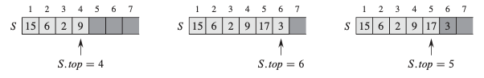
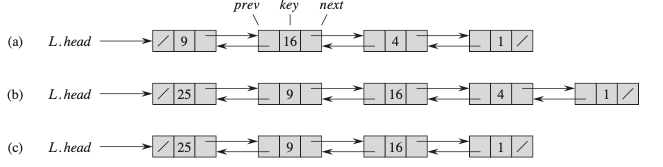
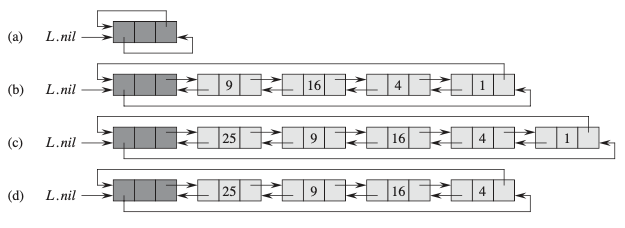

# 基本数据结构 Basic Data Structures
>[栈(Stack)](#栈(Stack)),
>[队列(Queue)](#队列(Queue)),
>[链表(LinkedList)](#链表(LinkedList))
## 栈(Stack)
在栈中，从集合中删除的元素是最近插入的元素：栈实现了后进先出或LIFO策略。

栈上的INSERT操作通常称为压入(PUSH)，不带元素参数的DELETE操作通常称为弹出(POP)。

利用数组S[1...n]来实现栈


当S.top = 0时，栈不包含任何元素并且为空。 我们可以通过查询操作STACK-EMPTY来测试堆栈是否为空。 如果尝试弹出一个空栈，则说栈下溢(underflow)，这通常是一个错误。 如果S.top超过n，则栈溢出(overflow)。

实现栈的几种操作：

```
STACK-EMPTY(S):
if S.top == 0
    return TRUE
else return FALSE
```
```
PUSH(S, x):
S.top = S.top + 1
S[top] = x
```
```
POP(S):
if STACK-EMPTY(S)
    error "underflow"
else S.top = S.top - 1
    return S[S.top + 1]
```

三个栈操作中的每一个都需要O(1)时间。

## 队列(Queue)
在队列中，删除的元素始终是集合中存在时间最长的元素：队列实施先进先出或FIFO策略。

队列上的INSERT操作称为入队(ENQUEUE)，DELETE操作称为出队(DEQUEUE)，像栈操作POP一样，DEQUEUE操作不带任何元素参数。

利用数组S[1...n]来实现栈


实现队列的几种操作：
```
ENQUEUE(Q, x):
Q[Q.tail] = x
if Q.tail == Q.length
    Q.tail = 1 
else Q.tail = Q:tail + 1
```
```
DEQUEUE(Q):
x = Q[Q.head]
if Q.head == Q.length
    Q.head = 1
else Q.head = Q.head + 1
return x
```

每个队列操作花费O(1)时间。
## 链表(LinkedList)
双向链表L的每个元素都是一个对象，其具有key和两个指针：next和prev。 给定链表中的元素x，如果x.prev == NIL，则元素x没有前任元素，因此是链表中的第一个元素或头。 如果x.next == NIL，则元素x没有后继元素，因此是链表的最后一个元素或结尾。 属性L.head指向链表的第一个元素。 如果L.head == NIL，则链表为空。



链表的搜索：
```
LIST-SEARCH(L, k):
x = L.head
while x != NIL and x.key != k 
    x = x.next
return x
```
链表的插入：
```
LIST-INSERT(L, x):
x.next = L.head
if L.head != NIL
    L.head.prev = x
L.head = x
x.prev = NIL
```
链表的删除：
```
LIST-DELETE(L, x):
if x.prev != NIL
    x.prev.next = x.next
else L.head = x.next 
if x.next != NIL
    x.next.prev = x.prev
```
哨兵(Sentinels):

前哨是一个哑对象，可让我们简化边界条件。例如，假设我们为列表L提供了一个对象L.nil，该对象表示NIL，但具有列表中其他对象的所有属性。 在列表代码中引用NIL的任何地方，我们都将其替换为对哨兵L.nil的引用。属性L.nil.next指向列表的开头，L.nil.prev指向列表的结尾。 同样，尾部的next属性和头部的prev属性都指向L.nil。 由于L.nil.next指向头，因此我们可以完全消除属性L.head，用对L.nil.next的引用替换对它的引用。



接下来简化代码：

链表的搜索：
```
LIST-SEARCH(L, k):
x = L.nil.next
while x != L.nil and x.key != k 
    x = x.next
return x
```
链表的插入：
```
LIST-INSERT(L, x):
x.next = L.nil.next
L.nil.next.prev = x
L.nil.next = x
x.prev = L.nil
```
链表的删除：
```
LIST-DELETE(L, x):
x.prev.next = x.next
x.next.prev = x.prev
```
我们应该谨慎使用哨兵。 当有许多小列表时，其标记使用的额外存储空间可能会浪费大量内存。 在本书中，仅当哨兵真正简化了代码时，我们才使用哨兵。