# 数据结构 Data Structures
>[栈(Stack)](#栈(Stack)),
>[队列(Queue)](#队列(Queue)),
>[链表(LinkedList)](#链表(LinkedList)),
>[二叉树(Binary_Tree)](#二叉树(Binary_Tree)),
>[分支无限制的有根树(Rooted_trees_with_unbounded_branching)](#分支无限制的有根树(Rooted_trees_with_unbounded_branching)),
>[哈希表(Hash_Table)](#哈希表(Hash_Table)),
>[二叉搜索树(Binary_Search_Trees)](#二叉搜索树(Binary_Search_Trees)),
>[红黑树(Red-Black_Trees)](#红黑树(Red-Black_Trees))

注：带*为没理解的知识点

## 栈(Stack)
---
在栈中，从集合中删除的元素是最近插入的元素：栈实现了后进先出或LIFO策略。

栈上的INSERT操作通常称为压入(PUSH)，不带元素参数的DELETE操作通常称为弹出(POP)。

利用数组S[1...n]来实现栈
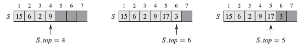

当S.top = 0时，栈不包含任何元素并且为空。 我们可以通过查询操作STACK-EMPTY来测试堆栈是否为空。 如果尝试弹出一个空栈，则说栈下溢(underflow)，这通常是一个错误。 如果S.top超过n，则栈溢出(overflow)。

实现栈的几种操作：

```
STACK-EMPTY(S):
if S.top == 0
    return TRUE
else return FALSE
```
```
PUSH(S, x):
S.top = S.top + 1
S[top] = x
```
```
POP(S):
if STACK-EMPTY(S)
    error "underflow"
else S.top = S.top - 1
    return S[S.top + 1]
```

三个栈操作中的每一个都需要O(1)时间。

## 队列(Queue)
---
在队列中，删除的元素始终是集合中存在时间最长的元素：队列实施先进先出或FIFO策略。

队列上的INSERT操作称为入队(ENQUEUE)，DELETE操作称为出队(DEQUEUE)，像栈操作POP一样，DEQUEUE操作不带任何元素参数。

利用数组S[1...n]来实现栈

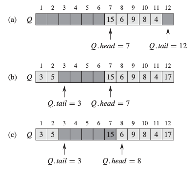

实现队列的几种操作：
```
ENQUEUE(Q, x):
Q[Q.tail] = x
if Q.tail == Q.length
    Q.tail = 1 
else Q.tail = Q:tail + 1
```
```
DEQUEUE(Q):
x = Q[Q.head]
if Q.head == Q.length
    Q.head = 1
else Q.head = Q.head + 1
return x
```

每个队列操作花费O(1)时间。
## 链表(LinkedList)
---
双向链表L的每个元素都是一个对象，其具有key和两个指针：next和prev。 给定链表中的元素x，如果x.prev == NIL，则元素x没有前任元素，因此是链表中的第一个元素或头。 如果x.next == NIL，则元素x没有后继元素，因此是链表的最后一个元素或结尾。 属性L.head指向链表的第一个元素。 如果L.head == NIL，则链表为空。

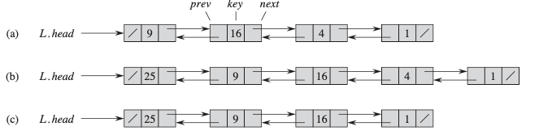

链表的搜索：
```
LIST-SEARCH(L, k):
x = L.head
while x != NIL and x.key != k 
    x = x.next
return x
```
链表的插入：
```
LIST-INSERT(L, x):
x.next = L.head
if L.head != NIL
    L.head.prev = x
L.head = x
x.prev = NIL
```
链表的删除：
```
LIST-DELETE(L, x):
if x.prev != NIL
    x.prev.next = x.next
else L.head = x.next 
if x.next != NIL
    x.next.prev = x.prev
```
哨兵(Sentinels):

前哨是一个哑对象，可让我们简化边界条件。例如，假设我们为列表L提供了一个对象L.nil，该对象表示NIL，但具有列表中其他对象的所有属性。 在列表代码中引用NIL的任何地方，我们都将其替换为对哨兵L.nil的引用。属性L.nil.next指向列表的开头，L.nil.prev指向列表的结尾。 同样，尾部的next属性和头部的prev属性都指向L.nil。 由于L.nil.next指向头，因此我们可以完全消除属性L.head，用对L.nil.next的引用替换对它的引用。

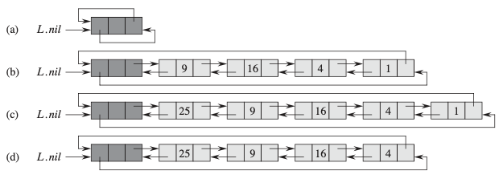

接下来简化代码：

链表的搜索：
```
LIST-SEARCH(L, k):
x = L.nil.next
while x != L.nil and x.key != k 
    x = x.next
return x
```
链表的插入：
```
LIST-INSERT(L, x):
x.next = L.nil.next
L.nil.next.prev = x
L.nil.next = x
x.prev = L.nil
```
链表的删除：
```
LIST-DELETE(L, x):
x.prev.next = x.next
x.next.prev = x.prev
```
我们应该谨慎使用哨兵。 当有许多小列表时，其标记使用的额外存储空间可能会浪费大量内存。 在本书中，仅当哨兵真正简化了代码时，我们才使用哨兵。

## 二叉树(Binary_Tree)
---
我们使用属性p, left, right存放指向父节点、左孩子和右孩子的指针。 如果x.p == NIL，则x为根。 如果节点x没有左子节点，则x.left == NIL，右子节点也是如此。 整个树T的根由属性T.root指向。 如果T.root == NIL，则树为空。
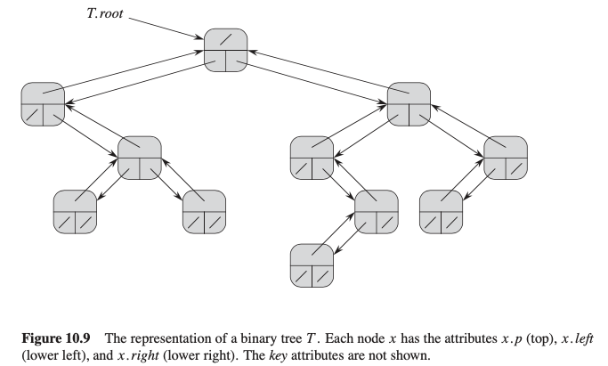

## 分支无限制的有根树(Rooted_trees_with_unbounded_branching)
---
左孩子右兄弟的表示形式。 和以前一样，每个节点都包含一个父指针p，并且T.root指向树T的根。但是，每个节点x都没有指向其每个子节点的指针，而只有两个指针：
1. x.left-child指向节点x的最左子点
2. x.right-sibling指向其右侧兄弟节点

如果节点x没有子节点，则x.left-child == NIL，如果节点x是其父节点的最右边子节点，则x.right-sibling == NIL。
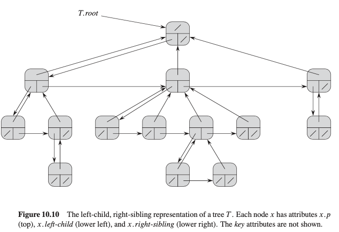

## 哈希表(Hash_Table)
---
通过散列，此元素存储在槽h(k)中； 也就是说，我们使用哈希函数h从关键字k计算槽的位置。在这里，h将键的全域U映射到哈希表T[0....m-1]的槽中
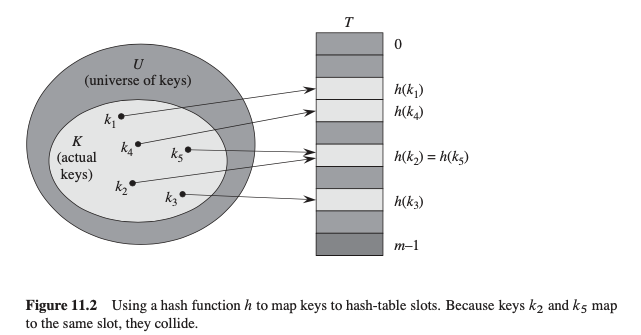
其中哈希表的大小m通常远小于|U|。 我们说一个键为k的元素散列到槽h(k); 我们还说h(k)是关键字k的哈希值。哈希函数减小了数组索引的范围，从而减小了数组的大小。 代替|U|的大小，该数组可以具有大小m。

这有个问题：两个关键字可能会散列到同一槽。 我们称这种情况为冲突。
### 1. 碰撞处理 ：
通常有两类方法处理碰撞：开放寻址(Open Addressing)法和链接(Chaining)法。前者是将所有结点均存放在散列表T[0..m-1]中；后者通常是把散列到同一槽中的所有元素放在一个链表中，而将此链表的头指针放在散列表T[0..m-1]中。
#### 1.1 链接解决冲突

在链接中，我们将散列到同一槽的所有元素放入同一链接列表。槽j包含一个指向所有哈希到j的存储元素列表的开头的指针； 如果没有这样的元素，则槽j包含NIL。
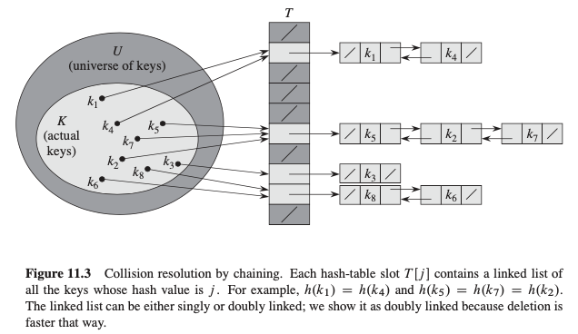

#### 哈希表上的字典操作
```
CHAINED-HASH-INSERT(T,x)
insert x at the head of list T[h(x.key)]
如果哈希表中的链表是双向链接的话，最坏情况运行时间O(1)
```
```
CHAINED-HASH-SEARCH(T,k)
search for an element with key k in list T[h(k)]
平均情况运行时间O(1)，最坏情况运行时间O(n)
```
```
CHAINED-HASH-DELETE(T,x)
delete x from the list T[h(x.key)]
如果哈希表中的链表是双向链接的话，最坏情况运行时间O(1)
```
全部的字典操作平均情况下都可以在O(1)时间内完成

当散列表中空闲位置不多的时候，散列冲突的概率就会大大提高。为了尽可能保证散列表的操作效率，一般情况下，我们会尽可能保证散列表中有一定比例的空闲槽位。我们用装载因子(load factor)来表示空位的多少。
装载因子的计算公式是：散列表的装载因子=填入表中的元素个数/散列表的长度 装载因子越大，说明空闲位置越少，冲突越多，散列表的性能会下降。

#### 1.2 开放寻地址法(open addressing)解决冲突 *
所有的元素都在散列表中，每一个表项或包含动态集合的一个元素，或包含NIL。这种方法中散列表可能被填满，以致于不能插入任何新的元素。在开放寻址法中，当要插入一个元素时，可以连续地检查或探测散列表的各项，直到有一个空槽来放置待插入的关键字为止。有三种技术用于开放寻址法：线性探测、二次探测以及双重探测。

### 2. 散列函数(Hash Function) *
好的散列函数的特点是每个关键字都等可能的散列到m个槽位上的任何一个中去，并与其他的关键字已被散列到哪一个槽位无关。多数散列函数都是假定关键字域为自然数N={0,1,2,....}，如果给的关键字不是自然数，则必须有一种方法将它们解释为自然数。例如对关键字为字符串时，可以通过将字符串中每个字符的ASCII码相加，转换为自然数。书中介绍了三种设计方案：除法散列法、乘法散法和全域散列法。

#### 2.1 除法散列法 *

　　通过取k除以m的余数，将关键字k映射到m个槽的某一个中去。散列函数为：h(k)=k mod m 。m不应是2的幂，通常m的值是与2的整数幂不太接近的质数。

#### 2.2 乘法散列法 *
乘法散列法构造散列函数需要两个步骤。第一步，用关键字k乘上常数A(0 < A < 1)，并抽取kA的小数部分。然后，用m乘以这个值，再取结果的底。散列函数如下：h(k) = m(kA mod 1)。

#### 2.3 全域散列 *
给定一组散列函数H，每次进行散列时候从H中随机的选择一个散列函数h，使得h独立于要存储的关键字。全域散列函数类的平均性能是比较好的。

## 二叉搜索树(Binary_Search_Trees)
---
### 1. 二叉搜索树的定义
二叉查找树是按照二叉树结构来组织的，因此可以用二叉链表结构表示。除了key和卫星数据外，每个节点还包含属性left，right和p，这些属性分别指向分别对应于其左子节点，右子节点和父节点。 如果缺少子节点或父节点，则相应的属性值为NIL。根节点是树中唯一其父节点为NIL的节点。

二叉查找树中的关键字的存储方式满足的特征是：设x为二叉查找树中的一个结点。如果y是x的左子树中的一个结点，则y.key≤x.key。如果y是x的右子树中的一个结点，则x.key≤y.key。

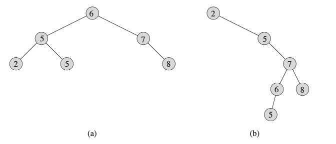

### 2. 遍历二叉搜索树

二叉搜索树的性质允许我们通过一种称为中序遍历的简单递归算法，输出的子树根的关键字位于其左子树的关键字值和右子树的关键字值之间(类似地，先序遍历中输出的根的关键字在其左右子数的关键字值之前，后序遍历中输出的根的关键字在其左右子数的关键字值之后)

```
inorder-tree-walk(x):
if x != NIL
    inorder-tree-walk(x.left)
    print x.key
    inorder-tree-walk(x.right)

如果x是n节点子树的根，则调用inorder-tree-walk(x)需花费O(n)时间。
```
### 3. 二叉搜索树的操作
搜索树数据结构支持许多动态集操作，包括SEARCH，MINIMUM，MAXIMUM，PREDECESSOR，SUCCESSOR，INSERT和DELETE。

对二叉搜索树的基本操作所花费的时间与树的高度成比例。 对于具有n个节点的完整二叉树，此类操作在O(lg n)最坏的情况下运行。 但是，如果树是n个节点的线性链，则相同的操作将花费O(n)最坏的时间。

随机生成的二叉搜索树的预期高度为O(lg n)，因此对这种树的基本动态集操作平均需要O(lg n)时间。

#### 3.1 查找(search)
给定一个指向树根的指针和一个关键字k，TREE-SEARCH返回一个指向具有关键字k的节点的指针（如果存在）。否则，返回NIL。
```
递归过程：
TREE-SEARCH(x,k):
if x == NIL or k == x.key
    return x
if k < x.key
    return TREE-SEARCH(x.left,k)
else return TREE-SEARCH(x.right,k)
```
```
迭代过程：
ITERATIVE-TREE-SEARCH(x,k):
while x != NIL and k != x.key
    if k < x.key
        x = x.left
    else x = x.right
return x
```
#### 3.2 最大关键字元素和最小关键字元素(maximum and minimum)
通过从树根开始沿着left孩子指针直到遇到一个NIL，找到一个指向在以给定结点x为根的子树中的最小元素的指针
```
tree-minimum(x):
while x.left != NIL
    x = x.left
return x
```
通过从树根开始沿着right孩子指针直到遇到一个NIL，找到一个指向在以给定结点x为根的子树中的最大元素的指针
```
tree-maximum(x):
while x.right != NIL
    x = x.right
return x
```
#### 3.3 后继和前驱(successor and predecessor)
给定一个二叉查找树中的结点，找出在中序遍历顺序下某个节点的前驱和后继。

一个结点x的后继是大于x.key的最小关键字的结点。如果x是这棵树中的最大关键字，则返回NIL

```
tree-successor(x)
if x.right != NIL
    return tree-minimum(x.right)
y = x.p
while x != NIL and x == y.right
    x = y
    y = y.p
return y
如果节点x的右子树是非空的，则x的后继是x的右子树中的最左节点
如果节点x的右子树为空且x具有后继y，那么y就是x的有左孩子的最底层祖先，从x开始沿树而上直到遇到一个有左孩子的父节点
```

一个结点x的前驱是小于x.key最大关键字的结点
搜索前驱的过程与搜索后驱的过程是对称的

#### 3.4 插入和删除(insert and delete)
插入：TREE-INSERT从树的根部开始，指针x向下跟踪一条简单路径，以寻找要替换为输入项z的NIL
```
TREE-INSERT(T, z):
y = NIL
x = T.root
// search for the target node
while x != NIL
    y = x
    if z.key < x.key
        x = x.left
    else x = x.right
// insert the node
z.p = y
if y == NIL
    T.root = z  // tree T was empty
else if z.key < y.key
    y.left = z
else y.right = z
```
删除：删除结点z分为三种情况
- 如果z没有子结点，那就修改其父节点，用NIL作为子结点来替换z

    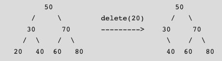
- 如果z只有一个子结点，那么将这个子结点提升到树中z的位置上，并修改z的父节点，用z的孩子来替换z

    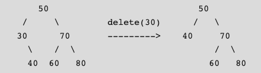
- 查找节点的有序后继者。 将有序后继者的内容复制到节点并删除有序后继者。 注意，也可以使用有序的前驱。* 这种情况细节可能还需再需确认

    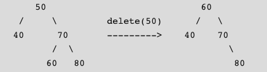

#### 3.5 在n个不同的关键字上随机构建的二叉搜索树的预期高度为0(lg n)。

## 红黑树(Red-Black_Trees)
---
