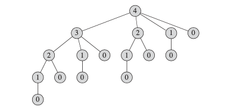
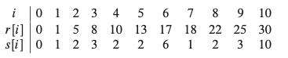

# 动态规划 Dynamic Programming
>[动态规划基础](#动态规划基础),
>[钢条切割(Rod cutting)](#钢条切割(Rod_cutting)),
>[动态规划原理](#动态规划原理)

注：带*为没理解的知识点

## 动态规划基础
---
动态规划（dynamic programming）是通过组合子问题的解而解决整个问题的。分治算法是指将问题划分为一些独立的子问题，递归的求解各个问题，然后合并子问题的解而得到原问题的解。例如归并排序，快速排序都是采用分治算法思想。而动态规划与此不同，适用于子问题不是独立的情况，也就是说各个子问题包含有公共的子问题。如在这种情况下，用分治算法则会重复做不必要的工作。采用动态规划算法对每个子问题只求解一次，将其结果存放到一张表中，以供后面的子问题参考，从而避免每次遇到各个子问题时重新计算答案。

#### 动态规划与分治法之间的区别
（1）分治法是指将问题分成一些独立的子问题，递归的求解各子问题

（2）动态规划适用于这些子问题不是独立的情况，也就是各子问题包含公共子问题

动态规划通常用于最优化问题（此类问题一般有很多可行解，我们希望从这些解中找出一个具有最优（最大或最小）值的解）。动态规划算法的设计分为以下四个步骤：

（1）描述最优解的结构

（2）递归定义最优解的值

（3）按自低向上的方式计算最优解的值

（4）由计算出的结果构造一个最优解

## 钢条切割(Rod_cutting)
---
问题描述：给定一段长度为n的钢条和一个价格表pi，求切割钢条方案，使得销售收益rn最大。

#### 解法1：递归

如果一个最优解将钢条切割为k段，那么最优切割方案：

n = i1 + i2 + ... + ik

得到最大收益: 

rn = pi1 + pi2 + ... + pin

更一般地，对于n >= 1：

rn = max(pn, r1 + rn-1, r2 + rn-2, ..., rn-1 + r1)

当完成首次切割后，将两段钢条看成两个独立的钢条切割问题实例，通过组合两个相关问题的最优解，在所有可能的两段切割方案中选取组合收益最大者，构成原问题的最优解。钢条切割问题满足最优子结构性质：一个问题的最优解由相关子问题的最优解组合在一起，这些子问题可以独立求解。

#### 解法2: 递归

将钢条从左边切割下长度为i的一段，只对右边剩下的长度为n-i的一段继续进行切割，对左边的一段不再进行切割：

rn = max(pi + rn-i), 1<=i<=n

```bash
自顶向下递归：
CUT-ROD(p,n):
    if n == 0:
        return 0
    q = -∞
    for i = 1 to n
        q = max(q, p[i] + CUT-ROD[p,n-i])
```
但是这个解法的效率差，它反复地求解相同的子问题，每个结点的标号对应子问题的规模n，因此，从父节点s到子结点t的边表示从钢条左端切下长度为s-t的一段，然后继续递归求解剩余的规模为t的子问题


#### 解法3: 动态规划（两种等价的实现方法）
第一种方法是带备忘的自顶向下法(top-down with memoization)，此方法按照递归形式编写，但过程会保存每个子问题的解
```bash
MEMOIZED-CUT-ROD(p, n):
    let r[0..n] be a new array
    for i = 0 to n:
        r[i] = -∞
    return MEMOIZED-CUT-ROD-AUX(p, n, r)

MEMOIZED-CUT-ROD-AUX(p, n, r):
    if r[n] >= 0:
        return r[n]
    if n == 0:
        q = 0
    else q == -∞
        for i = 1 to n:
            q = max(q, p[i] + MEMOIZED-CUT-ROD-AUX[p, n-i], r)
    r[n] = q
    return q
```

第二种方法称为自底向上法(bottom-up method)，将子问题按规模排序，因为任何子问题的求解都只依赖于更小子问题的求解，当求解某个子问题时，它所依赖的那么更小的子问题都已经求解完毕并保存。对于任何子问题，直至它依赖的所有子问题均已经求解完成，才会求解它。求解规模为j的子问题的方法与带备忘的自顶向下法采用的方法相同，只是现在直接访问数组与元素r[j-i]来获得规模为j-i的子问题的解，而不必进行递归调用
```bash
BOTTOM-UP-CUT-ROD(p, n)
let r[0..n] be a new array
r[0] = 0
for j = 1 to n:
    q = -∞
    for i = 1 to j:
        q = max(q, p[i] + r[j - i])
    r[j] = q
return r[n]
```
##### 重构解(Reconstructing a solution)
前文两种动态规划的解法只返回了最优解的受益值，但未返回解本身（切割后每段钢条的长度），下面扩展动态规划算法，保存最优受益值和相对应的切割方案
```bash
s[j]中保存的是在求解规模为j的子问题时第一段钢条的最优切割长度
EXTENDED-BOTTOM-UP-CUT-ROD(p, n):
    let r[0..n] and s[0..n] be new arrays
    r[0] = 0
    for j = 1 to n:
        q = -∞
        for i = 1 to j:
            if q < p[i] + r[j - i]
                q = p[i] + r[j - i]
                s[j] = i
        r[j] = q
    return r and s
```
结果样例：



n = 7时候，最优方案为1+6

## 动态规划原理
---
在什么情况下应该寻求用动态规划方法求解问题：最优子结构和子问题重叠

#### 最优子结构：

发掘最优子结构的过程：
- 证明问题最优解的第一个组成部分是做出一个选择，例如选择钢条第一次切割的位置
- 对于一个给定问题，在其可能的第一步选择中，你假定已经知道哪种选择才会得到最优解
- 给定可获得最优解的选择后，你确定这次选择会产生哪些子问题
- 作为构成原问题最优解的组成部分，每个子问题的解就是它本身的最优解

在动态规划方法中，我们通常自底向上地使用最优子结构：首先求得子问题的最优解，然后求原问题的最优解。在求解原问题的过程中，我们需要在涉及的子问题中做出选择，选出能得到原问题最优解的子问题。原问题最优解的代价通常就是子问题最优解的代价加上由此次选择直接产生的代价。例如，对于钢条切割问题，我们首先求解子问题，确定长度为i=0，1，...n-1的钢条的最优切割方案，然后再确定哪个子问题的解能构成长度为n的钢条的最优切割方案。此次选择本身所产生的代价就是pi。

#### 贪心算法和动态规划的最优子结构的区别：
贪心算法并不是首先寻找子问题的最优解，然后在其中进行选择，而是首先做出一个贪心选择，在当时看来最优的选择，然后求解选出的子问题，从而不必费心求解所有可能相关的子问题。

#### 重叠子问题：
适合用动态规划方法求解的最优化问题应该具备的性质是问题的递归算法会反复地求解相同的子问题，而不是一直生成新的子问题。如果递归算法反复求解相同的子问题，我们就称最优化问题具有重叠子问题性质。与之相对的，适合用分治方法求解的问题通常在递归的每一步都生成全新的子问题。动态规划算法通常这样利用重叠子问题性质：对每个子问题求解一次，将解存入一个表中，当再次需要这个子问题时直接查表。

#### 重构最优解：
我们通常将每个子问题所做的选择存在一个表中

#### 自底向上动态规划和自顶向下备忘算法的对比：
通常情况下，如果每个子问题都必须至少求解一次，自底向上动态规划算法会比自顶向下备忘算法快（都是O(n^3)时间，相差一个常量系数），因为自底向上算法没有递归调用的开销，表的维护开销也更小。而且，对于某些问题，我们可以利用表的访问模式来进一步降低时空代价。相反，如果子问题空间中的某些子问题完全不必求解，备忘方法就会体现出优势了，因为它只会求解那些绝对必要的子问题。

## 最长公共子序列
---

## 最优二叉搜索树
---