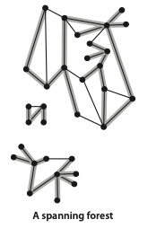
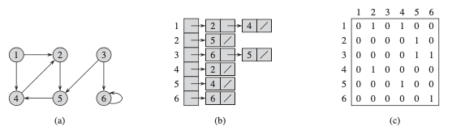
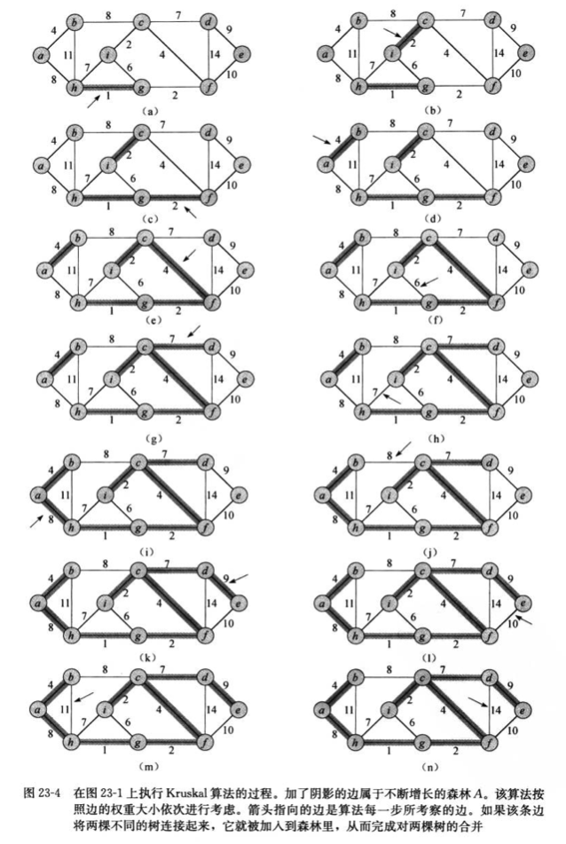

# 图算法 Graph Algorithms
>[无向图的术语](#无向图的术语),
>[图的表示](#图的表示(Representations_of_Graphs))

>[广度优先搜索BFS](#广度优先搜索(Breadth-first-search)),
>[深度优先搜索DFS](#深度优先搜索(Depth-first-search)),
>[连通分量](#连通分量(Connected-components))

>[有向图的术语](#有向图的术语(directed-graphs)),
>[有向无环图的拓扑排序](#有向无环图的拓扑排序(Topological-sort)),
>[有向图中的强连通性](#有向图中的强连通性(Strong-connectivity-in-digraphs))

>[最小生成树](#最小生成树(Minimum-spanning-tree)),
>[Kruskal算法](#Kruskal算法),
>[Prim算法](#Prim算法)

>[最短路径](#最短路径(Shortest-Paths)),
>[单点最短路径](#单点最短路径(Single-source-shortest-paths)),
>[Bellman-Ford算法](#Bellman-Ford算法),
>[Dijkstra算法](#Dijkstra算法),
>[有向无环图的单源最短路径](#有向无环图的单源最短路径)


注：带*为没理解的知识点

## 无向图的术语
---
自环(self-loop)：一条连接顶点和其自身的边

平行边(parallel)：连接同一对顶点的两条边


多重图(multigraph)：含有平行边的图

简单图(simple graph)：没有平行边或自环的图

当两个顶点通过一条边相连时，该连接依附(incident)于这两个顶点。某个顶点的度数(degree)就是依附于它的边的总数。子图是由一幅图的所有边的一个子集(以及它们所依附的所有顶点)组成的图。

路径：由边顺序连接的一系列顶点

简单路径：一条没有重复顶点的路径

环：一条至少含有一条边且起点和终点相同的路径

简单环：一条不含邮重复顶点和边且起点和终点相同的路径

连通的(connected)：当两个顶点之间存在一条连接双方的路径时，我们称一个顶点和另一个顶点是连通的

连通图：如果从任意一个顶点都存在一条路径到达另一个任意顶点，我们称这幅图为连通图。

非连通图：一副非连通的图由若干连通的部分组成，它们都是其极大连通子图(maximal connected subgraphs)。

将任意顶点提起，连通图都将是一个整体，而非连通图则会变成两个或多个部分。

无环图(acyclic graph)：不包含环的图

树是无环连通图，互不相连的树组成的集合为森林(forest)，连通图的生成树(spanning tree)是它的一幅子图，它含有图中的所有顶点且是一棵树。图的生成树森林(spanning forest)是它的所有连通子图的生成树的集合。




稀疏图(sparse graph)：被连接的顶点对很少的图

稠密图(dense graph)：只有少部分顶点对之间没有边连接

连通分量(connected component)

二分图(bipartite graph)：将所有结点分为两部分的图，其中图每条边所连接的两个顶点都分别属于不同的部分。


## 图的表示(Representations_of_Graphs)
---
对于图G=(V,E), 可以用邻接链表和邻接矩阵来表示。这两种表示方法既可以表示无向图，也可以表示有向图。邻接链表在表示稀疏图时非常紧凑而称为通常的选择。不过在稠密图的情况下，更倾向于邻接矩阵表示法。如果需要快速判断任意两结点是否相连，也需要使用邻接矩阵表示法。
#### 邻接链表表示(Adjacency-list representation)
对于图G=(V,E)，邻接链表表示有一个包含|V|条链表的数组Adj所构成，每个结点有一条链表。对于每一个结点，Adj[u]包含图G中所有与u邻接的结点。由于邻接链表代表的是图的边，我们将数组Adj看做是图的一个属性，所以可以看到G.Adj[u]这样的表示。无论是有向图还是无向图，邻接链表表示法的储存空间需求均为O(V+E)。邻接链表还可以用来表示权重图，将边(u,v)的权重值w(u,v)存放在结点u的邻接链表里。

邻接链表的缺陷是无法快速判断一条鞭(u,v)是否是图中的一条边，邻接矩阵则克服了这一问题，但是消耗了更大的存储空间。


#### 邻接链表表示(Adjacency-matrix representation)
将图G中的结点编为1，2...,|V|，图G的邻接矩阵表示由一个|V| * |V|的矩阵A = (aij)满足该条件: aij = 1 if (i, j) 属于E, else = 0。

无向图的邻接矩阵是一个对称矩阵，无向图的邻接矩阵就是自己的转置。邻接矩阵也可以用来表示权重图，直接将权重w(u,v)存放在邻接矩阵的第u行第v列上，若不存在边则存放nil，邻接矩阵表示法更为简单，而且对于无向图来说，邻接矩阵只需要1位的空间。



## 广度优先搜索(Breadth-first-search)
---
给定图G=(V,E)和一个可以识别的源结点s，广度优先搜索对图G的边进行探索来发现可以从源结点s达到的所有结点。对于每个从源结点s可以到达的结点v，在广度优先搜索树里从结点s到结点v的简单路径所对应的就是图G中从结点s到结点v的最短路径，可以用于有向图和无向图。

bfs需要在发现所有距离源结点s为k的所有结点之后，才会发现距离源结点s为k+1的其他结点。

在执行广度优先搜索的过程中将构造出一颗广度优先树，一开始该树仅含有源结点s。在扫描已发现结点u的邻接链表时，每当发现一个未被发现的结点，就将结点v和边(u,v)加入该树中。结点u是结点v的前驱或父节点。由于每个结点最多被发现一次，它最多只有一个父节点。如果结点u是从根结点s到结点v的简单路径上的一个结点，则结点u是结点v的祖先，结点v是结点u的后代。

假定未被发现的结点为白色，凡是灰色和黑色的结点都是被已被发现的结点，所有与黑色结点邻接的结点都已经被发现，与灰色结点邻接的结点中可能存在未被发现的白色结点。灰色结点代表的是已知和未知两个集合之间的边界。

```bash
广度优先搜索的运行时间为O(V+E)，是图G的邻接链表大小的一个线性函数
BFS(G,s):
    for each vertex u from G.V - {s}:
        u.color = white
        u.d = ∞
        u.parent = nil
    s.color = gray
    s.d = 0
    s.parent = nil
    // 用FIFO的list来管理灰色结点集
    Q = {}
    enqueue(Q,s)
    while Q is not empty:
        u = dequeue(Q,s)
        for each v from G.Adj[u]
            if v.color = white
                v.color = gray
                v.d = u.d + 1
                v.parent = u
                enqueue(Q,v)
        u.color = black
```
bfs的推进过程：


#### 最短路径
解决单点最短路径(single-source shortest paths)的问题：广度优先搜索算法能够正确计算出最短路径距离。对于从s可达的任意顶点v，广度优先搜索都能找到一条从s到v的最短路径。所需时间最坏情况下和V+E成正比。

#### BFS的java实际实现
它使用了一个队列来保存所有已经被标记过但其邻接表还未被检查过的顶点。现将顶点加入队列并标记，然后重复以下步骤直到队列为空：1. 取队列中的下一个顶点v；2. 将与v相邻的所有未被标记过的顶点加入队列并标记。

```bash
public class BreadthFirstSearch {
    private boolean[] marked;
    private final int s;

    public BreadthFirstSearch(Graph G, int s) {
        marked = new boolean[G.V()];
        this.s = s;
        bfs(G, s);
    }
    private void bfs(Graph G, int s) {
        Queue<Integer> queue = new Queue<>();
        marked[s] = true;
        queue.enqueue(s);
        while (!queue.isEmpty()) {
            int v = queue.dequeue();
            for (int w: G.adj(v)) {
                if (!marked[w]) {
                    queue.enqueue(w);
                    marked[w] = true;
                }
            }
        }
    }
}
```

## 深度优先搜索(Depth-first-search)
用递归方法来遍历所有顶点，在访问其中一个顶点时候，将它标记为已访问，然后递归地访问它的所有没有被标记过的邻居顶点。它使用一个boolean数组来记录和起点连通的所有顶点。递归方法会标记给定的顶点并调用自己来访问该顶点的相邻顶点列表中所有没有被标记过的顶点。如果图是连通的，每个邻接链表中的元素都会被检查到。
```bash
public class DepthFirstSearch {
    private boolean[] marked;
    private int count;

    public DepthFirstSearch(Graph G, int s) {
        marked = new boolean[G.V()];
        dfs(G, s);
    }
    private void dfs(Graph G, int v) {
        marked[v] = true;
        count++;
        for (int w: G.adj(v)) {
            if (!marked[w]) dfs(G, w);
        }
    }
    public boolean marked(int w) { return marked[w]; }
    public int count() { return count; }
}
```

## 连通分量(Connected-components)
深度优先搜索的直接应用就是找出一幅图的所有连通分量
```bash
使用深度优先搜索找出图中的所有连通分量:
public class CC {
    private boolean[] marked;
    // id[]是一个有顶点索引的数组，如果v属于第i个连通分量，则id[v]的值为i。
    private int[] id;
    private int count;
    // 构造函数会找出一个未被标记的顶点并调用递归函数dfs()来标记并区分出所有和它连通的顶点，如此重复直到所有的顶点都被标记并区分。
    public CC(Graph G) {
        marked = new boolean[G.V()];
        id = new int [G.V()];
        for (int s = 0; s < G.V(); s++) {
            if (!marked[s]) {
                dfs(G, s);
                count++;
            }
        }
    }
    private void dfs(Graph G, int v) {
        marked[v] = true;
        id[v] = count;
        for (int w: G.adj(v)) {
            if (!marked[w]) {
                dfs(G, w);
            }
        }
    }
    public boolean connected(int v, int w)
     {  return id[v] == id[w];  }
     public int id(int v)
     {  return id[v];  }
     public int count()
     {  return count;  }
}
```

## 有向图的术语(directed-graphs)
---
有向图(directed graph/digraph)：由一组顶点和一组有方向的边组成的，每条有方向的边都连接着有序的一对顶点。

有向路径(directed path)：由一系列顶点组成，对于其中的每个顶点都存在一条有向边从它指向序列中的下一个顶点。

有向环(directed cycle)：一条至少含有一条边且起点和重点相同的有向路径。

简单有向环：一条不含有重复的顶点和边的有向环。

有向无环图(DAG)：不含有环的有向图

## 有向无环图的拓扑排序(Topological-sort)
---
在有向图中，优先级限制下的调度问题等价于拓扑排序(topological sort)：给定一幅有向图，将所有的顶点排序，使得所有的有向边均从排在前面的元素指向排在后面的元素。


如果任务x必须在任务y之前完成，而任务y必须在任务z之前完成，但任务z又必须在任务x之前完成，这三个限制条件不可能被同时满足。如果一个有优先级限制的问题中存在有向环，那么这是无解的，所以需要有向环检测。

#### 寻找有向环(Finding a directed cycle)
```bash
public class DirectedCycle {
    private boolean[] marked;
    private int[] edgeTo;
    private Stack<Integer> cycle; // 有向环中的所有顶点
    private boolean[] onStack;    // 递归调用的栈上的所有顶点
    
    public DirectedCycle (Digraph G) {
        onStack = new boolean[G.V()];
        edgeTo = new int[G.V()];
        marked = new boolean[G.V()];
        for (int v = 0; v < G.V(); v++) {
            if (!marked[v]) dfs(G, v);
        }
    }
    // 在执行dfs时，查找的是一条由起点到v的有向路径。
    // 由顶点索引的数组onStack保存这条路径
    private void dfs(Digraph G, int v) {
        onStack[v] = true;
        marked[v] = true;
        for (int w : G.adj(v)) {
            if (this.hasCycle()) return;
            else if (!marked[w]) {      
                edgeTo[w] = v; 
                dfs(G, w);  
            } else if (onStack[w]) {
                // 一旦我们找到一条边v->w且w已经存在于栈中，就找到了一个环，因为栈表示的是一条由w到v的有向路径，而v->w正好补全了这个环。
                cycle = new Stack<Integer>();
                for (int x = v; x != w; x = edgeTo[x])
                    cycle.push(x); 
                cycle.push(w); 
                cycle.push(v);
            }
        }
        onStack[v] = false;
    }
    public boolean hasCycle(){  
        return cycle != null;  
    }
}
```


#### 有向图中基于深度优先搜索的顶点排序(Depth-first search vertex ordering in a digraph)
```bash
public class DepthFirstOrder {
    private boolean[] marked;
    private Queue<Integer> pre;  // 所有顶点的前序排列，在递归调用之前将顶点加入队列
    private Queue<Integer> post; // 所有顶点的后序排列，在递归调用之后将顶点加入队列
    private Stack<Integer> reversePost; // 所有顶点的逆后序排列，在递归调用后将顶点压入栈

    public DepthFirstOrder(Digraph G) {
        pre = new Queue<Integer>();
        post = new Queue<Integer>();
        reversePost = new Stack<Integer>();
        marked = new boolean[G.V()];
        for (int v = 0; v < G.V(); v++) {
            if (!marked[v]) dfs(G, v);
        }
    }
    private void dfs(Digraph G, int v) {
        pre.enqueue(v);
        marked[v] = true;
        for (int w : G.adj(v))
           if (!marked[w])
              dfs(G, w);
        post.enqueue(v);
        reversePost.push(v);
    }
    public Iterable<Integer> pre() {  
        return pre;
    }
    public Iterable<Integer> post() {  
        return post;  
    }
    public Iterable<Integer> reversePost() {  
        return reversePost;
    }
}
```


#### 拓扑排序(Topological sort)
拓扑排序的order方法就是调用了reversePost()方法，应用于有优先级限制的调度问题

定理：一幅有向五环图的拓扑排序即为所有顶点的逆后序排列。

拓扑排序的实现使用了深度优先搜索来对有向无环图进行拓扑排序，所用深度优先搜索对有向无环图进行拓扑排序所需的时间和V+E成正比。有向环的检测是排序的前提

解决任务调度的过程：1. 指明任务和优先级条件 2. 不断检测并去除有向图中的所有环，以确保存在可行方案 3. 使用拓扑排序解决调度问题。

```bash
public class Topological {
    private Iterable<Integer> order; // 顶点的拓扑排序

    public Topological(Digraph G) {
        DirectedCycle cyclefinder = new DirectedCycle(G);
        if (!cyclefinder.hasCycle()) {
            DepthFirstOrder dfs = new DepthFirstOrder(G);
            order = dfs.reversePost();
        }
    }

    public Iterable<Integer> order()
    {  return order;  }
    
    public boolean isDAG()
    {  return order == null;  }
    
    public static void main(String[] args) {
        String filename = args[0];
        String separator = args[1];
        SymbolDigraph sg = new SymbolDigraph(filename, separator);
        Topological top = new Topological(sg.G());
        for (int v : top.order()) 
            StdOut.println(sg.name(v));
    }
}
```


## 有向图中的强连通性(Strong-connectivity-in-digraphs)
---
定理：如果既存在一条从v到w的有向路径，也存在一条从w到v的有向路径，那么v和w是强连通的。如果一幅有向图中的任意两个顶点都是强连通的，则称这幅有向图也是强连通的。两个顶点时强连通的当且仅当它们都在一个普通的有向环中。

#### 强连通分量(Strong components)
有向图中的强连通性的性质：

自反性(reflexive)：任意顶点v和自己都是强连通的。

对称性(symmetric)：如果v和w是强连通的，那么w和v也是强连通的。

传递性(transitive)：如果v和w是强连通的且w和x也是强连通的，那么v和x也是强连通的。

强连通性将所有顶点分为了一些平等的部分，每个部分都是由相互均为强连通的顶点的最大子集组成的。我们将这些子集称为强连通分量(strong connected components)。一个强连通图(strong connected digraph)只含有一个强连通分量，而一个有向无环图中则含有V个强连通分量。在有向图的处理中识别强连通分量也是非常重要的。

为了找到所有强连通分量，它会在反向图中进行深度优先搜索来将顶点逆后序排序，在给定有向图中用这个顺序再进行一个深度优先搜索，其每一次递归调用所标记的顶点都在同一个强连通分量之中。

该算法能解决这些问题：1. 给定两个顶点是强连通的吗？ 2. 这幅有向图中含有多少个强连通分量？ 

```bash
计算强连通分量的Kosaraju算法(Kosaraju’s algorithm for computing strong components):

public class KosarajuSCC {
    private boolean[] marked;
    private int[] id;
    private int count;

    public KosarajuSCC(Digraph G) {
        marked = new boolean[G.V()];
        id = new int[G.V()];
        DepthFirstOrder order = new DepthFirstOrder(G.reverse()); 
        for (int s : order.reversePost()) {
            if (!marked[s]) {  
                dfs(G, s); 
                count++;
            }
        }
    }
    private void dfs(Digraph G, int v) {
        marked[v] = true;
        id[v] = count;
        for (int w : G.adj(v))
            if (!marked[w])
            dfs(G, w);
    }
    public boolean stronglyConnected(int v, int w)
    {  return id[v] == id[w];  }
    public int id(int v)
    {  return id[v];  }
    public int count()
    {  return count;  }
}
```


## 最小生成树(Minimum-spanning-tree)
---
图的生成树是它的一颗含有其所有顶点的无环连通子图。一幅加权无向图的最小生成树(MST)是它的一颗权值(树中所有边的权值之和)最小的生成树。


#### 最小生成树的形成
计算最小生成树的两种算法：Prim算法和Kruskal算法

假定一个连通无向图G和权重函数w，找出G的一颗最小生成树。每遍循环前，边集合A是某棵最小生成树的一个子集。每一步中，选择一条边(u, v)，将其加入到集合A中，使得A不违反循环不变式，即A union {(u, v)}也是某棵最小生成树的子集。由于我们可以安全地将这种边加入集合A，这样的边为集合A的安全边(safe edge)。

```bash
GENERIC-MST(G,w):
    A={}
    while A does not form a spanning tree:
        find an edge(u,v)that is safe for A
        A = A union {(u,v)}
    return A
```

问题是如果快速找到安全边。

无向图G=(V,E)的一个切割cut(S,V-S)是集合V的一个划分。如果一边(u,v)from E的一个端点位于集合S，另一个端点位于集合V-S，则称该条边横跨cross切割(S,V-S)。如果集合A中不存在横跨该切割的边，则称该切割尊重respect集合A。在横跨一个切割的所有边中，权重最小的边称为轻量级边(light edge)


辨认安全边的定理规则：设G=(V,E)是一个在边E上定义了实数值权重函数w的连通无向图。设集合A为E的一个子集，且A包括在图G的某棵最小生成树中，设(S,V-S)是图G中尊重集合A的任意一个切割，又设(u, v)是横跨切割(S,V-S)的一条轻量级边。那么边(u,v)对于集合A是安全的。

## Kruskal算法
---
在Kruskal算法中，集合A是一个森林，其结点就是给定图的结点。每次加入到集合A中的安全边永远是权重最小的连接两个不同分量的边。

Kruskal算法找到安全边的方法是，在所有连接森林中两棵不同树的边里面，找到权重最小的边(u, v)。假设c1和c2为边(u, v)所连接的两棵树，由于边(u, v)一定是连接c1和其他某棵树的一条轻量级边，所以边(u, v)是c1的一条安全边。
#### 实现Kruskal算法的伪代码：
```bash
MST-KRUSKAL(G,w):
    // 初始化一个空集
    A={}
    // 创建|V|棵树，每棵树仅包含一个结点
    for each vertex from G.V:
        MAKE-SET(v)
    sort the edges of G.E into nondecreasing order by weight w
    // 按照权重从低到高逐边检查边(u,v)
    for each edge(u, v) from G.E, taken in nondecreasing order by weight
        // 判断u和v是否属于同一棵树
        if FIND-SET(v) != FIND-SET(v):
            // 如果分别属于不同的树，这条边被加入集合A
            A = A union {(u, v)}
            // 将两棵树中的结点进行合并
            UNION(u, v)
    return A
```


## Prim算法
---
在Prim算法中，集合A则是一棵树。每次加入到A中的安全边永远是连接A和A之外某个节点的边中权重最小的边。

Prim算法与Dijkstra算法类似。Prim算法所具有的一个性质是集合A中的边总是构成一棵树。一棵树从任意的根结点r开始，一直长大到覆盖V中的所有节点时为止。算法每一步在连接集合A和A之外的结点的所有边中，选择一条轻量级边加入到A中。


#### Prim算法的实现
为了实现Prim算法，需要一种快速的方法来选择一条新的边，以便加入到由集合A中的边所构成的树里。在算法过程中，所有不在树A中的结点都存放在一个基于key属性的最小优先队列Q中。对于每个结点v，属性v.key保存的是连接v和树中结点的所有边中最小边的权重，如果不存在这样的边，则v.key = ∞

```bash
MST-PRIM(G,w,r):
    // 每个结点的key为∞，r的key为0
    for each u from G.V:
        u.key = ∞
        u.parent = nil
    r.key = 0
    // 对最小优先队列Q初始化
    Q=G.V
    while Q != {}:
        // 找到结点from Q, 该结点是某条横跨切割(V-Q, Q)的轻量级边的一个端点并将其加入到集合V-Q中。
        u = EXTRACT-MIN(Q)
        // for循环将每个与u邻接但却不在树中的结点v的key和parent属性进行更新。
        for each v from G.Adj[u]:
            if v from Q and w(u, v) < v.key:
                v.parent = u
                v.key = w(u, v)
```

## 最短路径(Shortest-Paths)
---
最短路径就是找到从一个顶点到达另一个顶点的成本最小的路径。在一幅加权有向图中，从顶点s到顶点t的最短路径是所有从s到t的路径中的权重最小者。


## 单点最短路径(Single-source-shortest-paths)
---
给定一幅加权有向图和一个起点s，找出最短的/总权重最小的从s到每个结点的最短路径。

#### 最短路径树(Shortest-paths tree)
给定一幅加权有向图和一个顶点s，以s为起点的一棵最短路径树(SPT)是图的一幅子图，它包含s和从s可达的所有顶点。这棵有向树的根结点为s，树的每条路径都是有向图中的一条最短路径。


广度优先搜索算法只能用于无权重的图。

定理：最短路径的子路径也是最短路径

#### 负权重的边
如果图不包含从源结点s可以到达的权重为负值的环路，则最短路径权重有精确定义。如果图包含从源结点s可以到达的权重为负值的环路，则最短路径权重无精确定义，从s到该环路上的任意结点的路径都不可能是最短路径。


Dijkstra算法假设输入图的所有的边权重为非负值，而Bellman-Ford算法允许负权重的边，但只要没有可以从源结点到达的权重为负值的环路，就可以有正确答案。且Bellman-Ford算法还能够侦测是否存在从源结点可以到达的权重为负值的环路。

一条最短路径没有环路，都是简单路径。


#### 松弛操作(Relaxation)
对最短路径估计和前驱结点进行初始化：

```bash
INITIALIZE-SINGLE-SOURCE(G,s):
    for each vertex v from G.V:
        v.d = ∞
        v.predecessor = nil
    s.d = 0
```

对一条边(u,v)的松弛过程为：首先测试下是否可以对从s到v的最短路径进行改善：将从s到u之间的最短路径距离加上u与v之间的边权重，并与当前的s到v的最短路径估计进行比较，如果前者更小，则对v.d和v.predecessor进行更新。松弛步骤可能降低最短路径的估计值v.d并更新v的前驱属性v.predecessor，下面是松弛操作的伪代码：

```bash
RELAX(u,v,w):
    if v.d > u.d + w(u,v):
        v.d = u.d + w(u,v)
        v.predecessor = u
```

松弛操作的例子：


Dijkstra算法和用于有向无环图的最短路径算法对每条边仅松弛一次，Bellman-Ford算法则对每条边松弛|V|-1次

## Bellman-Ford算法
---
Bellman-Ford算法解决的是一般情况下的单源最短路径问题，边的权重可以为负值。Bellman-Ford算法通过对边进行松弛操作来降低从源结点s到每个结点v的最短路径估计值v.d，直到该估计值与实际的最短路径权重相同为止。该算法返回true当且仅当输入图不包含可以从源结点到达的权重为负值的环路。

```bash
BELLMAN-FORD(G, w, s):
    // 初始化
    INITIALIZE-SINGLE-SOURCE(G, s)
    // 对图的每条边进行|V|-1次处理
    for i=1 to |G.V|-1
        // 每条边松弛操作
        for each edge (u,v) from G.E: 
            RELAX(u, v, w)
    // 检查图是否包含可以从源结点到达的权重为负值的环路
    for each edge (u, v) from G.E: 
        if v.d > u.d + w(u, v)
            return FALSE
    return TRUE
```


## Dijkstra算法
---
Dijkstra算法解决的事带权重的有向图上单源最短路径问题，要求所有边的权重都为非负值。算法重复从结点集V-S中选择最短路径估计最小的结点u，将u加入到集合S，然后对所有从u发出的边进行松弛，用最小优先队列Q来保存结点集合。

```bash
DIJKSTRA(G, w, s):
    INITIALIZE-SINGLE-SOURCE(G, s)
    S = {}
    Q = G.V
    while Q != {}:
        u = EXTRACT-MIN(Q)
        S = S union {u}
        for each vertex v from G.Adj[u]:
            RELAX(u, v, w)
```


因为Dijkstra算法总是选择集合V-S中最轻或最近的结点来加入到集合S中，该算法使用的是贪心算法。

## 有向无环图(DAG)的单源最短路径
---
根据结点的拓扑排序来对带权重的有向无环图进行松弛操作，在O(V+E)内计算出从单个源结点到所有结点之间的最短路径。
```bash
DAG-SHORTEST-PATHS(G, w, s):
    topologically sort the vertices of G
    INITIALIZE-SINGLE-SOURCE(G, s)
    for each vertex u, taken in topologically sorted order:
        for each vertex v from G.Adj[u]:
            RELAX(u, v, w)
```


[上一篇：贪心算法 Greedy Algorithms](algorithm/greedy_algorithm.md)

[下一篇：分治策略 Divide and Conquer](algorithm/divide_and_conquer.md)

[返回主页](../README.md)