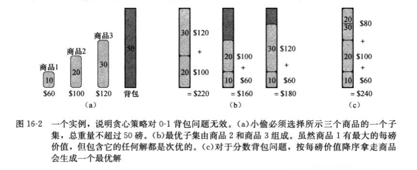

# 贪心算法 Greedy Algorithms
>[贪心算法原理](#贪心算法原理)

>[贪心算法与动态规划的不同](#贪心算法与动态规划的不同)

>[0-1背包问题](#0-1背包问题(0-1-knapsack-problem)),
>[分数背包问题](#分数背包问题(fractional-knapsack-problem))

>[活动选择问题](#活动选择问题(Activity-selection-problem))

注：带*为没理解的知识点

## 贪心算法原理
---
贪婪算法总是会做出目前看起来最好的选择。也就是说，它做出了局部最优选择，希望该选择将导致全局最优解决方案。

#### 贪心算法的设计步骤
1. 将最优化问题转化为：对其做出一次选择后，只剩下一个子问题需要求解。
2. 证明做出贪心选择后，原问题总是存在最优解
3. 证明做出贪心选择后，剩余的子问题满足性质：其最优解与贪心选择组合即可得到原问题的最优解。

#### 贪心选择性质
我们可以通过做出局部最优（贪心）的选择来组合一个全局最优解。换句话说，当我们考虑做出哪个选择时，我们会选择最适合当前问题的选择，而不考虑子问题的结果。

#### 最优子结构
如果问题的最优解中包含子问题的最优解，则问题将表现出最优子结构。

## 贪心算法与动态规划的不同
---
在动态规划中，我们在每个步骤都做出选择，但是选择通常取决于子问题的解决方案。因此，我们通常以自底向上的方式解决动态规划问题，从较小的子问题发展到较大的子问题。在贪心算法中，我们做出的选择似乎最适合然后解决剩下的子问题。贪心算法做出的选择可能取决于到目前为止的选择，但不能取决于任何将来的选择或子问题的解决方案。

## 0-1背包问题(0-1-knapsack-problem)
---
小偷抢劫商店发现n件物品。第i个项目价值vi美元，重wi磅，其中vi和wi是整数。小偷想承担尽可能多的重担，但他可以在背包中携带最多W磅（整数W）。他应该带哪些物品？

我们可以通过贪心算法解决分数背包问题，但不能解决0-1背包问题。



## 分数背包问题(fractional-knapsack-problem)
---
设定与0-1背包问题是相同的，但是小偷可以取零碎的物品，而不必为每个物品二元选择（0-1）。 您可以将0-1背包问题中的商品视为金锭，并将分数背包问题中的项目视为金粉。

为了解决分数问题，我们首先为每个商品计算每磅vi/wi的值。 小偷遵循贪婪的策略，首先从每磅最大的物品中获取尽可能多的物品。 如果该物品拿完了并且他仍然可以携带更多物品，则他会尽可能多地获取每磅第二高的物品，依此类推，直到达到体重限制W为止。 因此，通过按每磅值对项目进行排序，贪婪算法的运行时间为O(nlgn)时间。

## 活动选择问题(Activity-selection-problem)
---
这是一个调度竞争共享资源的多个活动的问题，目的是选出一个最大的互相兼容的活动集合。假设由一个n个活动的集合S，使用同一种资源，例如演讲厅，一次只能服务一个活动。每个活动ai有一个开始时间si和一个结束时间fi，如果两个活动的时间段不重叠，则活动ai和aj是兼容的。也就是说，如果si>=fj或sj>=fi，则ai和aj是兼容的。在活动选择问题中，我们希望选出一个最大兼容的活动集。

我们应该选择一个活动，选出它后剩下的资源应能被尽可能多的其他活动所用。现在考虑可选的活动，其中必然有一个最先结束。因此，我们的直觉告诉我们，选择S中最早结束的活动，因为它剩下的资源可供它之后尽量多的活动使用。由于活动是按照结束时间以单调递增的顺序排序的，所以贪婪的选择是活动a1。与活动a1兼容的所有活动都必须在a1完成后开始。令Sk为在ak结束后开始的任务合集。选择a1后，剩下的S1是唯一需要求解的子问题。如果a1在最优解中，那么原问题的最优解由活动a1及子问题S1中所有活动组成。

解决活动选择问题的算法不需要像基于表哥的动态规划算法那样自底而上。相反，它可以自顶向下，选择一个活动放入最优解，然后对剩余的子问题（包含与已选择的活动兼容的活动）进行求解。 贪婪算法通常都是这种自顶而下的设计：做出选择，然后解决剩下的子问题

#### 递归贪心算法(recursive greedy algorithm)
```bash
//s和f分别为开始和结束时间，n为问题规模，k指出要求解的子问题Sk
RECURSIVE-ACTIVITY-SELECTOR(s,f,k,n):
    m=k+1
    // 查找Sk中最早结束的活动，直到找到第一个与ak兼容的活动am，满足sm>=fk
    while m <= n and s[m] < f[k]: //find the first activity in Sk to finish
        m=m+1
    // 如果查找成功而结束
    if m <= n:
        return {am} union RECURSIVE-ACTIVITY-SELECTOR(s,f,m,n)
    else return {}
```


#### 迭代贪心算法(iterative greedy algorithm)

```bash
GREEDY-ACTIVITY-SELECTOR(s,f):
    n = s.length
    A={a1}
    k=1
    for m=2 to n:
        if s[m] >= f[k]:
            A = A union {am}
            k = m
    return A
```
