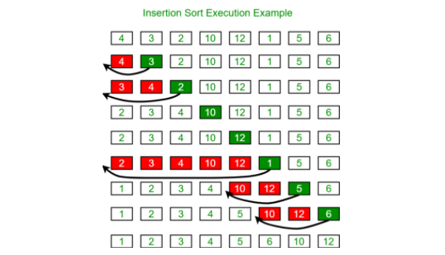
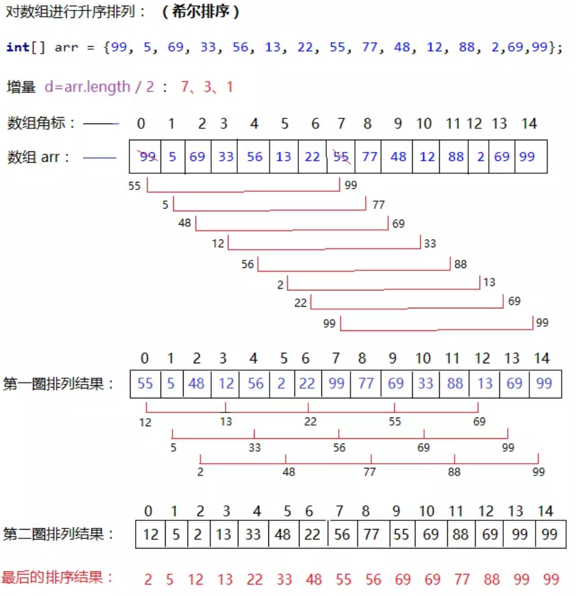
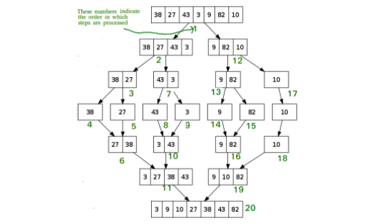
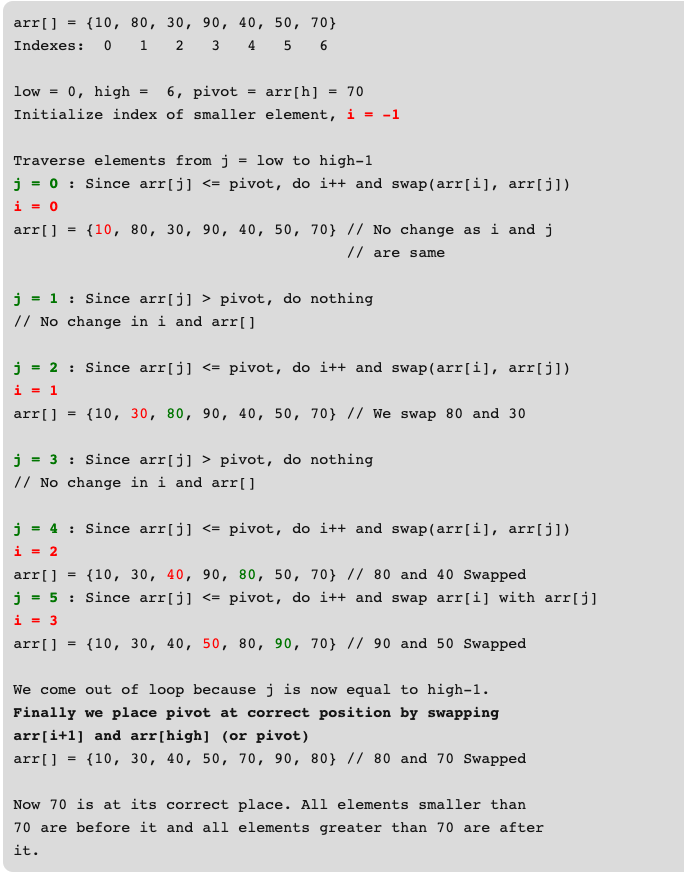
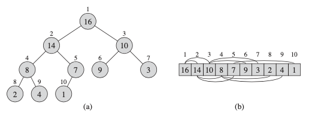
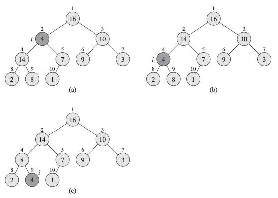
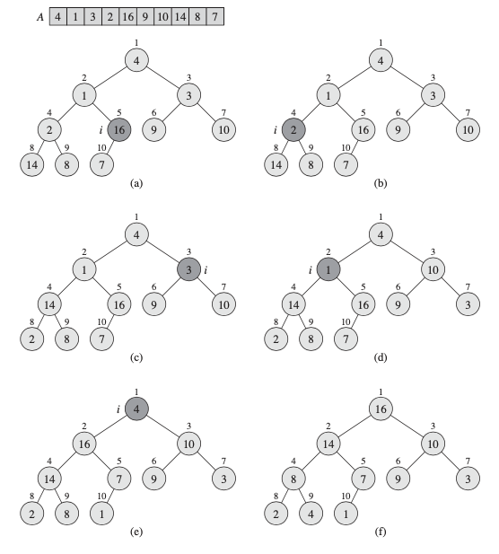
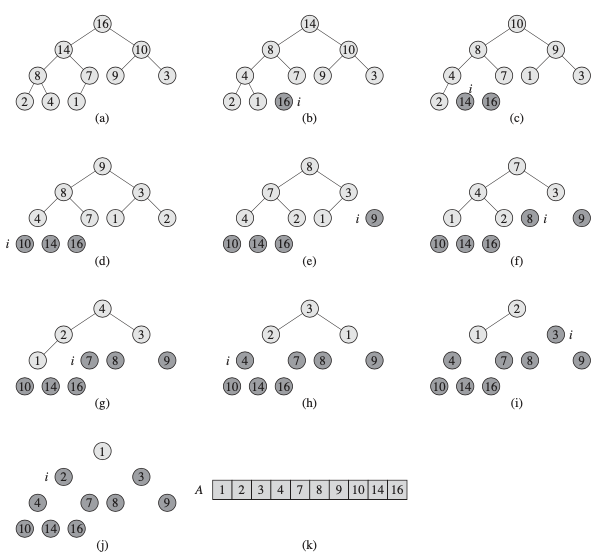

# 排序 Sorting Algoritms
>[排序算法基础](#排序算法基础)

>[选择排序(Selection_Sort)](#选择排序(Selection_Sort)),
>[插入排序(Insertion_Sort)](#插入排序(Insertion_Sort)),
>[希尔排序(Shell_Sort)](#希尔排序(Shell_Sort))

>[归并排序(Merge_Sort)](#归并排序(Merge_Sort)),
>[快速排序(Quick_Sort)](#快速排序(Quick_Sort))

>[堆排序(Heap_Sort)](#堆排序(Heap_Sort))

注：带*为没理解的知识点

## 排序算法基础
---
实际上，要排序的数字很少是单独的值。他们通常都是称为记录的数据集的一部分。每个记录包含一个关键字(key)，该关键字是要排序的值。记录的其余部分由卫星数据(satellite data)组成，通常随关键字一同存取的。实际上，当排序算法对关键字进行排列时，它也必须对卫星数据进行排列。如果每个记录都包含大量卫星数据，则我们通常重排记录指针的数组，而不是记录本身，以最大程度地减少数据移动。

如果输入数组中仅有常数个元素需要在排序过程中存储在数组之外，则称排序算法是原址的(in place)

## 选择排序(Selection_Sort)
---
首先，找到数组中最小的那个元素，其次，将它和数组的第一个元素交换位置（如果第一个元素就是最小的元素那么它就和自己交换）。再次，在剩下的元素中找到最小的元素，将它与数组中的第二个元素交换位置。如此往复，直到将整个数组排序，这种方法叫选择排序的原因是它在不断地选择剩余元素之中的最小者。

平均和最坏情况的时间复杂度O(n^2)，空间复杂度O(1)

运行时间和输入无关：为了找出最小的元素而扫描一遍数组并不能为下一遍扫描提供什么信息，一个已经有序的数组和一个元素随机排列的数组所用的排序时间一样长。

数据移动是最少的：数组元素交换的次数和数组的大小是线性关系。

```bash
public static void selection_sort(int[] target_arr) {
    int N = target_arr.length;
    for (int i = 0; i < N - 1; i++) {
        int min_idx = i;
        for (int j = i + 1; j < N; j++) {
            if (target_arr[j] < target_arr[min_idx]) {
                min_idx = j;
            }
        }
        int temp = target_arr[min_idx];
        target_arr[min_idx] = arr[i];
        arr[i] = temp;
    }
}
```

## 插入排序(Insertion_Sort)
---
每次将数组元素插入已经有序的部分数组中的合适位置，然后为了给要插入的元素腾出空间，我们需要将剩余的元素在插入之前都向右移动一位。当前索引左边的所有元素都是有序的，当索引到达数组的右端时，数组排序就完成了。

插入排序所需的时间取决于输入中元素的初始顺序。一个有序或接近有序的数组进行排序会随机顺序的数组快。

时间复杂度O(n^2)，空间复杂度O(1)


```bash
public static void insertion_sort(int[] arr) {
    int n = arr.length;
    for (int i = 1; i < n; i++) {
        int key = arr[i];
        int j = i - 1;
        while (j >= 0 && arr[j] > key) {
            arr[j + 1] = arr[j];
            j--;
        }
        arr[j + 1] = key;
    }
}
```
```bash
def insertion_sort(arr):
    for i in range(1, len(arr)):
        key = arr[i]
        j = i - 1
        while j >= 0 and key < arr[j]:
            arr[j + 1] = arr[j]
            j -= 1
        arr[j + 1] = key
```

## 希尔排序(Shell_Sort)
---
希尔排序是一种基于插入排序的快速的排序算法，是对直接插入排序的一种优化，插入排序对已经排好序的数据操作时效率高，即可达到线性排序的效率。但对于大规模乱序数组插入排序很慢，因为它只会交换相邻的元素，但是希尔排序为了加快速度，将带排序的数组元素按下标的一定增量分组，分成多个子序列，然后对各个子序列进行直接插入排序，然后依次缩减增量再进行排序，直到增量为1时，进行最后一次直接插入排序，排序结束。

原理图示：


```bash
public static void shell_sort(int[] arr) {
    int n = arr.length;
    for (int gap = n / 2; gap > 0; gap /= 2) {
        for (int i = gap; i < n; i++) {
            int value = arr[i];
            int j;
            for (j = i; j >= gap && arr[j - gap] > temp; j -= gap) {
                arr[j] = arr[j - gap];
            }
            arr[j] = temp;
        }
    }
}
```
上述shellsort实现的时间复杂度为O(n^2)。在上面的实现中，每次迭代的gap减少了一半。

## 归并排序(Merge_Sort)
---
先递归地将目标数组分成两半分别排序，然后将结果归并起来。归并排序能够保证将任意长度为N的数组排序所需时间和NlogN成正比，缺点是它所需的额外空间和N成正比


原地归并实现起来很复杂，所以我们使用额外空间，将涉及的所有元素复制到一个辅助数组中，再把归并的结果放回原数组中
```bash
public static void merge(int[] arr, int low, int mid, int high) {
    int n1 = mid - low + 1;
    int n2 = high - mid;
    int[] L = new int[n1];
    int[] R = new int[n2];
    // 将元素复制到辅助数组中
    for (int i = 0; i < n1; i++) {
        L[i] = arr[low + i];
    }
    for (int j = 0; j < n2; j++) {
        R[j] = arr[mid + 1 + j];
    }
    int i = 0;
    int j = 0;
    int k = low;
    while (i < n1 && j < n2) {
        if (L[i] <= R[j]) {
            arr[k] = L[i++];
        } else {
            arr[k] = R[j++];
        }
        k++;
    }
    // 右半边用尽，取左半边的数组元素
    while (i < n1) {
        arr[k++] = L[i++];
    }
    // 左半边用尽，取右半边的数组元素
    while (j < n2) {
        arr[k++] = R[j++];
    }
}
```
利用分治思想实现归并排序:
```bash
public static void merge_sort(int[] arr, int low, int high) {
    if (low < high) {
        int mid = (low + high) / 2;
        merge_sort(arr, low, mid);
        merge_sort(arr, mid + 1, high);
        merge(arr, low, mid, high);
    }
}
```
在所有3种情况下(最差，平均和最佳)，合并排序的时间复杂度均为O(nLogn)，因为合并排序始终将数组分为两半，并花费线性时间来合并两半。
辅助空间：O(n)
## 快速排序(Quick_Sort)
---
Divide: 数组a[low...high]被划分为两个子数组a[low...pivot-1]和a[pivot+1...high]，使得a[low...pivot-1]中的每一个元素都小于等于a[pivot]，而a[pivot]也小于等于a[pivot+1...high]中的每一个元素

Conquer: 通过递归调用快速排序，对两个子数组进行排序

Combine: 因为子数组都是原址排序的，所以不需要合并操作，得到的数组已经有序了

快速排序采用分治思想，对包含n个数的输入数组，最坏情况下运行时间为θ(n^2)，但是平均性能相当好，期望的运行时间为θ(nlgn)。且快速排序能够原址排序
```bash
public static void quick_sort(int[] arr, int low, int high) {
    if (low < high) {
        int pivot = partition(arr, low, high);
        quick_sort(arr, low, pivot - 1);
        quick_sort(arr, pivot + 1, high);
    }
}

public static void partition(int[] arr, int low, int high) {
    // 将数组最后一个元素作为pivot
    int pivot = arr[high];
    // 初始化会被放到pivot左边的较小元素的index
    int i = low - 1;
    for (int j = low; j <= high - 1; j++) {
        if (arr[j] < pivot) {
            i++;
            // 交换arr[i]和arr[j]
            int temp = arr[i];
            arr[i] = arr[j];
            arr[j] = temp;
        }
    }
    // 交换arr[i + 1]和pivot
    int temp = arr[i + 1];
    arr[i + 1] = arr[high];
    arr[high] = temp;

    // 返回pivot的位置
    return i + 1;
}
```

实现过程的例子详情：


## 堆排序(Heap_Sort)
---
堆排序的时间复杂度是O(nlgn)，对排序具有空间原址性
#### 堆(Heap)
二叉堆是一个数组，可以被看成一个近似的完全二叉树。除了最底层外，该树是完全从左向右充满的。对于表示堆的数组，有如下性质：

PARENT(i) => return i/2; 

LEFT(i) => return 2i; 

RIGHT(i) => return 2i+1;


二叉堆可以分为最大堆和最小堆，在最大堆中，除了根以外的所有结点i都要满足：A[PARENT(i)]>=A[i]，最大元素存放在根结点；相反，在最小堆中，除了根以外的所有结点i都要满足：A[PARENT(i)]<=A[i]，最小元素存放在根结点

在堆排序算法中，使用的是最大堆，最小堆通常用于构造优先队列(Priority Queue)
如果一个包含n个元素的堆可以看作一颗完全二叉树，那么该堆的高度是θ(lgn)

关于堆结构的一些基本操作和procedure：
- MAX-HEAPIFY: 用来维护最大堆的性质，时间复杂度为O(lgn)
- BUILD-MAX-HEAP: 具有线性时间复杂度，功能是从无序的数组中构造一个最大堆
- HEAPSORT: 时间复杂度为O(nlgn)，功能是对一个数组进行原址排序
- MAX-HEAP-INSERT, HEAP-EXTRACT-MAX, HEAP-INCREASE-KEY, HEAP-MAXIMUM：时间复杂度为O(lgn), 功能是利用堆实现一个优先队列

#### 维护堆的性质(MAX-HEAPIFY)
输入为一个数组a和一个下标i，假设LEFT(i)和RIGHT(i)的二叉树都是最大堆，MAX-HEAPIFY通过让a[i]的值在最大堆中逐级下降，使得以下标i为根结点的子树满足最大堆的性质
```bash
伪码
MAX-HEAPIFY(A, i):
    left = LEFT(i)
    right = RIGHT(i)
    if left <= A.heap-size and A[left] > A[i]:
        largest = left
    else:
        largest = i
    if right <= A.heap-size and A[right] > A[largest]:
        largest = right
    if largest != i:
        exchange A[i] with A[largest]
        MAX-HEAPIFY(A, largest)
代码解释：在程序每一步中，从A[i], A[LEFT(i)], A[RIGHT(i)]中选出最大的，储存在largest中，如果A[i]是最大的，那么程序结束，否则交换A[i]和A[largest]的值，交换后下标为largest的结点的值是原来的A[i]，然后递归调用MAX-HEAPIFY
```
时间复杂度为O(lgn)


#### 建堆(BUILD-MAX-HEAP)
建立最大堆的过程是自底向上地调用最大堆调整程序将一个数组A[1..n]变成一个最大堆。将数组视为一颗完全二叉树，从其最后一个非叶子节点（n/2）开始调整，子数组A(n/2+1..n)中的元素都是树的叶结点，每个叶结点看成只包含一个元素的堆。确保每次循环保持结点i+1, i+2 .. n都是一个最大堆的根结点
```bash
BUILD-MAX-HEAP(A):
    A.heap-size = A.length
    for i = A.length / 2 downto 1:
        MAX-HEAPIFY(A, i)
```

BUILD-MAX-HEAP的时间复杂度为O(n)，渐进紧确的

类似的也可以构造最小堆: BUILD-MIN-HEAP

#### 堆排序算法(Heap-Sort)
先调用BUILD-MAX-HEAP将输入数组A[1..n]建成一个最大堆，使得最大的值存放在数组第一个位置A[1]，然后用数组最后一个位置元素与第一个位置进行交换，将堆的大小减少1去掉结点n，剩余的结点中，原来根的孩子结点仍然是最大堆，调用MAX-HEAPIFY，在A[1..n-1]上max-heapify一个新的大堆，直到堆的大小降到2

```bash
pseudo-code:
Heap-Sort(A)
    BUILD-MAX-HEAP(A)
    for i = A.length downto 2:
        exchange A[1] with A[i]
        A.heap-size = A.heap-size - 1
        MAX-HEAPIFY(A, 1)

java-implementation:
public void sort(int arr[]) 
    { 
        int n = arr.length; 
  
        // Build heap (rearrange array) 
        for (int i = n / 2 - 1; i >= 0; i--) 
            heapify(arr, n, i); 
  
        // One by one extract an element from heap 
        for (int i=n-1; i>0; i--) 
        { 
            // Move current root to end 
            int temp = arr[0]; 
            arr[0] = arr[i]; 
            arr[i] = temp; 
  
            // call max heapify on the reduced heap 
            heapify(arr, i, 0); 
        } 
    } 
  
    // To heapify a subtree rooted with node i which is 
    // an index in arr[]. n is size of heap 
    void heapify(int arr[], int n, int i) 
    { 
        int largest = i; // Initialize largest as root 
        int l = 2*i + 1; // left = 2*i + 1 
        int r = 2*i + 2; // right = 2*i + 2 
  
        // If left child is larger than root 
        if (l < n && arr[l] > arr[largest]) 
            largest = l; 
  
        // If right child is larger than largest so far 
        if (r < n && arr[r] > arr[largest]) 
            largest = r; 
  
        // If largest is not root 
        if (largest != i) 
        { 
            int swap = arr[i]; 
            arr[i] = arr[largest]; 
            arr[largest] = swap; 
  
            // Recursively heapify the affected sub-tree 
            heapify(arr, n, largest); 
        } 
    } 
```

#### 优先队列(Priority-Queue)
优先级队列有两种：最大优先级队列和最小优先级队列，这两种类别分别可以用最大堆和最小堆实现。通常优先级队列用在操作系统中的多任务调度，任务优先级越高，任务优先执行（类似于出队列），后来的任务如果优先级比以前的高，则需要调整该任务到合适的位置，以便于优先执行，整个过程总是使得队列中的任务的第一任务的优先级最高。

一个最大优先级队列支持的操作如下操作：

INSERT(S,x)：把元素x插入到集合S

MAXIMUM(S)：返回S中具有最大关键字的元素

EXTRACT_MAX(S)：去掉并返回S中的具有最大关键字的元素

INCREASE_KEY(S,x,k)：将元素x的关键字的值增加到k，这里k值不能小于x的原关键字的值。

HEAP-MAXIMUM操作：
```bash
HEAP-MAXIMUM(A):
    return A[1]

时间复杂度为O(1)
```
HEAP-EXTRACT-MAX操作：
```bash
HEAP-EXTRACT-MAX(A):
    if A.heap-size < 1:
        error"heap underflow"
    max = A[1]
    A.heap-size = A.heap-size - 1
    MAX-HEAPIFY(A, 1)
    return max

时间复杂度为O(lgn)
```
HEAP-INCREASE-KEY操作：不断使当前元素和其父节点进行比较，如果当前元素的key较大，则当前元素与父节点交换
```bash
HEAP-INCREASE-KEY(A, i, key):
    if key < A[i]:
        error "new key is smaller than current key"
    A[i] = key
    while i > 1 and A[PARENT(i) < A[i]]:
        exchange A[i] with A[PARENT(i)]
        i = PARTENT(i)

时间复杂度为O(lgn)
```
MAX-HEAP-INSERT操作：增加关键字为-∞的结点，然后heap-increase-key为目标key，保持最大堆性质
```bash
MAX-HEAP-INSERT(A, key):
    A.heap-size = A.heap-size + 1
    A[A.heap-size] = -∞
    HEAP-INCREASE-KEY(A, A.heap-size, key)
    
时间复杂度为O(lgn)
```
