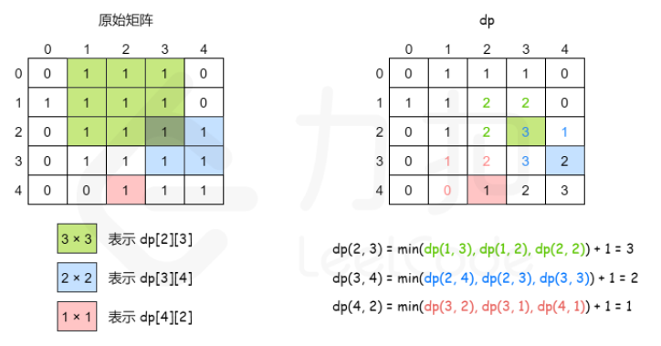
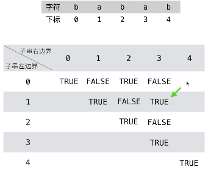

# Dynamic_Programming
> [数组中的动态规划](#数组中的动态规划),
> [矩阵中的动态规划](#矩阵中的动态规划)

不知道读者有没有发现，有关动态规划的问题，大多是让你求最值的，比如最长子序列，最小编辑距离，最长公共子串等等等。这就是规律，因为动态规划本身就是运筹学里的一种求最值的算法。

那么贪心算法作为特殊的动态规划也是一样，也一定是让你求个最值。

动态规划的问题考虑dp表示的是什么，dp的状态，选择，写dp的状态转移方程

动态规划的框架
```
# 初始化 base case
dp[0][0][...] = base
# 进行状态转移
for 状态1 in 状态1的所有取值：
    for 状态2 in 状态2的所有取值：
        for ...
            dp[状态1][状态2][...] = 求最值(选择1，选择2...)
```

最长子序列的解题模版
```
int n = array.length;
int[] dp = new int[n];

for (int i = 1; i < n; i++) {
    for (int j = 0; j < i; j++) {
        dp[i] = 最值(dp[i], dp[j] + ...)
    }
}
举个我们写过的例子「最长递增子序列」，在这个思路中 dp 数组的定义是：

在子数组 array[0..i] 中，我们要求的子序列（最长递增子序列）的长度是 dp[i]。
```
```
这种思路运用相对更多一些，尤其是涉及两个字符串/数组的子序列，比如前文讲的「最长公共子序列」。本思路中 dp 数组含义又分为「只涉及一个字符串」和「涉及两个字符串」两种情况。
int n = arr.length;
int[][] dp = new dp[n][n];

for (int i = 0; i < n; i++) {
    for (int j = 0; j < n; j++) {
        if (arr[i] == arr[j]) 
            dp[i][j] = dp[i][j] + ...
        else
            dp[i][j] = 最值(...)
    }
}
2.1 涉及两个字符串/数组时（比如最长公共子序列），dp 数组的含义如下：

在子数组 arr1[0..i] 和子数组 arr2[0..j] 中，我们要求的子序列（最长公共子序列）长度为 dp[i][j]。

2.2 只涉及一个字符串/数组时（比如本文要讲的最长回文子序列），dp 数组的含义如下：

在子数组 array[i..j] 中，我们要求的子序列（最长回文子序列）的长度为 dp[i][j]。
```


## 数组中的动态规划
---
[Leetcode Q70](java_src/70.爬楼梯.java) 爬楼梯
```
用dp[i]表示爬到第x级台阶的方案数，考虑最后一步可能跨了一级台阶，也可能跨了两级台阶，所以我们可以列出如下式子：dp(x)=dp(x−1)+dp(x−2)

它意味着爬到第x级台阶的方案数是爬到第x−1级台阶的方案数和爬到第x−2级台阶的方案数的和。很好理解，因为每次只能爬1级或2级，所以f(x)只能从f(x−1) 和f(x−2)转移过来，而这里要统计方案总数，我们就需要对这两项的贡献求和。
```

## 矩阵中的动态规划
---
[Leetcode Q221](java_src/221.最大正方形.java) Maximal Square (最大正方形)
> Huawei
```
用dp(i,j)表示以(i,j) 为右下角，且只包含1的正方形的边长最大值。如果我们能计算出所有dp(i,j)的值，那么其中的最大值即为矩阵中只包含1的正方形的边长最大值，其平方即为最大正方形的面积。
dp(i,j)=min(dp(i−1,j),dp(i−1,j−1),dp(i,j−1))+1
```



[Leetcode Q5](java_src/5.最长回文子串.java) Longest Palindromic Substring (最长回文子串) 
> ByteDance, Huawei
```
1. Dynamic programming: dp[i][j] = (s[i] == s[j]) and (dp[i + 1][j - 1]), when traverse the dp matrix, you should consider that the result dp[i][j] always relies on the leftdown dp element(dp[i + 1][j - 1]), so we need to traverse column first then row, since j always > i, consider the pic below.
You should always consider the edge case, that is the length of substring[i + 1, j - 1] is 0 or 1, when meet with this situtation, dp[i][j] will be true, no need to rely on the value of dp[i + 1][j - 1]

```


[Leetcode Q516](java_src/516.最长回文子序列.java) 最长回文子序列
[最长回文子序列](https://leetcode-cn.com/problems/longest-palindromic-subsequence/solution/zi-xu-lie-wen-ti-tong-yong-si-lu-zui-chang-hui-wen/)
```
看连接
```

[Leetcode Q121](java_src/121.买卖股票的最佳时机.java) Best Time to Buy and Sell Stock (买卖股票的最佳时机) 
> ByteDance
```
1. Dynamic programming: 前i天的最大收益 = max{前i-1天的最大收益，第i天的价格-前i-1天中的最小价格}

```

[Leetcode Q53](java_src/53.最大子序和.java) 最大子序和
```
dp[i] 代表以第i个数结尾的「连续子数组的最大和」，那么很显然我们要求的答案就是：dp中最大
dp[i] = Math.max(dp[i - 1] + nums[i], nums[i]);
今天这道「最大子数组和」就和「最长递增子序列」非常类似，dp 数组的定义是「以 nums[i] 为结尾的最大子数组和/最长递增子序列为 dp[i]
```

[Leetcode Q300](java_src/300.最长上升子序列.java) 最长上升子序列
```
带备忘的自底向上的迭代动态规划
dp[i]表示以nums[i]这个结尾的最长递增子序列的长度
今天这道「最大子数组和」就和「最长递增子序列」非常类似，dp 数组的定义是「以 nums[i] 为结尾的最大子数组和/最长递增子序列为 dp[i]
```

[Leetcode Q509](java_src/509.java) 斐波那契数
```
带备忘的自底向上的迭代动态规划
```

[Leetcode Q322](java_src/322.零钱兑换.java) 零钱兑换
```
带备忘的自底向上的迭代动态规划
```

[Leetcode Q416](java_src/416.分割等和子集.java) 416.分割等和子集
[0-1背包问题](https://zhuanlan.zhihu.com/p/112075593)
[子集背包问题](https://labuladong.gitbook.io/algo/dong-tai-gui-hua-xi-lie/bei-bao-zi-ji)
```
第一步要明确两点，「状态」和「选择」。
状态就是「背包的容量」和「可选择的物品」，选择就是「装进背包」或者「不装进背包」。
第二步要明确 dp 数组的定义。
按照背包问题的套路，可以给出如下定义：
dp[i][j] = x 表示，对于前 i 个物品，当前背包的容量为 j 时，若 x 为 true，则说明可以恰好将背包装满，若 x 为 false，则说明不能恰好将背包装满。
比如说，如果 dp[4][9] = true，其含义为：对于容量为 9 的背包，若只是用前 4 个物品，可以有一种方法把背包恰好装满。
或者说对于本题，含义是对于给定的集合中，若只对前 4 个数字进行选择，存在一个子集的和可以恰好凑出 9。
根据这个定义，我们想求的最终答案就是 dp[N][sum/2]，base case 就是 dp[..][0] = true 和 dp[0][..] = false，因为背包没有空间的时候，就相当于装满了，而当没有物品可选择的时候，肯定没办法装满背包。
第三步，根据「选择」，思考状态转移的逻辑。
回想刚才的 dp 数组含义，可以根据「选择」对 dp[i][j] 得到以下状态转移：
如果不把 nums[i] 算入子集，或者说你不把这第 i 个物品装入背包，那么是否能够恰好装满背包，取决于上一个状态 dp[i-1][j]，继承之前的结果。
如果把 nums[i] 算入子集，或者说你把这第 i 个物品装入了背包，那么是否能够恰好装满背包，取决于状态 dp[i-1][j-nums[i-1]]。
首先，由于 i 是从 1 开始的，而数组索引是从 0 开始的，所以第 i 个物品的重量应该是 nums[i-1]，这一点不要搞混。
dp[i - 1][j-nums[i-1]] 也很好理解：你如果装了第 i 个物品，就要看背包的剩余重量 j - nums[i-1] 限制下是否能够被恰好装满。
换句话说，如果 j - nums[i-1] 的重量可以被恰好装满，那么只要把第 i 个物品装进去，也可恰好装满 j 的重量；否则的话，重量 j 肯定是装不满的。
```

[Leetcode Q518](java_src/518.零钱兑换II.java) 518.零钱兑换II
[完全背包问题](https://labuladong.gitbook.io/algo/dong-tai-gui-hua-xi-lie/bei-bao-ling-qian)
```
这个凑给定sum的值一般都是背包动态规划问题
第一步要明确两点，「状态」和「选择」。
状态有两个，就是「背包的容量」和「可选择的物品」，选择就是「装进背包」或者「不装进背包」嘛，背包问题的套路都是这样。
明白了状态和选择，动态规划问题基本上就解决了，只要往这个框架套就完事儿了：
for 状态1 in 状态1的所有取值：
    for 状态2 in 状态2的所有取值：
        for ...
            dp[状态1][状态2][...] = 计算(选择1，选择2...)
第二步要明确 dp 数组的定义。
首先看看刚才找到的「状态」，有两个，也就是说我们需要一个二维 dp 数组。
dp[i][j] 的定义如下：
若只使用前 i 个物品，当背包容量为 j 时，有 dp[i][j] 种方法可以装满背包。
换句话说，翻译回我们题目的意思就是：
若只使用 coins 中的前 i 个硬币的面值，若想凑出金额 j，有 dp[i][j] 种凑法。
经过以上的定义，可以得到：
base case 为 dp[0][..] = 0， dp[..][0] = 1。因为如果不使用任何硬币面值，就无法凑出任何金额；如果凑出的目标金额为 0，那么“无为而治”就是唯一的一种凑法。
我们最终想得到的答案就是 dp[N][amount]，其中 N 为 coins 数组的大小。
大致的伪码思路如下：
int dp[N+1][amount+1]
dp[0][..] = 0
dp[..][0] = 1

for i in [1..N]:
    for j in [1..amount]:
        把物品 i 装进背包,
        不把物品 i 装进背包
return dp[N][amount]
第三步，根据「选择」，思考状态转移的逻辑。
注意，我们这个问题的特殊点在于物品的数量是无限的，所以这里和之前写的背包问题文章有所不同。
如果你不把这第 i 个物品装入背包，也就是说你不使用 coins[i] 这个面值的硬币，那么凑出面额 j 的方法数 dp[i][j] 应该等于 dp[i-1][j]，继承之前的结果。
如果你把这第 i 个物品装入了背包，也就是说你使用 coins[i] 这个面值的硬币，那么 dp[i][j] 应该等于 dp[i][j-coins[i-1]]。
首先由于 i 是从 1 开始的，所以 coins 的索引是 i-1 时表示第 i 个硬币的面值。
dp[i][j-coins[i-1]] 也不难理解，如果你决定使用这个面值的硬币，那么就应该关注如何凑出金额 j - coins[i-1]。
比如说，你想用面值为 2 的硬币凑出金额 5，那么如果你知道了凑出金额 3 的方法，再加上一枚面额为 2 的硬币，不就可以凑出 5 了嘛。
综上就是两种选择，而我们想求的 dp[i][j] 是「共有多少种凑法」，所以 dp[i][j] 的值应该是以上两种选择的结果之和：
for (int i = 1; i <= n; i++) {
    for (int j = 1; j <= amount; j++) {
        if (j - coins[i-1] >= 0)
            dp[i][j] = dp[i - 1][j] 
                     + dp[i][j-coins[i-1]];
return dp[N][W]
```

[Leetcode Q72](java_src/72.编辑距离.java) 72.编辑距离
[编辑距离](https://labuladong.gitbook.io/algo/dong-tai-gui-hua-xi-lie/bian-ji-ju-li)
```
编辑距离问题就是给我们两个字符串 s1 和 s2，只能用三种操作，让我们把 s1 变成 s2，求最少的操作数。
if s1[i] == s2[j]:
    啥都别做（skip）
    i, j 同时向前移动
else:
    三选一：
        插入（insert）
        删除（delete）
        替换（replace）

def dp(i, j):
        # base case
        if i == -1: return j + 1
        if j == -1: return i + 1

        if s1[i] == s2[j]:
            return dp(i - 1, j - 1)  # 啥都不做
        else:
            return min(
                dp(i, j - 1) + 1,    # 插入
                dp(i - 1, j) + 1,    # 删除
                dp(i - 1, j - 1) + 1 # 替换
            )

    # i，j 初始化指向最后一个索引
    return dp(len(s1) - 1, len(s2) - 1)

def dp(i, j) -> int
# 返回 s1[0..i] 和 s2[0..j] 的最小编辑距离

dp(i, j - 1) + 1,    # 插入
# 解释：
# 我直接在 s1[i] 插入一个和 s2[j] 一样的字符
# 那么 s2[j] 就被匹配了，前移 j，继续跟 i 对比
# 别忘了操作数加一

dp(i - 1, j) + 1,    # 删除
# 解释：
# 我直接把 s[i] 这个字符删掉
# 前移 i，继续跟 j 对比
# 操作数加一

dp(i - 1, j - 1) + 1 # 替换
# 解释：
# 我直接把 s1[i] 替换成 s2[j]，这样它俩就匹配了
# 同时前移 i，j 继续对比
# 操作数加一
```
887.鸡蛋掉落 (*不是很懂)
[Leetcode Q887](java_src/887.鸡蛋掉落.java) 鸡蛋掉落
[鸡蛋掉落](https://labuladong.gitbook.io/algo/dong-tai-gui-hua-xi-lie/gao-lou-reng-ji-dan-wen-ti)
[鸡蛋掉落](https://leetcode-cn.com/problems/super-egg-drop/solution/ken-ding-rang-ni-li-jie-de-si-lu-by-blade-4/)
```
定义dp状态
假设dp[k][j] = N 代表有k个鸡蛋，操作次数为j时，包含F楼层的最大层数为N。
按照层数j = 1,2,3,4不断的迭代，第一个 >= N的dp[k][j]的j就时所求的最小移动次数。
状态转移方程：
j和j-1有什么关系。

设 dp[k][j] = NN， dp[k][j] 可以由两个状态转换过来
在[1,NN]中随便选1层 X 扔鸡蛋，有两种情况，扔下去碎了，那么F一定在 [0,X-1]中，这是dp[k][j]的状态就退化成了
dp[k-1][j-1] , 即k-1个鸡蛋，操作数为j-1, 即 dp[k-1][j-1] 代表 [0,X-1]
如果没碎，F一定在[X,NN]中,这时dp[k][j]的状态就退化成dp[k][j-1]

在回顾一下dp[k][j]的含义， dp[k][j] 代表了 [0,N]这样一个区间
dp[k][j-1]代表[X,NN] - > [0,NN-X] -> dp[k][j-1] = NN - X
dp[k-1][j-1] 代表[0,X-1] -> dp[k-1][j-1] = X - 1
但是dp[k][j] = NN = (X - 1) + (NN - X) + 1 = dp[k][j-1] + dp[k-1][j-1] + 1

这就是为啥有这个1。
```

[Leetcode Q312](java_src/312.戳气球.java) 戳气球 (*不是很懂)
[戳气球](https://labuladong.gitbook.io/algo/dong-tai-gui-hua-xi-lie/za-qi-qiu)
```
见链接
```

[Leetcode Q1143](java_src/1143.最长公共子序列.java) 最长公共子序列
[最长公共子序列](https://labuladong.gitbook.io/algo/dong-tai-gui-hua-xi-lie/zui-chang-gong-gong-zi-xu-lie)
```
因为子序列类型的问题，穷举出所有可能的结果都不容易，而动态规划算法做的就是穷举 + 剪枝，它俩天生一对儿。所以可以说只要涉及子序列问题，十有八九都需要动态规划来解决，往这方面考虑就对了。

这个「在」和「不在」就是选择，关键是，应该如何选择呢？这个需要动点脑筋：如果某个字符应该在 lcs 中，那么这个字符肯定同时存在于 s1 和 s2 中，因为 lcs 是最长公共子序列嘛。所以本题的思路是这样：

用两个指针 i 和 j 从后往前遍历 s1 和 s2，如果 s1[i]==s2[j]，那么这个字符一定在 lcs 中；否则的话，s1[i] 和 s2[j] 这两个字符至少有一个不在 lcs 中，需要丢弃一个。
```

[Leetcode Q198](java_src/198.打家劫舍.java) 198.打家劫舍
[打家劫舍系列问题](https://mp.weixin.qq.com/s/z44hk0MW14_mAQd7988mfw)
```
看解读
```
[Leetcode Q213](java_src/213.打家劫舍II.java) 213.打家劫舍II
[打家劫舍系列问题](https://mp.weixin.qq.com/s/z44hk0MW14_mAQd7988mfw)
```
看解读
```
[Leetcode Q64](java_src/64.最小路径和.java) 64.最小路径和
[大佬解答](https://github.com/CyC2018/CS-Notes/blob/master/notes/Leetcode%20%E9%A2%98%E8%A7%A3%20-%20%E5%8A%A8%E6%80%81%E8%A7%84%E5%88%92.md#%E6%95%B0%E7%BB%84%E5%8C%BA%E9%97%B4)
```
看解读
```

[Leetcode Q62](java_src/62.不同路径.java) 62.不同路径
[大佬解答](https://github.com/CyC2018/CS-Notes/blob/master/notes/Leetcode%20%E9%A2%98%E8%A7%A3%20-%20%E5%8A%A8%E6%80%81%E8%A7%84%E5%88%92.md#%E6%95%B0%E7%BB%84%E5%8C%BA%E9%97%B4)
```
看解读
```

[Leetcode Q303](java_src/303.区域和检索-数组不可变.java) 303.区域和检索-数组不可变
[大佬解答](https://github.com/CyC2018/CS-Notes/blob/master/notes/Leetcode%20%E9%A2%98%E8%A7%A3%20-%20%E5%8A%A8%E6%80%81%E8%A7%84%E5%88%92.md#%E6%95%B0%E7%BB%84%E5%8C%BA%E9%97%B4)
```
看解读
```

[Leetcode Q413](java_src/413.等差数列划分.java) 413.等差数列划分
[大佬解答](https://github.com/CyC2018/CS-Notes/blob/master/notes/Leetcode%20%E9%A2%98%E8%A7%A3%20-%20%E5%8A%A8%E6%80%81%E8%A7%84%E5%88%92.md#%E6%95%B0%E7%BB%84%E5%8C%BA%E9%97%B4)
```
看解读
```

[Leetcode Q343](java_src/343.整数拆分.java) 343.整数拆分
[大佬解答](https://github.com/CyC2018/CS-Notes/blob/master/notes/Leetcode%20%E9%A2%98%E8%A7%A3%20-%20%E5%8A%A8%E6%80%81%E8%A7%84%E5%88%92.md#%E6%95%B0%E7%BB%84%E5%8C%BA%E9%97%B4)
```
看解读
```

[Leetcode Q279](java_src/279.完全平方数.java) 279.完全平方数
[大佬解答](https://github.com/CyC2018/CS-Notes/blob/master/notes/Leetcode%20%E9%A2%98%E8%A7%A3%20-%20%E5%8A%A8%E6%80%81%E8%A7%84%E5%88%92.md#%E6%95%B0%E7%BB%84%E5%8C%BA%E9%97%B4)
```
看解读
```

[Leetcode Q91](java_src/91.解码方法.java) 91.解码方法
[大佬解答](https://github.com/CyC2018/CS-Notes/blob/master/notes/Leetcode%20%E9%A2%98%E8%A7%A3%20-%20%E5%8A%A8%E6%80%81%E8%A7%84%E5%88%92.md#%E6%95%B0%E7%BB%84%E5%8C%BA%E9%97%B4)
```
看解读
```

[Leetcode Q646](java_src/646.最长数对链.java) 646.最长数对链
[大佬解答](https://github.com/CyC2018/CS-Notes/blob/master/notes/Leetcode%20%E9%A2%98%E8%A7%A3%20-%20%E5%8A%A8%E6%80%81%E8%A7%84%E5%88%92.md#%E6%95%B0%E7%BB%84%E5%8C%BA%E9%97%B4)
```
看解读
```

[Leetcode Q647](java_src/647.回文子串.java) 647.回文子串
```
    // 本题是找到一个字符串中所有的回文子串，而第 5 题是求解一个字符串中最长的回文子串，很明显求解出所有的字符串自然能够找到最大的
    // 这一题可以使用动态规划来进行解决：
    // 状态：dp[i][j] 表示字符串s在[i,j]区间的子串是否是一个回文串。
    // 如果dp[i][j]相同，如果子串i+1, j-1的长度<2，则dp[i][j] = true，否则是否为true还要看dp[i+1][j-1]
```

[Leetcode Q152](java_src/152.乘积最大子数组.java) 152.乘积最大子数组
```
    // 本题思路：
    // 求乘积的最大值，示例中负数的出现，告诉我们这题和 53 题不一样了，一个正数乘以负数就变成负数，即：最大值乘以负数就变成了最小值；
    // 因此：最大值和最小值是相互转换的，这一点提示我们可以把这种转换关系设计到「状态转移方程」里去；
    // 在原始的状态设计后面多加一个维度，减少分类讨论，降低解决问题的难度。
    // dp[i][j]：以 nums[i] 结尾的连续子数组的最值，计算最大值还是最小值由 j 来表示，j 就两个值；
    // 当 j = 0 的时候，表示计算的是最小值；
    // 当 j = 1 的时候，表示计算的是最大值。
```

[剑指 Offer 60](java_src/剑指Offer60.n个骰子的点数.java) 剑指Offer60.n个骰子的点数
```
    // 本题思路：
    // dp[i][j]，表示投掷完 i 枚骰子后，点数 j 的出现次数。
```

[剑指 Offer 65](java_src/剑指Offer65.不用加减乘除做加法.java) 剑指Offer65.不用加减乘除做加法
```
    // 本题思路：
    // 位运算
    // 异或保留，与进位, 与为空时就返回
    // （和 s）==（非进位和 n）++（进位 c）。即可将 s=a+b 转化为：s = n + c
    // 循环求 n 和 c ，直至进位 c=0 ；此时 s=n ，返回 n 即可。
```

[剑指 Offer 49](java_src/剑指Offer49.丑数.java) 剑指Offer49.丑数
```
    // 本题思路：
    // 丑数 = 某较小丑数 × 某因子
    // 用三指针，第一个丑数是1，以后的丑数都是基于前面的小丑数分别乘2，3，5构成的。
    // 我们每次添加进去一个当前计算出来个三个丑数的最小的一个，并且是谁计算的，谁指针就后移一位。
```

[Leetcode Q264](java_src/264.丑数II.java) 264. 丑数 II
```
    // 本题思路：
    // 丑数 = 某较小丑数 × 某因子
    // 用三指针，第一个丑数是1，以后的丑数都是基于前面的小丑数分别乘2，3，5构成的。
    // 我们每次添加进去一个当前计算出来个三个丑数的最小的一个，并且是谁计算的，谁指针就后移一位。
```

[Leetcode Q1049](java_src/1049.最后一块石头的重量II.java) 1049.最后一块石头的重量II
```
    // 本题思路：
    // 背包问题
    // 有一堆石头，分成两堆，如何分才能使两堆石头之间的重量差距最小
```

[剑指Offer14-I](java_src/剑指Offer14-I.剪绳子.java) 剑指Offer14-I.剪绳子
```
    // 本题思路：
    // 动态规划, dp[i]是指长度为i的绳子剪过后相乘的结果的最大值
```

[剑指Offer14-II](java_src/剑指Offer14-II.剪绳子II.java) 剑指Offer14-II.剪绳子II
```
    // 本题思路：
    // 动态规划, dp[i]是指长度为i的绳子剪过后相乘的结果的最大值
    // 跟剪绳子1一样，只是把求最大值和求模写成大数的运算
```

[剑指Offer46](java_src/剑指Offer46.把数字翻译成字符串.java) 剑指Offer46.把数字翻译成字符串
```
    // 本题思路：
    // 动态规划，dp[i]代表以xi为结尾的数字的翻译方案数量
    // dp[i] = dp[i - 1] + dp[i - 2], 当Xi-1 Xi可被翻译
    // dp[i] = dp[i - 1], 当Xi-1 Xi不可被翻译
```

[剑指Offer47](java_src/剑指Offer47.礼物的最大价值.java) 剑指Offer47.礼物的最大价值
```
    // 本题思路：
    // 二维数组的dp
```

[剑指Offer63](java_src/剑指Offer63.股票的最大利润.java) 剑指Offer63.股票的最大利润
```
    // 本题思路：
    // 动态规划：2个状态量：0为不持有，1为持有
    // 比如说 dp[3][1] 的含义就是：今天是第三天，我现在手上持有着股票
```

[剑指Offer42](java_src/剑指Offer42.连续子数组的最大和.java) 剑指Offer42.连续子数组的最大和
```
    // 本题思路：
    // 动态规划，dp[i]为以第i个元素结尾的连续子数组
```

[剑指Offer10-II](java_src/剑指Offer10-II.青蛙跳台阶问题.java) 剑指 Offer 10- II. 青蛙跳台阶问题
```
    // 本题思路：
    // 动态规划，跟lc70 爬楼梯类似
```
674. 最长连续递增序列
300. 最长上升子序列
673. 最长递增子序列的个数
53. 最大子序和
718. 最长重复子数组
152. 乘积最大子数组
139. 单词拆分
140. 单词拆分 II
698. 划分为k个相等的子集
32. 最长有效括号
64. 最小路径和
62. 不同路径
63. 不同路径 II
