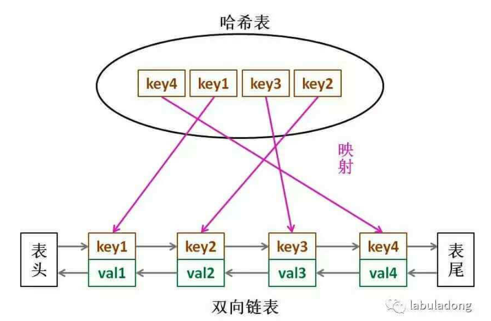

# LRU&LFU

## LRU
[Leetcode Q146](java_src/146.LRU缓存机制.java) LRU缓存机制 [大佬分析](https://labuladong.gitbook.io/algo/shu-ju-jie-gou-xi-lie/lru-suan-fa)
```
LRU 算法的核心数据结构是使用哈希链表 LinkedHashMap，首先借助链表的有序性使得链表元素维持插入顺序，同时借助哈希映射的快速访问能力使得我们可以在 O(1) 时间访问链表的任意元素。

分析上面的操作过程，要让 put 和 get 方法的时间复杂度为 O(1)，我们可以总结出 cache 这个数据结构必要的条件：
1、显然 cache 中的元素必须有时序，以区分最近使用的和久未使用的数据，当容量满了之后要删除最久未使用的那个元素腾位置。
2、我们要在 cache 中快速找某个 key 是否已存在并得到对应的 val；
3、每次访问 cache 中的某个 key，需要将这个元素变为最近使用的，也就是说 cache 要支持在任意位置快速插入和删除元素。
那么，什么数据结构同时符合上述条件呢？哈希表查找快，但是数据无固定顺序；链表有顺序之分，插入删除快，但是查找慢。所以结合一下，形成一种新的数据结构：哈希链表 LinkedHashMap。
LRU 缓存算法的核心数据结构就是哈希链表，双向链表和哈希表的结合体。这个数据结构长这样：
```


## LFU
[Leetcode Q460](java_src/460.LFU缓存.java) LFU缓存 [大佬分析](https://labuladong.gitbook.io/algo/shu-ju-jie-gou-xi-lie/lfu)
```
一定先从最简单的开始，根据 LFU 算法的逻辑，我们先列举出算法执行过程中的几个显而易见的事实：
1、调用 get(key) 方法时，要返回该 key 对应的 val。
2、只要用 get 或者 put 方法访问一次某个 key，该 key 的 freq 就要加一。
3、如果在容量满了的时候进行插入，则需要将 freq 最小的 key 删除，如果最小的 freq 对应多个 key，则删除其中最旧的那一个。
好的，我们希望能够在 O(1) 的时间内解决这些需求，可以使用基本数据结构来逐个击破：
1、使用一个 HashMap 存储 key 到 val 的映射，就可以快速计算 get(key)。
HashMap<Integer, Integer> keyToVal;
2、使用一个 HashMap 存储 key 到 freq 的映射，就可以快速操作 key 对应的 freq。
HashMap<Integer, Integer> keyToFreq;

3.1、首先，肯定是需要 freq 到 key 的映射，用来找到 freq 最小的 key。
3.2、将 freq 最小的 key 删除，那你就得快速得到当前所有 key 最小的 freq 是多少。想要时间复杂度 O(1) 的话，肯定不能遍历一遍去找，那就用一个变量 minFreq 来记录当前最小的 freq 吧。
3.3、可能有多个 key 拥有相同的 freq，所以 freq 对 key 是一对多的关系，即一个 freq 对应一个 key 的列表。
3.4、希望 freq 对应的 key 的列表是存在时序的，便于快速查找并删除最旧的 key。
3.5、希望能够快速删除 key 列表中的任何一个 key，因为如果频次为 freq 的某个 key 被访问，那么它的频次就会变成 freq+1，就应该从 freq 对应的 key 列表中删除，加到 freq+1 对应的 key 的列表中。
```