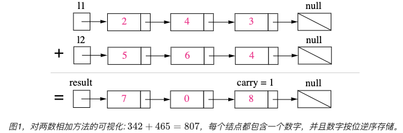
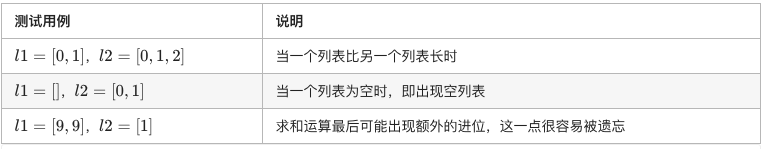

# Linked_List
>[链表高精度加法](#链表高精度加法),
>[链表的旋转与反转](#链表的旋转与反转),
>[链表的合并](#链表的合并)

## 链表高精度加法
---
[Leetcode Q2](java_src/2.两数相加.java) Add Two Numbers (两数相加)
> ByteDance, Huawei
```
Using the linkedlist to add two numbers. It is necessary to notice edge cases: null, carry
```



## 链表的旋转与反转
---
[Leetcode Q206](java_src/206.反转链表.java) Reverse Linked List (反转链表)
> ByteDance, amazon, tencent
```
迭代: 在遍历列表时，将当前节点的 next 指针改为指向前一个元素。由于节点没有引用其上一个节点，因此必须事先存储其前一个元素。在更改引用之前，还需要另一个指针来存储下一个节点。最后返回新的头引用

递归：想要先对链表尾操作，应该在对当前结点操作之前调用递归。
我子节点下的所有节点都已经反转好了，现在就剩我和我的子节点 没有完成最后的反转了，所以反转一下我和我的子节点。
如果 head 为空或者 head.next 为空，则说明没有节点或者只有一个节点了，返回本节点即可。
假设链表为1，2，3，4，5。按照递归，当执行reverseList（5）的时候返回了5这个节点，reverseList(4)中的p就是5这个节点，我们看看reverseList（4）接下来执行完之后，5->next = 4, 4->next = null。这时候返回了p这个节点，也就是链表5->4->null，接下来执行reverseList（3），代码解析为4->next = 3,3->next = null，这个时候p就变成了，5->4->3->null, reverseList(2), reverseList(1)依次类推，p就是:5->4->3->2->1->null
```

[Leetcode Q92](java_src/92.反转链表-ii.java) 反转链表 ii
```
顺序遍历m到n
// t  c
// 1->2->3->4->5
// t     c
// 1->3->2->4->5
// t        c
// 1->4->3->2->5
```

[Leetcode Q25](java_src/25.K个一组翻转链表.java) K个一组翻转链表
```
递归翻转链表
```

## 链表的合并
---
[Leetcode Q21](java_src/21.合并两个有序链表.java) 合并两个有序链表
```
合并连个有序链表，用递归和迭代的方法，分治策略里归并的步骤！
```

[Leetcode Q23](java_src/23.合并K个排序链表.java) 合并K个排序链表
```
用分治的方法进行合并。分治的策略：edge case->divide->conquer->combine，分治时候function的参数需要start end
顺序合并: 按顺序依次merge two lists
优先序列：将每个list的头结点（最小的）加入优先队列，每次remove的就是最小的node，一旦remove了就这个结点后面next的node之后全部遍历完
```

[Leetcode Q160](java_src/160.相交链表.java) 160.相交链表
```
设 A 的长度为 a + c，B 的长度为 b + c，其中 c 为尾部公共部分长度，可知 a + c + b = b + c + a。

当访问 A 链表的指针访问到链表尾部时，令它从链表 B 的头部开始访问链表 B；同样地，当访问 B 链表的指针访问到链表尾部时，令它从链表 A 的头部开始访问链表 A。这样就能控制访问 A 和 B 两个链表的指针能同时访问到交点。
```

[Leetcode Q19](java_src/19.删除链表的倒数第N个节点.java) 19.删除链表的倒数第N个节点
```
快慢指针，快指针先走n步，然后快慢一起走，直到快指针走到最后，要注意的是可能是要删除第一个节点，这个时候可以直接返回head.next
```

[Leetcode Q24](java_src/24.两两交换链表中的节点.java) 两两交换链表中的节点
```
看代码
```

[Leetcode Q725](java_src/725.分隔链表.java) 725.分隔链表
```
看代码
```