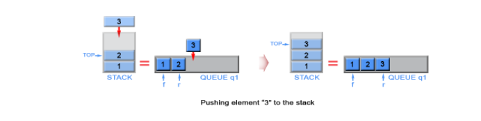
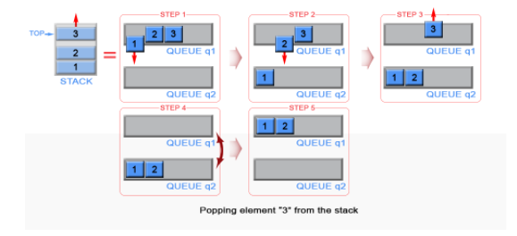

## Stack
[Leetcode Q20](java_src/20.有效的括号.java) Valid Parentheses (有效的括号)
> ByteDance
```
Using stack to solve this problem, the Symmetry of these signs
```
[Leetcode Q225](java_src/225.用队列实现栈.java) Implement Stack using Queues (用队列实现栈)
> ByteDance
```
用 先入先出 实现 先入后出。
栈是一种 后进先出的数据结构，栈内元素从顶端压入（push），从顶端弹出（pop）。一般我们用数组或者链表来实现栈，但是这篇文章会来介绍如何用队列来实现栈。队列是一种与栈相反的 先进先出的数据结构，队列中元素只能从 后端（rear）入队（push），然后从 前端（front）端出队（pop）。为了满足栈的特性，我们需要维护两个队列 q1 和 q2。同时，我们用一个额外的变量来保存栈顶元素。
弹出：我们需要把栈顶元素弹出，就是 q1 中最后入队的元素。
考虑到队列是一种 FIFO 的数据结构，最后入队的元素应该在最后被出队。因此我们需要维护另外一个队列 q2，这个队列用作临时存储 q1 中出队的元素。q2 中最后入队的元素将作为新的栈顶元素。接着将 q1 中最后剩下的元素出队。我们通过把 q1 和 q2 互相交换的方式来避免把 q2 中的元素往 q1 中拷贝。
```



[Leetcode Q445](java_src/445.两数相加 II.java) 两数相加 II
> ByteDance
```
表示指针的时候直接用ListNode result = null;有时候不一定用dummy head，这个指针和dummy head不同
这道题不允许反转链表，那么就用栈
最妙的地方是：倒着把链表连起来
curnode = ListNode(cur)
curnode.next = ans
ans = curnode
```

[Leetcode Q394](java_src/394.字符串解码.java) 394.字符串解码
```
    // 本题思路：
    // 本题中可能出现括号嵌套的情况，比如 2[a2[bc]]，这种情况下我们可以先转化成2[abcbc]，再转化成abcbcabcbc
    // 如果当前的字符为数位，解析出一个数字（连续的多个数位）并进栈
    // 如果当前的字符为字母或者左括号，直接进栈
    // 如果当前的字符为右括号，开始出栈，一直到左括号出栈，出栈序列反转后拼接成一个字符串，此时取出栈顶的数字，就是这个字符串应该出现的次数，我们根据这个次数和字符串构造出新的字符串并进栈
    // 最终将栈中的元素按照从栈底到栈顶的顺序拼接起来，就得到了答案
```

[剑指Offer30](java_src/剑指Offer30.包含min函数的栈.java) 剑指Offer30.包含min函数的栈
```
    // 本题思路：
    // 需要设计一个数据结构，使得每个元素 a 与其相应的最小值 m 时刻保持一一对应。因此我们可以使用一个辅助栈，与元素栈同步插入与删除，用于存储与每个元素对应的最小值。
    // 当一个元素要入栈时，我们取当前辅助栈的栈顶存储的最小值，与当前元素比较得出最小值，将这个最小值插入辅助栈中；
    // 当一个元素要出栈时，我们把辅助栈的栈顶元素也一并弹出；
    // 在任意一个时刻，栈内元素的最小值就存储在辅助栈的栈顶元素中。
```

[剑指Offer09](java_src/剑指Offer09.用两个栈实现队列.java) 剑指Offer09.用两个栈实现队列
```
    // 本题思路：
    // 维护两个栈 stack1 和 stack2，其中 stack1 支持插入操作，stack2 支持删除操作
```
