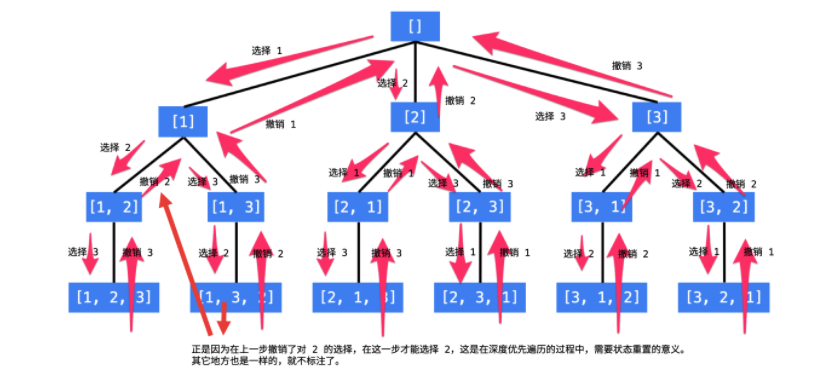

## 回溯算法
[大神的总结：直接看这个](https://labuladong.gitbook.io/algo/di-ling-zhang-bi-du-xi-lie/hui-su-suan-fa-xiang-jie-xiu-ding-ban)

碰到这种要几个方案的一般就是回溯算法

回溯算法就是个多叉树的遍历问题，关键就是在前序遍历和后序遍历的位置做一些操作，算法框架如下：
写 backtrack 函数时，需要维护走过的「路径」和当前可以做的「选择列表」，当触发「结束条件」时，将「路径」记入结果集。

回溯算法的框架：
```
result = []
def backtrack(路径, 选择列表):
    if 满足结束条件:
        result.add(路径)
        return
    
    for 选择 in 选择列表:
        做选择
        backtrack(路径, 选择列表)
        撤销选择
```
[Leetcode Q46](java_src/46.全排列.java) 全排列
> Huawei
```
典型的回溯算法：直接看图
```


[Leetcode Q51](java_src/51.n皇后.java) n皇后
```
皇后可以攻击同一行、同一列、左上左下右上右下四个方向的任意单位。
这个问题本质上跟全排列问题差不多，决策树的每一层表示棋盘上的每一行；每个节点可以做出的选择是，在该行的任意一列放置一个皇后。
直接套用框架
```

[Leetcode Q494](java_src/494.目标和.java) 494.目标和
```
关键就是搞清楚什么是「选择」，而对于这道题，「选择」不是明摆着的吗？对于每个数字 nums[i]，我们可以选择给一个正号 + 或者一个负号 -，然后利用回溯模板穷举出来所有可能的结果，数一数到底有几种组合能够凑出 target 不就行了嘛？

```

子集/排列/组合问题
---

[Leetcode Q78](java_src/78.子集.java) 78.子集
```
回溯算法
子集问题可以利用数学归纳思想，假设已知一个规模较小的问题的结果，思考如何推导出原问题的结果。也可以用回溯算法，要用 start 参数排除已选择的数字。
```

[Leetcode Q90](java_src/90.子集II.java) 90.子集II
```
回溯算法
```

[Leetcode Q46](java_src/46.全排列.java) 46.全排列
```
回溯算法
排列问题是回溯思想，也可以表示成树结构套用算法模板，不同之处在于使用 contains 方法排除已经选择的数字，前文有详细分析，这里主要是和组合问题作对比。
```

[Leetcode Q47](java_src/47.全排列II.java) 47.全排列II
```
回溯算法 去重剪枝
```

[Leetcode Q77](java_src/77.组合.java) 77.组合
```
回溯算法 去重剪枝
```

[Leetcode Q39](java_src/39.组合总和.java) 39.组合总和
```
回溯算法
```

[Leetcode Q22](java_src/22.括号生成.java) 22.括号生成
```
    // 本题思路：
    // 其实就是回溯算法，只不过加了一些限定条件
    // 选择列表为'('和')'
    // 限定条件为添加开括号的条件为开括号还不够，添加闭括号的条件为闭括号数量小于开括号数量
    // track完成的条件为长度为n*2
```

[剑指Offer38](java_src/剑指Offer38.字符串的排列.java) 剑指Offer38.字符串的排列
```
    // 本题思路：
    // 全排列II
    // 字符数组里有重复的元素，需要去重
```

[剑指Offer12](java_src/剑指Offer12.矩阵中的路径.java) 剑指Offer12.矩阵中的路径
```
    // 本题思路：
    // 遇到目标单词的首字母就开始dfs
```