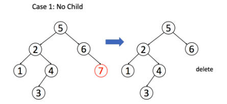
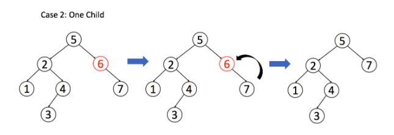
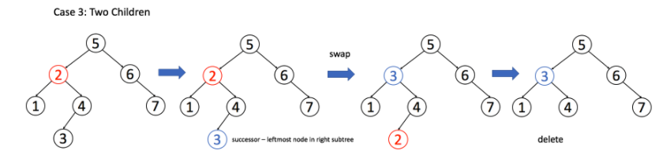

## 二叉搜索树操作
[大佬的技术总结](https://labuladong.gitbook.io/algo/shu-ju-jie-gou-xi-lie/er-cha-sou-suo-shu-cao-zuo-ji-jin)

二叉树算法设计的总路线：把当前节点要做的事做好，其他的交给递归框架，不用当前节点操心。
如果当前节点会对下面的子节点有整体影响，可以通过辅助函数增长参数列表，借助参数传递信息。

二叉树遍历的框架：
```
void traverse(TreeNode root) {
    // root 需要做什么？在这做。
    // 其他的不用 root 操心，抛给框架
    traverse(root.left);
    traverse(root.right);
}
```
二叉搜索树遍历的框架：
```
void BST(TreeNode root, int target) {
    if (root.val == target)
        // 找到目标，做点什么
    if (root.val < target) 
        BST(root.right, target);
    if (root.val > target)
        BST(root.left, target);
}
```

[Leetcode Q100](java_src/100.相同的树.java) 相同的树
```
判断两棵二叉树是否完全相同
```

[Leetcode Q98](java_src/98.验证二叉搜索树.java) 验证二叉搜索树
```
这启示我们设计一个递归函数 helper(root, lower, upper) 来递归判断，函数表示考虑以 root 为根的子树，判断子树中所有节点的值是否都在 (l,r)(l,r) 的范围内（注意是开区间）。如果 root 节点的值 val 不在 (l,r)(l,r) 的范围内说明不满足条件直接返回，否则我们要继续递归调用检查它的左右子树是否满足，如果都满足才说明这是一棵二叉搜索树。

那么根据二叉搜索树的性质，在递归调用左子树时，我们需要把上界 upper 改为 root.val，即调用 helper(root.left, lower, root.val)，因为左子树里所有节点的值均小于它的根节点的值。同理递归调用右子树时，我们需要把下界 lower 改为 root.val，即调用 helper(root.right, root.val, upper)。

```

[Leetcode Q700](java_src/700.二叉搜索树中的搜索.java) 二叉搜索树中的搜索
```
套用二叉搜索树遍历的框架
```

[Leetcode Q701](java_src/701.二叉搜索树中的插入操作.java) 二叉搜索树中的插入操作
```
套用二叉搜索树遍历的框架
```

[Leetcode Q450](java_src/450.删除二叉搜索树中的节点.java) 删除二叉搜索树中的节点
```
TreeNode deleteNode(TreeNode root, int key) {
    if (root.val == key) {
        // 找到啦，进行删除
    } else if (root.val > key) {
        root.left = deleteNode(root.left, key);
    } else if (root.val < key) {
        root.right = deleteNode(root.right, key);
    }
    return root;
}

找到目标节点了，比方说是节点 A，如何删除这个节点，这是难点。因为删除节点的同时不能破坏 BST 的性质。有三种情况
情况 1：A 恰好是末端节点，两个子节点都为空，那么它可以当场去世了。
情况 2：A 只有一个非空子节点，那么它要让这个孩子接替自己的位置。
情况 3：A 有两个子节点，麻烦了，为了不破坏 BST 的性质，A 必须找到左子树中最大的那个节点，或者右子树中最小的那个节点来接替自己。我们以第二种方式讲解。
```


