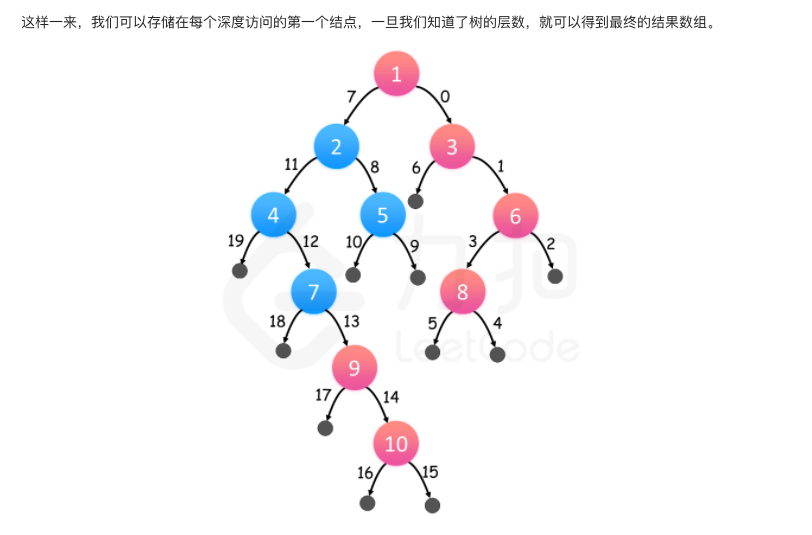
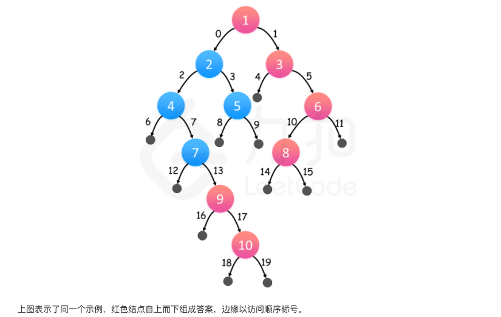

## 深度优先搜索 Depth-first Search
[Leetcode Q200](java_src/200.岛屿数量.java) Number of Islands (岛屿数量) 
> Huawei
```
这道题就明显是识别图的连通分量，直接用dfs就完事了
```
[Leetcode Q199](java_src/199.二叉树的右视图.java) 二叉树的右视图 

```
DFS: 我们对树进行深度优先搜索，在搜索过程中，我们总是先访问右子树。那么对于每一层来说，我们在这层见到的第一个结点一定是最右边的结点。
```

```
BFS: 我们可以对二叉树进行层次遍历，那么对于每层来说，最右边的结点一定是最后被遍历到的。二叉树的层次遍历可以用广度优先搜索实现。
```

