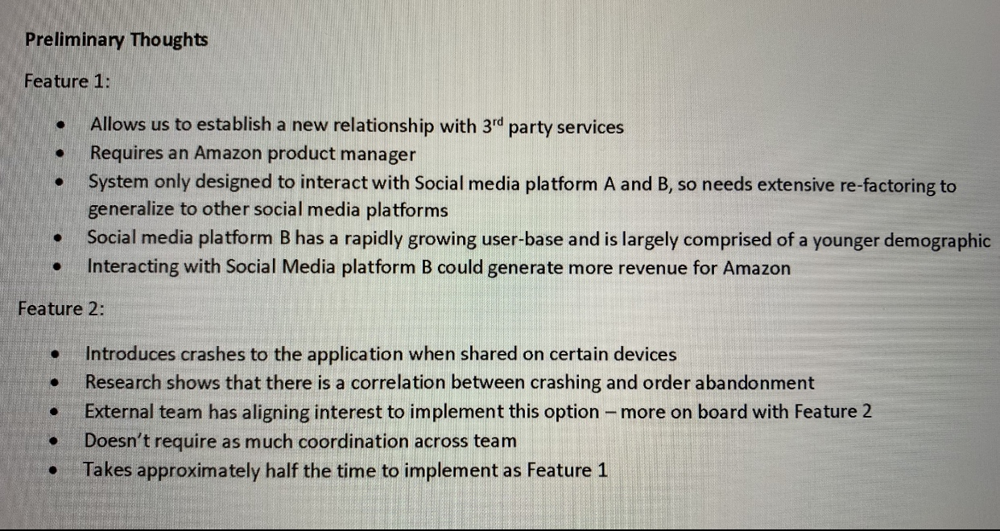

# 亚麻


[Leetcode Q1268](java_src/1268.搜索推荐系统.java) 1268.搜索推荐系统
```
暴力求解
```

[Leetcode Q937](java_src/937.重新排列日志文件.java) 937.重新排列日志文件
```
排序
```

[Leetcode Q763](java_src/763.划分字母区间.java) 763.划分字母区间
```
贪心算法，看代码
```

[Leetcode Q1328](java_src/1328.破坏回文串.java)

[题目描述](https://leetcode-cn.com/problems/break-a-palindrome/)
```
看代码
```

[Leetcode Q1120](java_src/1120.子树的最大平均值.java) 1120.子树的最大平均值
```
看代码
```
[employment tree](java_src/oa2_employment_tree.java) employment tree

[题目描述](https://leetcode.com/discuss/interview-question/797541/Amazon-Online-Assessment-2-SDE-1)
```
看代码
```

[data center grid/Leetcode Q1135](java_src/最小生成树oa_q1135.java)

[题目描述](https://leetcode.com/discuss/interview-question/797541/Amazon-Online-Assessment-2-SDE-1)
```
kruskal + union-find
```

[仓库里最近的两个机器人](java_src/closestPointPairs.java)

[题目描述](https://leetcode.com/discuss/interview-question/799431/AMAZON-OA-2021-NEW-GRAD)
```
用分治策略
```

[供应商 仓库 利润最大](java_src/oa2profit.java)

[题目描述](https://leetcode.com/discuss/interview-question/799615/Amazon-OA2-New-Grad-2021-or-Sorting-Problem)
```
最大堆
```

[maximum_fill_truck](java_src/maximum_fill_truck.java)

[题目描述](https://leetcode.com/discuss/interview-question/793606/Amazon-OA-Question)
```
最小堆
```

[forming_team 找专家](java_src/forming_team.java)

[题目描述](https://www.1point3acres.com/bbs/thread-661422-1-1.html)
```
全组合问题
```

[items_from_given_page 商品 名字/相关性/价格](java_src/items_from_given_page.java)

[题目描述](https://leetcode.com/discuss/interview-question/801590/Amazon-New-Grad-2021-OA2)
```
优先队列，排序
```

[largest_item_association_group](java_src/largest_item_association_group.java)

[题目描述](https://leetcode.com/discuss/interview-question/783947/Amazon-or-OA-or-SDE-1-or-Aug-2020)
```
寻找最大的连通分量
```

[k-1distinct_substr](java_src/k-1distinct_substr.java)

[题目描述](https://leetcode.com/discuss/interview-question/783947/Amazon-or-OA-or-SDE-1-or-Aug-2020)
```
看代码
```

[破坏回文串](java_src/破坏回文串.java)

[题目描述](https://leetcode-cn.com/problems/break-a-palindrome/)
```
看代码
```

[critical_connections](java_src/critical_connections.java) 没搞懂的一题

[题目描述](https://leetcode.com/discuss/interview-question/372581)
```
看代码
```

[max_Minima_Disk_Space](java_src/max_Minima_Disk_Space.java)

[题目描述](https://www.1point3acres.com/bbs/thread-661621-1-1.html)
```
看代码
```

[不同id的最少数量](java_src/不同id的最少数量.java)

[题目描述](https://www.1point3acres.com/bbs/thread-661621-1-1.html)
```
看代码
```

[服务器集群数量](java_src/服务器集群数量.java)

[题目描述](https://www.1point3acres.com/bbs/thread-662080-1-1.html)
```
看代码
```

[字符串分割质数方案](java_src/字符串分割质数方案.java)

[题目描述](https://www.1point3acres.com/bbs/thread-661768-1-1.html)
```
看代码
```

[商店旋转门](java_src/商店旋转门.java) 没搞懂的一题

[题目描述](https://leetcode.com/discuss/interview-question/798231/Amazon-OA-for-SDE1)
```
看代码
```

[Two_sum_unique_pairs](java_src/Two_sum_unique_pairs.java) 没搞懂的一题

[题目描述](https://leetcode.com/discuss/interview-question/372434)
```
看代码
```

[寻找最近的城市](java_src/寻找最近的城市.java)

[题目描述](https://www.1point3acres.com/bbs/thread-661422-1-1.html)
```
看代码
```

---
Module1:
```
交通算法对比：3问 上来播一个视频，一女的说让你review两个交通的算法deliver货物用。这两个算法是根据最近100天的各种数据弄出来的。要求每天至少送80个，每个route每天小于200miles。然后给你两个表对应两个算法在最近3天的结果。包括不同的routes，有东西南北四个区域，有不同的时间段，每个时间段的deliver数量，总体每个route deliver的数量和milage。问你选哪个好。。两个明显都不符合。alg1特点是deliver数量比较稳定，但是milage有的超了很多。alg2是milage超的不多，但是deliver比较不稳定。少的60几个，多的100多个。我选的倾向于deliver数量稳定的alg1+收集更多数据。然后她问你大概怎么做判断（好像是这个，记不太清了） 我选的问milage和deliver数量这两个有没有priority。紧接着她又给你发过来两个表，一个是100天的交通数据（就是研发算法用的），另一个是近三天的交通数据。可以明显看出总体上3天的数据比100的交通流量要大。结合之前两个表，最后问你哪个algo好。我个人觉得deliver数量比milage重要 毕竟车开得远顶多绕电路费油 但是deliver不到的话客户就收不到邮件了。所以最后我还是选的1.
```

制定deliver route plan 需要满足1.enable 80 deliveries per day 2.should not exceed 200 miles

有两个备选方案，第一个每天够了80但是mile数超了好多，第二个mile数没超但送货数量不够

Q1 问你选哪个 五个statement按effective级别排序

每个选项可以评1~5分，most effective 是5，然后1是least effective

Q2 问你如果可以request additional info 哪个更重要 （我选了BC）

A 会影响efficiency的future trends data B mile数和delivery数哪个重要 C 过去100天的data D 城市地图 E 过去3天的performance data

Q3 给了你过去3天和100天的traffic data 问你planA和B哪个好

我真的不知道哪个好啊！！！最后犹豫半天选了第一个 因为送货数量pattern比较符合traffic，也不知道对不对

---
Module2:
```
1. 好像是2问，有3个人给你code review。2个人觉得还行。第三个拜仁哥说你的designing pattern错了 必须整个推倒了重写。这时候manager问你怎么做。可以安排会议跟他们商量。 然后manager出现在一个视频里说，刚刚的会议有很多内容，你没记住怎么办？可以找拜仁大哥花30mins再过一遍，可以自己理解多少写多少，可以找另外两个review的人问。

```

同组的两个人说你的code不错，一个人说不行要重做

Q1问你怎么办

选项大致就是 A 有人approve了所以就按我的来 B 你说不对就按你的来吧 C meeting决定
应该是选和这个人单独offline meeting那个选项 因为接下来就和他讨论了

Q2 讨论到了下班，你还是很confused, 但记了好多笔记 问你怎么办 排序

A 明天再full time meeting B 新方法太难了还是用旧的 C 回家过一遍笔记把能写的都写出来 不能写的记下来明天接着meeting D do as much as you can E找那两个说你做的不错的同事帮你 F 和这人再meet三十分钟（这是要把他累死啊）

---
Module3:
```
2，一个人给你发信说要加两个features 他找external team给每个feature一些feedback，就是加这个feature的pro和con。feature1是能增加Amazon的revenue，有一个social media平台有很多年轻人，所以以后对吸引年轻人有帮助，但是system只支持两个平台 所以要加的话以后要对代码做refactor才能用到更多的平台上。 Feature2是对自己team沟通好用，external team估计会喜欢这个feature。然后分别问你f1和f2的pro是什么。有点像雅思阅读。。有的选项很模棱两可。但是注意题目上写着让你选几个选项呢 我记得f1是选4个，f2是2个。很明显f1对amazon有利，f2对自己人方便。最后说只能应用一个你选哪个，当然选f1了，得牺牲小我成全公司啊。

```

给你两个要implement的feature



Q1 选出4个feature1的优点

Q2 选出2个feature2的优点

两个都不难 比gre阅读简单

Q3只能implement一个 你选哪个 应该是排序 我选了feature1 应该是对的 因为最后决定做1了

Q4 有个senior engineer说我们要implement feature 2 问这时候你怎么做

A 和他还有high level decision makers开会 B 坚持做feature1因为已经讨论过pros and cons了 C 和这人还有external team开会 D 全组投票 E 因为他比你有经验所以听他的 F 问manager

Q5 manager过来说我们要做feature1，而且要在social media C D E上实现，但是ddl很紧张，问你怎么做 排序

A 直接跟manager说做不了 需要更多resource B 因为ddl紧张所以不test了 C 排序这三个social media的重要性 先做重要的 把不重要的留到ddl之后 D 先做着 过几周再找manager说你做不完了 需要additional resource（这个不太好吧） E 自己找team member寻求帮助 F 直接驳回 建议只work on 1-2 social medias G 自己work overtime

---
Module4:
```
4，3问 一个technician说客户抱怨有的product打不开。他发现网页没load进去。1问你除了log你觉得还要什么信息比较有用(customer location, customer session id, url啥的）。然后这哥们给你发过来一个java的error log，log上很明显写着customer rank和customer review的array长度不一样导致错误，就选这个就行了。

```

亚麻的product page出问题了，有customer无法查看product info，你manager让你解决


Q1 What additional info would be helpful? 排序

A customer region B URL C Screenshot of error page D session ID E Browser versions

Q2 你怎么fix this bug？ 排序

A search the logs B look at metrics(latency, error counts, # of requests....) C 手动去看code然后debug（好猛） D 分析有可能会fail的request的log E 跟technician说这是偶然现象 自己会fix F 只分析failed request不看valid request G 因为太urgent了所以立刻去向大佬请教

Q3 给了log data 让你分析到底哪出错了

这题应该选unequal number of rate and review

---
Module5: 这个module好好笑
```
5，3问你的manager说有个debug的事让你做，估计会花你3天时间。product manager说这个你今天就应该能弄完。你说今天就算弄完了也没时间做test。让你选怎么办。就是跟这个跟那个开会啥的选项。 后来你知道那个product manager开始pressure一个别的team的叫Dai Wang的人，也是因为类似的问题。但是是因为Dai Wang没做测试。DW说这么简单的东西不用测试肯定没问题（作死）。问你遇到这种情况会怎么做？比如给他看你之前惨痛的教训（error log）啊，找manager们开会啊，问senior如果有colleague不test就像push out code这种情况应该怎么办，竟然还有选项是report到DW的manager说他丫的不test代码想push。。。第3问，某天到下班的时间，Dai Wang来找你因为办公室只有你在，说他sb了。因为没test，之前push的code出错了，导致客户没法下订单了！！！问你这时候首先要做什么？有不理他打卡回家，或者说“I told u so”，或者自己尝试解决。我选的马上联系senior这种情况应该怎么办（没有马上联系manager的选项）。

```

你要debug一个东西，manager跟你说大概需要三天，但PM让你今天就交因为他觉得是个小bug 可以不用test

Q1 你怎么办 排序

A 跟senior eng讨论一下risk再决定 B 还是先test过后再release C 跟PM manager开会再决定 D 都有理所以重新问问你manager E 相信PM 不test了

Q2 一周以后你同事也遇到了相同情况，他想push without test，你怎么办 排序

这道题选项记不太清了 大致就以下几种： A 把你上次情况跟他说，劝他别这样 B 不关我事 C 建议他找senior eng讨论下 D 找他manager告状（当时看到这个选项笑得停不下来）

Q3 马上下班时候收到同事msg，他没听你的，直接push code了，结果翻车了（哈哈哈哈哈哈哈哈哈哈）你怎么办 排序

A 早跟你说了你不听 B ask for more info about the issue C 帮助他revert code change D 帮助他push另一个code把问题立刻解决（这真的能做到吗。。） E 找senior eng求救 F ignore the message and sign off（这个也好好笑）

Q4 manager给你发邮件说让你come up with a plan to make sure this doesn't happen again 而且希望你把这个任务prioritize 你怎么搞 单选

A 跟他说我做完手头的再去做（作死啊） B write up document详细描述 C set up automations来预防 D 规定以后每个code change都必须有至少一个peer review  E 和manager，PM再好好探讨下不test的风险（打PM脸啊这是）F 让之前翻车的同事跟你一起弄

---
[参考](https://www.1point3acres.com/bbs/forum.php?mod=viewthread&tid=445121&highlight=amazon%2Boa)

Work simulation(原则有先后顺序)
目前两大做题中最重要原则：
1.requirement排在第一，deadline第二。
2.有manager出现的选项无脑选manager，manager就是一个组的地头蛇。

Amazon9条主要原则

原则1：客户是上帝，requirement优先，任何影响上帝的事情都不能干，
        如某个requirement影响了上帝的体验，
        你就是死键盘上也不能砍了，宁愿miss deadline

原则2：为长远考虑，即客户几年之后可能会出现的需求也要考虑到，
        不会为了交付短期的deadline，
        而牺牲长期的价值。（比如 global api  和 local api）

原则3：最高标准，“最高”对应上面的“长远”。

原则4：一般情况，能请示manager就请示manager，manager一般不会出错

原则5：速度很重要，决策和行动都可以改变，因此不需要进行过于广泛的推敲
        ，但提倡在深思熟虑下进行冒险。

原则6：不需要一定要坚持“非我发明”，需求帮助也是可以的，四处寻找创意
        ，并且接受长期被误导的可能

原则7：敢于承担责任，任劳任怨，比如领导说谁会java，你会你就跳出来说我会

原则8：对问题刨根问底，探究细节

原则9：服从大局（团队比个人重要）

打分不是关键，排序才是关键。

大部分情况下其实并没有deadline 和 requirement谁更好，更多还是在
这个组合中你对ddl 和 requirement整体的权衡。

每个选项可以评1~5分，most effective 是5，然后1是least effective

刚开始让你看一些介绍amazon工作环境的视频
1.上来给一段video，场景是项目的晨会，就是把team正在推进的项目描述一下，
期间会有多个项目和你有关系，后面会遇到
2.进入工作界面，可以看到接受到邮件，接收到的instant message
3.进入工作状态。会有同事给你发邮件，发信息。需要你对他们提出的问题做一些判断，也就是给解决问题的选项评分
4.一个21题，有log分析bug，有给报告出问题结论，有判断项目 走向的

---
情境1：Response toAaron and Jacob (1)

给图书馆写图书推荐系统，关于book api
两个人，在表达不同的观点

选择：tell me more
```
Can you tell me more about what you're talking about?
```

一开始其实每个人都在强调自己是对的，即使有一个人更对一些，
也应该选tell me more（原则8），选了之后会得到更多信息

---
情境2：Response to Aaron and Jacob (2) & (3)

选择：选图书馆的服务器有没有开放关于实体书的api
```
You said we have an internal database of both digital and physical books. How did we get the physical book data if the Book Database API doesn't give it to us?
```
两个小哥讨论图书推荐的api应该是自己做还是用现成的。
自己做api覆盖面广，但是due赶不上，别人做的能赶上due。
requirement优先（原则2），tell me more层层递进

选择：为长远考虑，即客户几年之后可能会出现的需求也要考虑到，不会为了交付短期的deadline，而牺牲长期的价值。
```
I recommend you go with Jacob's solution. We should miss the deadline to build our own service andmeet all the requirements.
```

---
情境3：Response to Nadia

经理说咱们最近服务器老挂，什么情况？
先选看internal bug的记录

选 I think service 3 is the problem,
but I would like to see another report to confirm
烙印，义正言辞说自己做了20年服务器，不可能有错误，
刚刚调试过服务器，不可能是内部错误。

选自己去查，问题的关键在于不要麻烦别人
增加开发过程中测试的时间/测试覆盖更多case，放5
写Manuel test，放3
还有个是unit test，也放3
增加QA的人手，放1
让客户来当小白鼠发现问题，放1
```
5 - Increase timealotted for testing in overall lifecycle
5 - Update automatedend-to-end tests to include broader data coverage
3 - Write more unittests to include edge cases
3 - Have team membersperform more manual testing before checking code in
1 - Increase the sizeof QA team
1 - Have more usertesting in beta phase
```
---
情境4：Amazon recommendation system item

给你推荐一些你感兴趣的item，第一个issue总是失败，
第二个issue总是显示germany

testcase就是地里说的那些email没有初始化，

第一个问题是因为username 太长所以一直报错。
```
Database field storingusername is too short
```
第二个问题是因为他用proxy的name来决定是不是语言了。
```
Site is using proxyserver location to determine displayed language
```

---
情境5：德国amazon除了什么问题，让你看log回答问题。问你大概哪里除了问题
亚马逊推荐广告，给英国人推了德文广告，给你log文件，
问你可能在哪，找bug in error log

情境6：员工们讨论case media network服务器最近好多compliants
有德国的，有invalid recommendation，有返回404，
找出错原因的相同点
```
What were the internal test case results?
```
德语因为服务器， 一个因为用户名太长，一个是有些用户的语言变成德语

---
情境7：Response toRavi (1)

具体客户ddl 只有两周，两个方案，延到四周，做完整。

另一个说先实现一部分功能做个demo，再慢慢做。
先做demo放5，按部就班四周放3， 通知其他组说两走做不完接着做美国放1
```
5 - Take two weeks to create a prototype of the feature to demo at the conference, then take theadditional two weeks needed to fully complete the feature
4 - Take a day to investigate whether adding additional resources would allow us to meet the original timeline, and re-evaluate afterwards
3 - We should miss the conference and increase the timeline to four weeks because we have four weeks of work
2 - We can still hit the two week deadline without any changes by working harder and putting in overtime
1 - Tell the Localization team if can't be done in the timeline, so we should go ahead with the US launch and delay the global launch even though it means adding anadditional week of effort to the four week estimate
```

---
情境8：Schedule the design review meeting (1)

估计项目开发时间

Manager放5，找有经验的人请教4，上网查资料或是先做一段时间再估计都放3，
还有其他裸上的就1。

```
5 - Let's ask our manager how we should go about developing an estimate
4 - We should consult a coworker who has more relevant experience on this type of task
3 - We should conduct our own investigation utilizing online research materials and internaldocumentation
2 - We should work for a couple of days to gauge our progress, and then complete our estimate from there
1 - We can take our best guess at an estimate on our own
```
---

情境9：Roadmap

一个项目时间表设计

说你是这里最会用什么语言的，比如java

```
Since you know moreabout the programming language than anyone else, you revise the estimate forporting to Java.
```
---
情境10：Schedule the design review meeting (2)

安排会议

视频会议 5   三个老二开会和老二去找老大开会 3   推迟会议和邮件开会 1

```
5 - Set-up videoconferencing to include all POC's regardless of their physical location
4 - Agree to schedule the meeting at Xavier's location an hour away
3 - Ask all parties to identify a back-up person who could meet during a designated time
3 - See if there is a backup person on the Localization Team that can meet
2 - Discuss the design review over email
1 - Agree to postpone the design review for two weeks when all parties have more availability
```

---
情境11：Response for meeting the deadline

搞个数据库
两周时间可以搞个数据，**ben可以帮忙，大腿priya可以帮，但是要等一周半
报告manager放5，和**合作等大腿放4，合作/等大腿是3
自己单干，cut feaure都是1
```
5 - Tell your manager you will not be able to complete the project in the time avaliable
4 - Work on the project with Ben, being sure to watch his work closely because of his lack of experience
3 - Start working onthe project right away with Ben. Then ask Priya to contribute what she can whenshe is avaliable
3 - Work on the project on your own until Priya is available, then continue to work on it together
2 - Work on the project on your own, putting in extra effort to finish on time
1 - Cut features from the product so you will be able to meet the two week deadline
```

---
情境12：Upgrade 系统是否升级

做两个feature，一个让100%用户爽，一个让20%用户爽，

但要升级系统，升级系统自己组会爽，但是升级会推迟做的feature，

不升级吧，升级之后还得做一遍

这题的中心是不升级，先做feature，先让用户爽。

先做100的feature再升级，再做20的feature，放5
不升级，因为我们承诺要做feature，放4。
不升级，要搞定feature，可以以后推了其他ddl再升级，放3
不升级，因为对其他组没影响，我们应该focus在request上面，放2
升级，推迟这两个feature的ddl，因为升级造福子孙后代，放2
升级，不然要做两次，放1
这题的关键在于升不升级，要坚定的站在一边
```
5 - I think we should perform the upgrade. As a compromise, we can include the gift recommendation feature the Retail Website Team wants by the deadline and then complete the upgrade. We can finish the seasonal-based gift recommendations feature after the deadline

4 - We should not perform this upgrade at this point in time. We promised the Retail Website Team we would have their new features complete by the proposed deadline. Let's postpone the upgrade to another time

3 - We should not perform this upgrade at this point in time. Our top focus is meeting our agreed upon commitment with the Retail Website Team, so we should finish that first.We can focus on the upgrade afterwards by pushing our deadlines for some of our other projects

2 - We should not perform the upgrade because it will not have a significant impact on the Retail Website Team's experience. We should focus on the Retail Website Team's requests

2 - I think we should perform the upgrade. The right thing to do is push back on the Retail Website Team because it will allow us to more efficiently serve the customer and the customer will be helped in the long run.

1 - I think we should perform the upgrade. The right thing to do is push back on the Retail Website Team because it will keep our team from having to do the same work twice
```

---
情境13：新产品设计
给8周时间，选择题，让你pick up 一个features的组合要求利益最大化，
每个feature都有相应的价值，H >> M >> L 都代表远大于
首先ddl是前提，中位数不能超过8太多，那样的话就算feature再多也没意义，
同价值，按照ddl排序，同ddl按照价值排序。
```
5 - A, D, F
4 - A, B, D
3 - A, C, F
3 - F, G
2 - A, C, D, G
1 - A, C, D, G, H
```

情境17：代码分析
三段一长选最长

---
[参考](https://www.1point3acres.com/bbs/thread-474434-1-1.html)


Q1: Schedule the design reviewmeeting (1)
```
1 - We can take ourbest guess at an estimate on our own
2 - We should work fora couple of days to gauge our progress, and then complete our estimate fromthere
4 - We should consulta coworker who has more relevant experience on this type of task
3 - We should conductour own investigation utilizing online research materials and internaldocumentation
5 - Let's ask ourmanager how we should go about developing an estimate
```

---
Q2: Schedule thedesign review meeting (2)
```
3 - Ask all parties toidentify a back-up person who could meet during a designated time
3 - See if there is abackup person on the Localization Team that can meet
5 - Set-up videoconferencing to include all POC's regardless of their physical location
1 - Agree to postponethe design review for two weeks when all parties have more availability
2 - Discuss the designreview over email
4 - Agree to schedulethe meeting at Xavier's location an hour away
```

---
Q3: Response toRavi (1)
```
3 - We should miss theconference and increase the timeline to four weeks because we have four weeksof work
4 - Take a day toinvestigate whether adding additional resources would allow us to meet theoriginal timeline, and re-evaluate afterwards
1 - Tell theLocalization team if can't be done in the timeline, so we should go ahead withthe US launch and delay the global launch even though it means adding anadditional week of effort to the four week estimate
5 - Take two weeks tocreate a prototype of the feature to demo at the conference, then take theadditional two weeks needed to fully complete the feature
2 - We can still hitthe two week deadline without any changes by working harder and putting inovertime
```

---
Q4: Response toRavi (2)
```
Begin yourinvestigation using the old error logs, but tell Ravi he will need to run thenew logs if the old logs aren't useful
```

---
Q5: Response toAaron and Jacob (1)
```
Can you tell me moreabout what you're talking about?
```

---
Q6: Response toAaron and Jacob (2)
```
You said we have aninternal database of both digital and physical books. How did we get thephysical book data if the Book Database API doesn't give it to us?
```

---
Q7: Response toAaron and Jacob (3)
```
I recommend you gowith Jacob's solution. We should miss the deadline to build our own service andmeet all the requirements.
```

---
Q8: Roadmap
```
Since you know moreabout the programming language than anyone else, you revise the estimate forporting to Java.
```

---
Q9: Response toNadia
```
What were the internaltest case results?
```

---
Q10: Most likelycause of German language issue
```
Site is using proxyserver location to determine displayed language
```

---
Q11: Most likelycause of invalid recommendation issue
```
Database field storingusername is too short
```

---
Q12: Log traceinvestivation success
```
5 - Increase timealotted for testing in overall lifecycle

5 - Update automatedend-to-end tests to include broader data coverage

3 - Write more unittests to include edge cases

3 - Have team membersperform more manual testing before checking code in

1 - Increase the sizeof QA team

1 - Have more usertesting in beta phase
```

---
Q13: Response formeeting the deadline
```
2 - Work on theproject on your own, putting in extra effort to finish on time

3 - Work on theproject on your own until Priya is available, then continue to work on ittogether

4 - Work on theproject with Ben, being sure to watch his work closely because of his lack ofexperience

5 - Tell your manageryou will not be able to complete the project in the time avaliable

1 - Cut features fromthe product so you will be able to meet the two week deadline

3 - Start working onthe project right away with Ben. Then ask Priya to contribute what she can whenshe is avaliable
```

---
Q14: Response forcompleting this work on time
```
4 - Work with theCustomer Incentives Team to identify the critical features that they need bythe deadline, and focus on those

2 - Push the timelineback another week to ensure there is enough time for all work to be completedaccurately

3 - Ask your wholeteam for help, explaining the urgency that another team is blocked

5 - Ask your managerfor help in determining the best approach to meet the new deadline

1 - Put in extra hoursyourself to make sure everything gets done on time
```

---
Q15: Upgrade
```
4 - We should notperform this upgrade at this point in time. We promised the Retail Website Teamwe would have their new features complete by the proposed deadline. Let'spostpone the upgrade to another time

2 - We should notperform the upgrade because it will not have a significant impact on the RetailWebsite Team's experience. We should focus on the Retail Website Team'srequests

3 - We should notperform this upgrade at this point in time. Our top focus is meeting our agreedupon commitment with the Retail Website Team, so we should finish that first.We can focus on the upgrade afterwards by pushing our deadlines for some of ourother projects

1 - I think we shouldperform the upgrade. The right thing to do is push back on the Retail WebsiteTeam because it will keep our team from having to do the same work twice

5 - I think we shouldperform the upgrade. As a compromise, we can include the gift recommendationfeature the Retail Website Team wants by the deadline and then complete theupgrade. We can finish the seasonal-based gift recommendations feature afterthe deadline

2 - I think we shouldperform the upgrade. The right thing to do is push back on the Retail WebsiteTeam because it will allow us to more efficiently serve the customer and thecustomer will be helped in the long run.
```

---
Q16: New productdesign
```
2 - A, C, D, G
1 - A, C, D, G, H
4 - A, B, D
3 - A, C, F
5 - A, D, F
3 - F, G
```

---
Q17: ？
```
?
```

---
Q18: Problem withProduct.wasPurchasedByUser()
```
关于shopping的代码。第一问是某个method为什么不行，答案选的performance issue。

It has performance issue
```

---
Q19: Most effectiveway of improving ShoppingCart()
```
我选的是add user.id to shoppingcart class.

Change the design of ShoppingCart by removing ShoppingCart user and making shopping cart a property of User instead

ShoppingCartClass两道题三短一长选最长，之前这么选的拿到video了。。
```

---
Q20: Five tests within ShoppingCartTest()
```
Fail - Test1 第一个是getdefualtpayment会返回null
Pass - Test2
Fail - Test3 第三个是user并没有初始化email，所以getemail会出错
Pass - Test4
Fail - Test5 第5个是 setprice的method 返回的是integer，而testcase set的是double
```


Q21: Ask Jacob aquestion
```
3 - Do any other projects depend on fixing this problem?

5 - How many customers is this affecting?

5 - How does this affect customers

4 - Are we receiving complaints from customers?

2 - How long will it take to solve this problem?

1 - If I help you with this problem, will you help me finish my work today?
```
> [逻辑1](https://wdxtub.com/interview/14520850399861.html) 重要

> [逻辑2](https://seanforfun.github.io/interview/2019/06/14/AmazonInterview.html)

> [逻辑3](https://aonecode.com/amazon-online-assessment) 答案更准/重要
---

### Reverse Second Half of Linked List
---
```
struct ListNode {
	int val;
	ListNode *next;
	ListNode(int x) : val(x), next(NULL) {}
};

ListNode *reverse(ListNode *head){
	ListNode *pre = NULL, *cur = head, *next = NULL;
	while(cur){
		next = cur->next;
		cur->next = pre;
		pre = cur;
		cur = next;
	}
	return pre;
}
ListNode *reverse2ndHalfOfLinkedList(ListNode *head){
	ListNode *fast = head, *slow = head, *pre = NULL;
	while(fast && fast->next){
		pre = slow;
		slow = slow->next;
		fast = fast->next->next;
	}
	if(!fast) pre->next = reverse(slow);
	else slow->next = reverse(slow->next);
	return head;
}
```