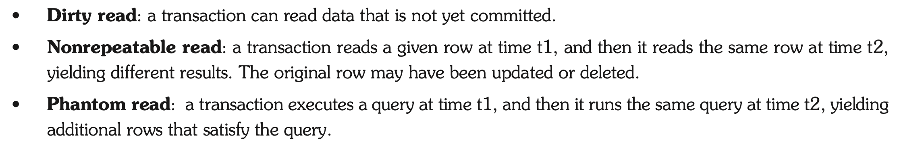
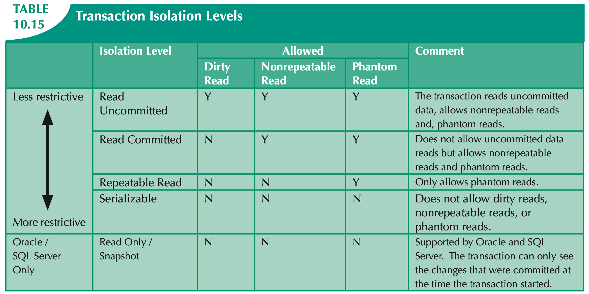

1. >数据库隔离级别以及可能出现的问题
    数据库事务的隔离级别有4个，由低到高依次为Read uncommitted 、Read committed 、Repeatable read 、Serializable

    ### Read uncommitted 读未提交
    当隔离级别设置为Read uncommitted 时，就可能出现脏读
    例子：两个并发的事务，“事务A：领导给singo发工资”、“事务B：singo查询工资账户”，事务B读取了事务A尚未提交的数据
    dirty read 脏读: 读到未提交更新的数据

    ### Read committed 读提交
    当隔离级别设置为Read committed 时，避免了脏读，但是可能会造成不可重复读和幻读。一个事务在执行过程中可以看到其他事务已经提交的新插入的记录，而且还能看到其他事务已经提交的对已有记录的更新。
    例子：两个并发的事务，“事务A：singo消费”、“事务B：singo的老婆网上转账”，事务A事先读取了数据，事务B紧接了更新了数据，并提交了事务，而事务A再次读取该数据时，数据已经发生了改变。
    Nonrepeatable read 不可重复读: 读到已经提交更新的数据，但一个事务范围内两个相同的查询却返回了不同数据。这是由于查询时系统中其他事务修改的提交而引起的。比如事务T1读取某一数据，事务T2读取并修改了该数据，T1为了对读取值进行检验而再次读取该数据，便得到了不同的结果。

    ### Repeatable read 可重复读
    当隔离级别设置为Repeatable read 时，可以避免不可重复读, 但还有可能出现幻读。一个事务在执行过程中可以看到其他事务已经提交的新插入的记录，但是不能看到其他事务对已有记录的更新。这种隔离级别使用共享锁来确保其他事务在原始查询读取行之后不会更新该行。但是，将读取新行（幻读），因为在第一个查询运行时这些行不存在。
    Phantom read 幻读: 读到已提交插入数据，幻读是指当事务不是独立执行时发生的一种现象，例如第一个事务对一个表中的数据进行了修改，比如这种修改涉及到表中的“全部数据行”。同时，第二个事务也修改这个表中的数据，这种修改是向表中插入“一行新数据”。那么，以后就会发生操作第一个事务的用户发现表中还有没有修改的数据行，就好象发生了幻觉一样。
    不可重复读和幻读的区别：幻读与不可重复读类似，幻读是查询到了另一个事务已提交的新插入数据，而不可重复读是查询到了另一个事务已提交的更新数据。简单来说，不可重复读是由于数据修改引起的，幻读是由数据插入引起的。

    ### Serializable 可串行化
    Serializable 是最高的事务隔离级别，同时代价也花费最高，性能很低，一般很少使用，在该级别下，事务顺序执行，不仅可以避免脏读、不可重复读，还避免了幻读。一个事务在执行过程中完全看不到其他事务对数据库所做的更新。当两个事务同时操作数据库中相同数据时，如果第一个事务已经在访问该数据，第二个事务只能停下来等待，必须等到第一个事务结束后才能恢复运行。

    

    