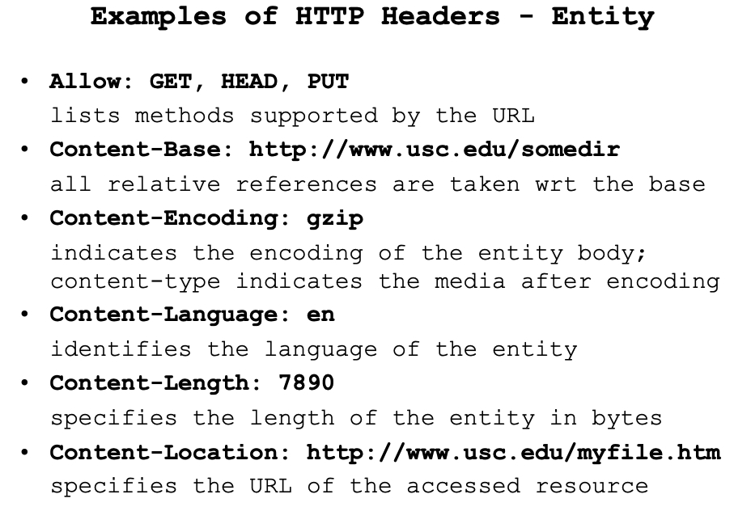
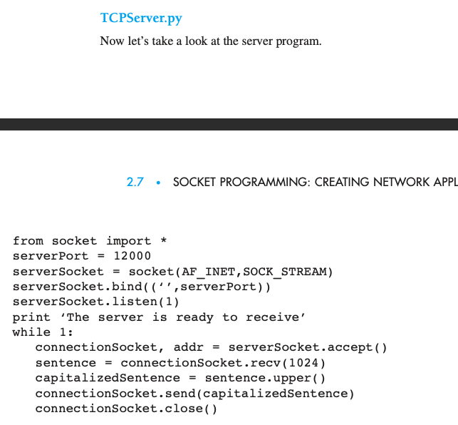

>[数据库隔离级别](#1--数据库隔离级别以及可能出现的问题),

>[输入url发生的事情](#2--输入url发生的事情),

>[http有哪些header](#3--http有哪些header),

>[http状态码](#4--http状态码),

>[TCP三次握手，四次挥手](#5--TCP三次握手，四次挥手),

>[TCP建立连接时socket相关函数](#6--TCP建立连接时socket相关函数),

>[TCP流量控制、拥塞控制](#7--TCP流量控制、拥塞控制),

>[滑动窗口](#8--滑动窗口),

>[进程和线程区别](#9--进程和线程区别),

>[进程控制块PCB](#10--进程控制块PCB)

>[进程间通信](#11--进程间通信)

>[进程有哪些状态，状态切换](#12--进程有哪些状态，状态切换)

>[堆和栈](#13--堆和栈)

>[了解arp吗](#14--了解arp吗)

>[HTTP与HTTPS的区别](#15--HTTP与HTTPS的区别)

>[TCP是怎么保证可靠传输的](#16--TCP是怎么保证可靠传输的)

>[TCP流量控制、拥塞控制](#17--TCP流量控制、拥塞控制)

>[分布式消息队列：如何保证消息的可靠性传输](#分布式消息队列：如何保证消息的可靠性传输)

>[redis为什么快？](#redis为什么快？)

## 1--数据库隔离级别以及可能出现的问题
数据库事务的隔离级别有4个，由低到高依次为Read uncommitted 、Read committed 、Repeatable read 、Serializable

### Read uncommitted 读未提交
当隔离级别设置为Read uncommitted 时，就可能出现脏读
例子：两个并发的事务，“事务A：领导给singo发工资”、“事务B：singo查询工资账户”，事务B读取了事务A尚未提交的数据
dirty read 脏读: 读到未提交更新的数据

### Read committed 读提交
当隔离级别设置为Read committed 时，避免了脏读，但是可能会造成不可重复读和幻读。一个事务在执行过程中可以看到其他事务已经提交的新插入的记录，而且还能看到其他事务已经提交的对已有记录的更新。
例子：两个并发的事务，“事务A：singo消费”、“事务B：singo的老婆网上转账”，事务A事先读取了数据，事务B紧接了更新了数据，并提交了事务，而事务A再次读取该数据时，数据已经发生了改变。
Nonrepeatable read 不可重复读: 读到已经提交更新的数据，但一个事务范围内两个相同的查询却返回了不同数据。这是由于查询时系统中其他事务修改的提交而引起的。比如事务T1读取某一数据，事务T2读取并修改了该数据，T1为了对读取值进行检验而再次读取该数据，便得到了不同的结果。

### Repeatable read 可重复读
当隔离级别设置为Repeatable read 时，可以避免不可重复读, 但还有可能出现幻读。一个事务在执行过程中可以看到其他事务已经提交的新插入的记录，但是不能看到其他事务对已有记录的更新。这种隔离级别使用共享锁来确保其他事务在原始查询读取行之后不会更新该行。但是，将读取新行（幻读），因为在第一个查询运行时这些行不存在。
Phantom read 幻读: 读到已提交插入数据，幻读是指当事务不是独立执行时发生的一种现象，例如第一个事务对一个表中的数据进行了修改，比如这种修改涉及到表中的“全部数据行”。同时，第二个事务也修改这个表中的数据，这种修改是向表中插入“一行新数据”。那么，以后就会发生操作第一个事务的用户发现表中还有没有修改的数据行，就好象发生了幻觉一样。
不可重复读和幻读的区别：幻读与不可重复读类似，幻读是查询到了另一个事务已提交的新插入数据，而不可重复读是查询到了另一个事务已提交的更新数据。简单来说，不可重复读是由于数据修改引起的，幻读是由数据插入引起的。

### Serializable 可串行化
Serializable 是最高的事务隔离级别，同时代价也花费最高，性能很低，一般很少使用，在该级别下，事务顺序执行，不仅可以避免脏读、不可重复读，还避免了幻读。一个事务在执行过程中完全看不到其他事务对数据库所做的更新。当两个事务同时操作数据库中相同数据时，如果第一个事务已经在访问该数据，第二个事务只能停下来等待，必须等到第一个事务结束后才能恢复运行。

## 2--输入url发生的事情
- URL输入: 当我们开始在浏览器中输入网址的时候，浏览器其实就已经在智能的匹配可能得 url 了，他会从历史记录，书签等地方，找到已经输入的字符串可能对应的 url, 浏览器解析出url中的域名。
- DNS解析: DNS解析的过程就是寻找哪台机器上有你需要资源的过程。（注：DNS是（1）在DNS服务器的层次结构中实现的分布式数据库，以及（2）是允许主机查询分布式数据库的应用程序层协议。(3) DNS协议通过UDP运行并使用端口53。）首先，浏览器缓存 ：首先会向浏览器的缓存中读取上一次访问的记录, 查询浏览器的DNS缓存。然后所需的IP地址通常存储在“附近”的DNS服务器中，这有助于减少DNS网络流量以及平均DNS延迟。一般本地 DNS 地址由 ISP（Internet Service Provider，互联网服务提供商）通过 DHCP 协议动态分配。每个ISP（例如大学，学术部门，员工公司或住宅ISP）都具有本地DNS服务器（也称为默认名称服务器）。 当主机连接到ISP时，ISP为主机提供一个或多个本地DNS服务器的IP地址（通常通过DHCP）。 您可以通过访问Windows或UNIX中的网络状态窗口轻松地确定本地DNS服务器的IP地址。 主机的本地DNS服务器通常“靠近”主机。 对于机构ISP，本地DNS服务器可能与主机在同一LAN上； 对于住宅ISP，它通常与主机之间的间隔不超过几个路由器。 主机进行DNS查询时，查询将发送到充当代理的本地DNS服务器，将查询转发到DNS服务器层次结构中。浏览器向本地 DNS 服务器发起请求，由于本地 DNS 服务器没有缓存不能直接将域名转换为 IP 地址，需要采用递归或者迭代查询的方式依次向根域名服务器(Root DNS servers)、顶级域名服务器(Top-level domain (TLD) servers)、权威域名服务器(Authoritative DNS servers)发起查询请求，直至找到一个或一组 IP 地址，返回给浏览器。在查询链中，当DNS服务器收到DNS答复（例如，包含从主机名到IP地址的映射）时，它可以将映射缓存在其本地内存中。

图2.21所示的示例同时使用了递归查询和迭代查询。 从cis.poly.edu发送到dns.poly.edu的查询是递归查询，因为该查询要求dns.poly.edu代表它获取映射。 但是随后的三个查询是迭代的，因为所有答复都直接返回到dns.poly.edu。 从理论上讲，任何DNS查询都可以是迭代的或递归的。 例如，图2.22显示了所有查询都是递归的DNS查询链。 在实践中，查询通常遵循图2.21中的模式：从请求主机到本地DNS服务器的查询是递归的，其余查询是迭代的。
（注：DNS负载均衡：当一个网站有足够多的用户的时候，假如每次请求的资源都位于同一台机器上面，那么这台机器随时可能会蹦掉。处理办法就是用DNS负载均衡技术，它的原理是在DNS服务器中为同一个主机名配置多个IP地址,在应答DNS查询时,DNS服务器对每个查询将以DNS文件中主机记录的IP地址按顺序返回不同的解析结果,将客户端的访问引导到不同的机器上去,使得不同的客户端访问不同的服务器,从而达到负载均衡的目的｡例如可以根据每台机器的负载量，该机器离用户地理位置的距离等等。）
- 建立TCP连接：
TCP（Transmission Control Protocol 传输控制协议）是一种面向连接的、可靠的、基于字节流的传输层通信协议。TCP建立连接需要三次握手，释放连接需要四次握手。
拿到域名对应的IP地址之后，浏览器会以一个随机端口（1024<端口<65535）向服务器的WEB程序（常用的有httpd,nginx等）80端口发起TCP的连接请求。这个连接请求到达服务器端后（这中间通过各种路由设备，局域网内除外），进入到网卡，然后是进入到内核的TCP/IP协议栈（用于识别该连接请求，解封包，一层一层的剥开），还有可能要经过Netfilter防火墙（属于内核的模块）的过滤，最终到达WEB程序，最终建立了TCP/IP的连接。tcp建立的三次握手:

- 发送HTTP请求：
建立了TCP连接之后，发起一个http请求。一个典型的 http request header 一般需要包括请求的方法，例如 GET 或者 POST 等，不常用的还有 PUT 和 DELETE 、HEAD、OPTION以及 TRACE 方法，一般的浏览器只能发起 GET 或者 POST 请求。
- HTTP 响应：
服务器收到了我们的请求，也处理我们的请求，到这一步，它会把它的处理结果返回，也就是返回一个HTPP响应。 HTTP响应与HTTP请求相似，HTTP响应也由3个部分构成，分别是：状态行，响应头(Response Header)，空行，响应正文
- 浏览器显示 HTML：
构建dom树 -> 构建render树 -> 布局render树 -> 绘制render树
- 连接结束：
这个关闭的过程就是著名的四次挥手。关闭是一个全双工的过程，发包的顺序的不一定的。一般来说是客户端主动发起的关闭，过程如下：

## 3--http有哪些header

General headers: 同时适用于请求和响应消息，但与最终消息主体中传输的数据无关的消息头。
    最常见的通用首部包括：Date、Cache-Control 或 Connection。

Request headers: 包含更多有关要获取的资源或客户端本身信息的消息头。
    请求头是 HTTP 头的一种，它可在 HTTP 请求中使用，并且和请求主体无关 。某些请求头如 Accept、Accept-*、 If-* 允许执行条件请求。某些请求头如：Cookie, User-Agent 和 Referer 描述了请求本身以确保服务端能返回正确的响应。

Response headers: 包含有关响应的补充信息，如其位置或服务器本身（名称和版本等）的消息头。
    响应头（Response header） 可以定义为：被用于http响应中并且和响应消息主体无关的那一类 HTTP header。像Age, Location 和 Server都属于响应头，他们被用于描述响应。

Entity headers: 包含有关实体主体的更多信息，比如主体长(Content-Length)度或其MIME类型。
    实体报头HTTP header用来描述消息体内容。实体报头既可用于请求也可用于响应中。如Content-Length，Content-Language，Content-Encoding之类的报头都是实体报头。
    
    
    
    
## 4--http状态码

    
    
    
    
    
    
## 5--TCP三次握手，四次挥手
参考[2--输入url发生的事情](#2--输入url发生的事情)
## 6--TCP建立连接时socket相关函数

## 7--TCP流量控制、拥塞控制
## 8--滑动窗口
## 9--进程和线程区别
进程是运行中的程序，线程是进程的内部的一个执行序列
进程是资源分配的单元，线程是执行行单元
进程间切换代价大，线程间切换代价小
进程拥有资源多，线程拥有资源少
多个线程共享进程的资源

进程和线程的主要差别在于它们是不同的操作系统资源管理方式。进程有独立的地址空间，一个进程崩溃后，在保护模式下不会对其它进程产生影响，而线程只是一个进程中的不同执行路径。线程有自己的堆栈和局部变量，但线程之间没有单独的地址空间，一个线程死掉就等于整个进程死掉，所以多进程的程序要比多线程的程序健壮，但在进程切换时，耗费资源较大，效率要差一些。但对于一些要求同时进行并且又要共享某些变量的并发操作，只能用线程，不能用进程。

1) 简而言之,一个程序至少有一个进程,一个进程至少有一个线程.
2) 线程的划分尺度小于进程，使得多线程程序的并发性高。
3) 另外，进程在执行过程中拥有独立的内存单元，而多个线程共享内存，从而极大地提高了程序的运行效率。
4) 线程在执行过程中与进程还是有区别的。每个独立的线程有一个程序运行的入口、顺序执行序列和程序的出口。但是线程不能够独立执行，必须依存在应用程序中，由应用程序提供多个线程执行控制。
5) 从逻辑角度来看，多线程的意义在于一个应用程序中，有多个执行部分可以同时执行。但操作系统并没有将多个线程看做多个独立的应用，来实现进程的调度和管理以及资源分配。这就是进程和线程的重要区别。

## 10--进程控制块PCB
PCB(process control block)，进程控制块，是我们学习操作系统后遇到的第一个数据结构描述，它是对系统的进程进行管理的重要依据，和进程管理相关的操作无一不用到PCB中的内容。一般情况下，PCB中包含以下内容：
（1）进程标识符（内部，外部）
（2）处理机的信息（通用寄存器，指令计数器，PSW，用户的栈指针）。
（3）进程调度信息（进程状态，进程的优先级，进程调度所需的其它信息，事件）
（4）进程控制信息（程序的数据的地址，资源清单，进程同步和通信机制，链接指针）
为了表示一个流程，我们需要一个数据结构，我们将其简称为流程控制块（PCB）。 它包含或引用上面提到的所有每个进程信息，包括地址空间及其线程。 线程还需要一个表示，我们称它为线程控制块（TCB）。 它包含或引用特定于线程的上下文，例如线程的堆栈和重要寄存器的副本（例如，堆栈指针）

## 11--进程间通信
1. 管道(pipe)
基于文件概念的有趣构造是管道。管道是一种使进程直接将数据发送到另一进程的方法，就好像它正在写入文件一样（见图1.11）。发送数据的过程的行为就好像它具有已为写入而打开的文件的文件描述符一样。接收数据的过程的行为就好像它具有一个文件描述符一样，该描述符引用了已打开以供读取的文件。
使用管道系统调用来建立管道和引用该管道的两个文件描述符。这会在内核中创建一个管道对象，并通过输出参数返回引用该对象的两个文件描述程序：一个，设置为只写，引用输入侧，另一个，设置为只读，指输出端。由于此管道对象的行为虽然有点像文件，但没有名称，所以任何进程引用它的唯一方法就是通过这两个文件描述符。因此，只有创建它的进程及其后代（继承文件描述符）才能引用管道。

（1） 管道（pipe）：管道是一种半双工的通信方式，数据只能单向流动，而且只能在具有血缘关系的进程间使用。进程的血缘关系通常指父子进程关系。

（2）有名管道（named pipe）：有名管道也是半双工的通信方式，但是它允许无亲缘关系进程间通信。

（3）信号量（semophore）：信号量是一个计数器，可以用来控制多个进程对共享资源的访问。它通常作为一种锁机制，防止某进程正在访问共享资源时，其他进程也访问该资源。因此，主要作为进程间以及同一进程内不同线程之间的同步手段。

（4）消息队列（message queue）：消息队列是由消息组成的链表，存放在内核中 并由消息队列标识符标识。消息队列克服了信号传递信息少，管道只能承载无格式字节流以及缓冲区大小受限等缺点。

（5）信号（signal）：信号是一种比较复杂的通信方式，用于通知接收进程某一事件已经发生。

（6）共享内存（shared memory）：共享内存就是映射一段能被其他进程所访问的内存，这段共享内存由一个进程创建，但多个进程都可以访问，共享内存是最快的IPC方式，它是针对其他进程间的通信方式运行效率低而专门设计的。它往往与其他通信机制，如信号量配合使用，来实现进程间的同步和通信。

（7）套接字（socket）：套接口也是一种进程间的通信机制，与其他通信机制不同的是它可以用于不同及其间的进程通信。

## 12--进程有哪些状态，状态切换
1.进程的三种基本状态
进程在运行中不断地改变其运行状态。通常，一个运行进程必须具有以下三种基本状态。
就绪(Ready)状态
当进程已分配到除CPU以外的所有必要的资源，只要获得处理机便可立即执行，这时的进程状态称为就绪状态。

执行（Running）状态
当进程已获得处理机，其程序正在处理机上执行，此时的进程状态称为执行状态。

阻塞(Blocked)状态
正在执行的进程，由于等待某个事件发生而无法执行时，便放弃处理机而处于阻塞状态。引起进程阻塞的事件可有多种，例如，等待I/O完成、申请缓冲区不能满足、等待信件(信号)等。

1）就绪——执行：对就绪状态的进程，当进程调度程序按一种选定的策略从中选中一个就绪进程，为之分配了处理机后，该进程便由就绪状态变为执行状态；

2）执行——阻塞：正在执行的进程因发生某等待事件而无法执行，则进程由执行状态变为阻塞状态，如进程提出输入/输出请求而变成等待外部设备传输信息的状态，进程申请资源（主存空间或外部设备）得不到满足时变成等待资源状态，进程运行中出现了故障（程序出错或主存储器读写错等）变成等待干预状态等等； 

3）阻塞——就绪：处于阻塞状态的进程，在其等待的事件已经发生，如输入/输出完成，资源得到满足或错误处理完毕时，处于等待状态的进程并不马上转入执行状态，而是先转入就绪状态，然后再由系统进程调度程序在适当的时候将该进程转为执行状态；

4）执行——就绪：正在执行的进程，因时间片用完而被暂停执行，或在采用抢先式优先级调度算法的系统中,当有更高优先级的进程要运行而被迫让出处理机时，该进程便由执行状态转变为就绪状态。

## 13--堆和栈
1、栈区（stack）—   由编译器自动分配释放   ，存放函数的参数值，局部变量的值等。其 
  操作方式类似于数据结构中的栈。

2、堆区（heap）   —   一般由程序员分配释放，   若程序员不释放，程序结束时可能由OS回 
  收   。注意它与数据结构中的堆是两回事，分配方式倒是类似于链表，呵呵。 

3、全局区（静态区）（static）—，全局变量和静态变量的存储是放在一块的，初始化的 
  全局变量和静态变量在一块区域，   未初始化的全局变量和未初始化的静态变量在相邻的另 
  一块区域。   -   程序结束后由系统释放。 

4、文字常量区   —常量字符串就是放在这里的。   程序结束后由系统释放 

5、程序代码区—存放函数体的二进制代码。

## 14--了解arp吗

## 15--HTTP 与 HTTPS 的区别
HTTP协议传输的数据都是未加密的，也就是明文的，因此使用HTTP协议传输隐私信息非常不安全，为了保证这些隐私数据能加密传输，于是网景公司设计了SSL（Secure Sockets Layer）协议用于对HTTP协议传输的数据进行加密，从而就诞生了HTTPS。

简单来说，HTTPS协议是由SSL+HTTP协议构建的可进行加密传输、身份认证的网络协议，要比http协议安全。

HTTPS和HTTP的区别主要如下：

1、https协议需要到ca申请证书，一般免费证书较少，因而需要一定费用。

2、http是超文本传输协议，信息是明文传输，https则是具有安全性的ssl加密传输协议。

3、http和https使用的是完全不同的连接方式，用的端口也不一样，前者是80，后者是443。

4、http的连接很简单，是无状态的；HTTPS协议是由SSL+HTTP协议构建的可进行加密传输、身份认证的网络协议，比http协议安全。

HTTP 明文传输，数据都是未加密的，安全性较差，HTTPS（SSL+HTTP） 数据传输过程是加密的，安全性较好。

使用 HTTPS 协议需要到 CA（Certificate Authority，数字证书认证机构） 申请证书，一般免费证书较少，因而需要一定费用。证书颁发机构如：Symantec、Comodo、GoDaddy 和 GlobalSign 等。

HTTP 页面响应速度比 HTTPS 快，主要是因为 HTTP 使用 TCP 三次握手建立连接，客户端和服务器需要交换 3 个包，而 HTTPS除了 TCP 的三个包，还要加上 ssl 握手需要的 9 个包，所以一共是 12 个包。

http 和 https 使用的是完全不同的连接方式，用的端口也不一样，前者是 80，后者是 443。

HTTPS 其实就是建构在 SSL/TLS 之上的 HTTP 协议，所以，要比较 HTTPS 比 HTTP 要更耗费服务器资源。

## 16--TCP是怎么保证可靠传输的
三次握手，保证两端建立连接。

应用数据被分割成TCP认为最适合发送的数据块。即将数据截断为合理的长度。

TCP发送一个数据段，启动一个定时器，等待目的端确认收到这个报文段。如果不能及时收到一个确认，将重发这个报文段。

TCP收到发自TCP连接另一端的数据，它将发送一个确认。这个确认不是立即发送，通常将推迟几分之一秒。（要对包做完整校验）。

TCP将保持它首部和数据的检验和。这是一个端到端的检验和。目的是检测数据在传输过程中的任何变化。如果收到的段的检验和有差错，TCP将丢弃这个报文段和不确认收到此报文段。（不给出响应，超时重传）

既然TCP报文段作为IP数据报来传输，而IP数据报的到达可能会失序，因此TCP报文段到达了也可能会失序。如果必要，TCP将对收到的数据进行重新排序。

IP数据报会发生重复，TCP接收端必须丢弃重复的数据。

TCP还能提供流量控制。TCP连接的每一方都有固定的缓冲空间。TCP接收端只允许另一端发送接收端缓冲区所能接纳的数据。这将防止较快主机发送数据到较慢主机不会发生缓冲区溢出。

TCP还能提供拥塞控制。当网络拥塞时，减少数据的发送。

1、确认和重传：接收方收到报文就会确认，发送方发送一段时间后没有收到确认就会重传。

2、数据校验：TCP报文头有校验和，用于校验报文是否损坏

3、数据合理分片和排序：

tcp会按MSS合理分片，接收方会缓存未按序到达的数据，重新排序后交给应用层。

4、流量控制：当接收方来不及处理发送方的数据，能通过滑动窗口，提示发送方降低发送的速率，防止包丢失。

5、拥塞控制：当网络拥塞时，通过拥塞窗口，减少数据的发送，防止包丢失。

## 17--TCP流量控制、拥塞控制
流量控制: 
如果发送者发送数据过快，接收者来不及接收，那么就会有分组丢失。为了避免分组丢失，控制发送者的发送速度，使得接收者来得及接收，这就是流量控制。流量控制根本目的是防止分组丢失，它是构成TCP可靠性的一方面。

如何实现流量控制？

由滑动窗口协议（连续ARQ协议）实现。滑动窗口协议既保证了分组无差错、有序接收，也实现了流量控制。主要的方式就是接收方返回的 ACK 中会包含自己的接收窗口的大小，并且利用大小来控制发送方的数据发送。

如果发送方把数据发送得过快，接收方可能会来不及接收，这就会造成数据的丢失。所谓流量控制就是让发送方的发送速率不要太快，要让接收方来得及接收

拥塞控制：拥塞控制是作用于网络的，它是防止过多的数据注入到网络中，避免出现网络负载过大的情况；常用的方法就是：（ 1 ）慢开始、拥塞避免（ 2 ）快重传、快恢复。

流量控制：流量控制是作用于接收者的，它是控制发送者的发送速度从而使接收者来得及接收，防止分组丢失的。

TCP的拥塞控制:

发送方维持一个叫做拥塞窗口cwnd（congestion window）的状态变量。拥塞窗口的大小取决于网络的拥塞程度，并且动态地在变化。发送方让自己的发送窗口等于拥塞窗口，另外考虑到接受方的接收能力，发送窗口可能小于拥塞窗口。

慢开始算法的思路就是，不要一开始就发送大量的数据，先探测一下网络的拥塞程度，也就是说由小到大逐渐增加拥塞窗口的大小。

一个传输轮次所经历的时间其实就是往返时间RTT，而且没经过一个传输轮次（transmission round），拥塞窗口cwnd就加倍。

为了防止cwnd增长过大引起网络拥塞，还需设置一个慢开始门限ssthresh状态变量。ssthresh的用法如下：当cwnd<ssthresh时，使用慢开始算法。
当cwnd>ssthresh时，改用拥塞避免算法。
当cwnd=ssthresh时，慢开始与拥塞避免算法任意

拥塞避免算法：让拥塞窗口cwnd缓慢地增大，即每经过一个往返时间RTT就把发送方的拥塞窗口cwnd加1，而不是加倍。这样拥塞窗口cwnd按线性规律缓慢增长，比慢开始算法的拥塞窗口增长速率缓慢得多。无论在慢开始阶段还是在拥塞避免阶段，只要发送方判断网络出现拥塞（其根据就是没有收到确认），就要把慢开始门限ssthresh设置为出现拥塞时的发送方窗口值的一半（但不能小于2）。然后把拥塞窗口cwnd重新设置为1，执行慢开始算法。这样做的目的就是要迅速减少主机发送到网络中的分组数，使得发生拥塞的路由器有足够时间把队列中积压的分组处理完毕。

（三）快重传算法：

快重传要求接收方在收到一个失序的报文段后就立即发出重复确认（为的是使发送方及早知道有报文段没有到达对方，可提高网络吞吐量约20%）而不要等到自己发送数据时捎带确认。快重传算法规定，发送方只要一连收到三个重复确认就应当立即重传对方尚未收到的报文段，而不必继续等待设置的重传计时器时间到期。

（四）快恢复算法：

快重传配合使用的还有快恢复算法，有以下两个要点：

当发送方连续收到三个重复确认时，就执行“乘法减小”算法，把ssthresh门限减半（为了预防网络发生拥塞）。但是接下去并不执行慢开始算法
考虑到如果网络出现拥塞的话就不会收到好几个重复的确认，所以发送方现在认为网络可能没有出现拥塞。所以此时不执行慢开始算法，而是将cwnd设置为ssthresh减半后的值，然后执行拥塞避免算法，使cwnd缓慢增大。

## 18--算法题
算法题:
小红吃n天汉堡，要求每天吃的汉堡数目不一样，而且要尽可能多吃，且尽可能少吃牛肉汉堡。每天鸡肉汉堡供应数目a[i]，牛肉汉堡供应数目b[i]。求至少要吃多少牛肉汉堡？

[链接](https://www.nowcoder.com/questionTerminal/09a480cee1364e4180fa304d2b9c78c7)

## 分布式消息队列：如何保证消息的可靠性传输

---
## redis为什么快？
Redis嘛，就是一种运行速度很快，并发很强的跑在内存上的NoSql数据库，支持键到五种数据类型的映射。
首先，采用了多路复用io阻塞机制
然后，数据结构简单，操作节省时间
最后，运行在内存中，自然速度快

---
## Redis为什么是单线程的？
因为Redis的瓶颈不是cpu的运行速度，而往往是网络带宽和机器的内存大小。再说了，单线程切换开销小，容易实现既然单线程容易实现，而且CPU不会成为瓶颈，那就顺理成章地采用单线程的方案了。