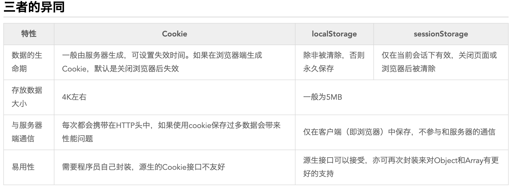

[前端复习1](https://www.nowcoder.com/discuss/432898?type=all&order=time&pos=&page=0&channel=1009&source_id=search_all)

[前端复习2](https://www.nowcoder.com/discuss/272253?type=post&order=time&pos=&page=0&channel=1009&source_id=search_post)
## 目录
- [进程和线程的区别](#进程和线程的区别)
- [tcp与udp](#tcp与udp)
- [http请求的幂等概念的理解以及常见请求的幂等性](#http请求的幂等概念的理解以及常见请求的幂等性)
- [跨域问题的解决方案](#跨域问题的解决方案)
- [options预请求](#options预请求)
- [跨域的同时携带cookie](#跨域的同时携带cookie)
- [多行超出显示省略号](#多行超出显示省略号)
- [多页面之间的通信](#多页面之间的通信)
- [Cookie,LocalStorage与SessionStorage](#Cookie,LocalStorage与SessionStorage)
- [call/apply/bind的区别](#call/apply/bind的区别)
## 进程和线程的区别
```
Ⅰ 拥有资源

进程是资源分配的基本单位，但是线程不拥有资源，线程可以访问隶属进程的资源。

Ⅱ 调度

线程是独立调度的基本单位，在同一进程中，线程的切换不会引起进程切换，从一个进程中的线程切换到另一个进程中的线程时，会引起进程切换。

Ⅲ 系统开销

由于创建或撤销进程时，系统都要为之分配或回收资源，如内存空间、I/O 设备等，所付出的开销远大于创建或撤销线程时的开销。类似地，在进行进程切换时，涉及当前执行进程 CPU 环境的保存及新调度进程 CPU 环境的设置，而线程切换时只需保存和设置少量寄存器内容，开销很小。

Ⅳ 通信方面

线程间可以通过直接读写同一进程中的数据进行通信，但是进程通信需要借助 IPC。
```
[回到顶部](#目录)
## tcp与udp
```
用户数据报协议 UDP（User Datagram Protocol）是无连接的，尽最大可能交付，没有拥塞控制，面向报文（对于应用程序传下来的报文不合并也不拆分，只是添加 UDP 首部），支持一对一、一对多、多对一和多对多的交互通信。

传输控制协议 TCP（Transmission Control Protocol）是面向连接的，提供可靠交付，有流量控制，拥塞控制，提供全双工通信，面向字节流（把应用层传下来的报文看成字节流，把字节流组织成大小不等的数据块），每一条 TCP 连接只能是点对点的（一对一）。
```
[回到顶部](#目录)
## http请求的幂等概念的理解以及常见请求的幂等性
```
一个HTTP方法是幂等的，指的是同样的请求被执行一次与连续执行多次的效果是一样的，服务器的状态也是一样的。换句话说就是，幂等方法不应该具有副作用（统计用途除外）。在正确实现的条件下，GET，HEAD，PUT和DELETE 等方法都是幂等的，而 POST 方法不是。所有的 safe 方法也都是幂等的。

* safe: 如果HTTP方法不更改服务器的状态，则它是安全的。 换句话说，如果方法导致只读操作，则它是安全的。 几种常见的HTTP方法是安全的：GET，HEAD或OPTIONS。

幂等性只与后端服务器的实际状态有关，而每一次请求接收到的状态码不一定相同。例如，第一次调用DELETE 方法有可能返回 200，但是后续的请求可能会返回404。DELETE 的言外之意是，开发者不应该使用DELETE方法实现具有删除最后条目功能的 RESTful API。

GET /pageX HTTP/1.1是幂等的。连续调用多次，客户端接收到的结果都是一样的
POST /add_row HTTP/1.1不是幂等的。如果调用多次，就会增加多行记录. 两次相同的POST请求会在服务器端创建两份资源，它们具有不同的URI；所以，POST方法不具备幂等性
对同一URI进行多次PUT的副作用和一次PUT是相同的；因此，PUT方法具有幂等性。
DELETE /idX/delete HTTP/1.1是幂等的，即便是不同请求之间接收到的状态码不一样，调用一次和N次对系统产生的副作用是相同的, DELETE方法用于删除资源，有副作用，但它应该满足幂等性。比如：DELETE http://www.forum.com/article/4231，调用一次和N次对系统产生的副作用是相同的，即删掉id为4231的帖子
```
[回到顶部](#目录)
## 跨域问题的解决方案
```
跨域是指一个域下的文档或脚本试图去请求另一个域下的资源，这里跨域是广义的。

跨域资源共享(CORS) 是一种机制，它使用额外的 HTTP 头来告诉浏览器 让运行在一个 origin (domain) 上的 Web 应用被准许访问来自不同源服务器上的指定的资源。

什么是同源策略？
同源策略/SOP（Same origin policy）是一种约定，由Netscape公司1995年引入浏览器，它是浏览器最核心也最基本的安全功能，如果缺少了同源策略，浏览器很容易受到XSS、CSFR等攻击。所谓同源是指"协议+域名+端口"三者相同，即便两个不同的域名指向同一个ip地址，也非同源。

解决方案：
1、 通过jsonp跨域
JSONP是一种发送JSON数据而无需担心跨域问题的方法。
由于跨域策略，从另一个域请求文件可能会导致问题。
JSONP不使用XMLHttpRequest对象。
JSONP使用<script>代替。
从另一个域请求外部脚本不会出现此问题。
JSONP利用了这一优势，并使用script标签而不是XMLHttpRequest对象来请求文件。
服务器上的文件将结果包装在一个函数调用中：
结果以JSON数据为参数返回对名为“ myFunc”的函数的调用。
确保该函数在客户端上存在。
jsonp的原理就是利用<script>标签没有跨域限制，通过<script>标签src属性，发送带有callback参数的GET请求，服务端将接口返回数据拼凑到callback函数中，返回给浏览器，浏览器解析执行，从而前端拿到callback函数返回的数据。
jsonp的缺点：只能发送get一种请求

2、 document.domain + iframe跨域
此方案仅限主域相同，子域不同的跨域应用场景。实现原理：两个页面都通过js强制设置document.domain为基础主域，就实现了同域。

3、 location.hash + iframe
实现原理： a欲与b跨域相互通信，通过中间页c来实现。 三个页面，不同域之间利用iframe的location.hash传值，相同域之间直接js访问来通信。

4、 window.name + iframe跨域
window.name属性的独特之处：name值在不同的页面（甚至不同域名）加载后依旧存在，并且可以支持非常长的 name 值
通过iframe的src属性由外域转向本地域，跨域数据即由iframe的window.name从外域传递到本地域。这个就巧妙地绕过了浏览器的跨域访问限制，但同时它又是安全操作。

5、 postMessage跨域
postMessage是HTML5 XMLHttpRequest Level 2中的API，且是为数不多可以跨域操作的window属性之一，它可用于解决以下方面的问题：
页面和其打开的新窗口的数据传递
多窗口之间消息传递
页面与嵌套的iframe消息传递
上面三个场景的跨域数据传递

6、 跨域资源共享（CORS）
CORS是一个W3C标准，全称是"跨域资源共享"（Cross-origin resource sharing）。
它允许浏览器向跨源服务器，发出XMLHttpRequest请求，从而克服了AJAX只能同源使用的限制。
CORS需要浏览器和服务器同时支持。目前，所有浏览器都支持该功能
跨源资源共享 (CORS) （或通俗地译为跨域资源共享）是一种机制，该机制使用附加的 HTTP 头来告诉浏览器，准许运行在一个源上的Web应用访问位于另一不同源选定的资源。 当一个Web应用发起一个与自身所在源（域，协议和端口）不同的HTTP请求时，它发起的即跨源HTTP请求。
跨源HTTP请求的一个例子：运行在 http://domain-a.com 的JavaScript代码使用XMLHttpRequest来发起一个到 https://domain-b.com/data.json 的请求。
出于安全性，浏览器限制脚本内发起的跨源HTTP请求。 例如，XMLHttpRequest和Fetch API遵循同源策略。 这意味着使用这些API的Web应用程序只能从加载应用程序的同一个域请求HTTP资源，除非响应报文包含了正确CORS响应头。
跨源域资源共享（ CORS ）机制允许 Web 应用服务器进行跨源访问控制，从而使跨源数据传输得以安全进行。现代浏览器支持在 API 容器中（例如 XMLHttpRequest 或 Fetch ）使用 CORS，以降低跨源 HTTP 请求所带来的风险。
跨源资源共享标准新增了一组 HTTP 首部字段，允许服务器声明哪些源站通过浏览器有权限访问哪些资源。另外，规范要求，对那些可能对服务器数据产生副作用的 HTTP 请求方法（特别是 GET 以外的 HTTP 请求，或者搭配某些 MIME 类型的 POST 请求），浏览器必须首先使用 OPTIONS 方法发起一个预检请求（preflight request），从而获知服务端是否允许该跨源请求。服务器确认允许之后，才发起实际的 HTTP 请求。在预检请求的返回中，服务器端也可以通知客户端，是否需要携带身份凭证（包括 Cookies 和 HTTP 认证相关数据）。
CORS 需要服务器设置header ：Access-Control-Allow-Origin
Origin 首部字段表明预检请求或实际请求的源站。
Access-Control-Request-Method 首部字段用于预检请求。其作用是，将实际请求所使用的 HTTP 方法告诉服务器。
Access-Control-Request-Headers 首部字段用于预检请求。其作用是，将实际请求所携带的首部字段告诉服务器。
服务端返回的 Access-Control-Allow-Origin: * 表明，该资源可以被任意外域访问
普通跨域请求：只服务端设置Access-Control-Allow-Origin即可，前端无须设置，若要带cookie请求：前后端都需要设置。

7、 nginx代理跨域
Nginx是一个高性能的HTTP和反向代理服务器，由俄罗斯的伊戈尔·赛索耶夫开发，其特点是占有内存少，并发能力强。
提到Nginx这里就想多讲一下它的负载均衡，Nginx可以将请求转发均匀转发至多台服务器上，通过部署多台相同服务的服务器，可以减轻服务器的压力
反向代理（Reverse Proxy）方式是指以代理服务器来接受Internet上的连接请求，然后将请求转发给内部网络上的服务器，并将从服务器上得到的结果返回给Internet上请求连接的客户端，此时代理服务器对外就表现为一个服务器。
正向代理指的是，一个位于客户端和原始服务器之间的服务器，为了从原始服务器取得内容，客户端向代理发送一个请求并指定目标(原始服务器)，然后代理向原始服务器转交请求并将获得的内容返回给客户端。
Nginx 相当于起了一个跳板机，这个跳板机的域名也是client.com，让客户端首先访问 client.com/api，这当然没有跨域，然后 Nginx 服务器作为反向代理，将请求转发给server.com，当响应返回时又将响应给到客户端，这就完成整个跨域请求的过程。
项目前后端分离后，前后端项目分开开发，尤其是单页面应用，前端代码会开启单独的服务器，若直接在前端项目中访问后端API，肯定会遇到因跨域不能访问的问题。
这时候，用nginx反向代理实现跨域，是最简单的跨域方式。只需要修改nginx的配置即可解决跨域问题，支持所有浏览器，支持session，不需要修改任何代码，并且不会影响服务器性能。
我们只需要配置nginx，在一个服务器上配置多个前缀来转发http/https请求到多个真实的服务器即可。这样，这个服务器上所有url都是相同的域名、协议和端口。

8、 nodejs中间件代理跨域
node中间件实现跨域代理，原理大致与nginx相同，都是通过启一个代理服务器，实现数据的转发，也可以通过设置cookieDomainRewrite参数修改响应头中cookie中域名，实现当前域的cookie写入，方便接口登录认证

9、 WebSocket协议跨域
WebSocket protocol是HTML5一种新的协议。它实现了浏览器与服务器全双工通信，同时允许跨域通讯，是server push技术的一种很好的实现。
原生WebSocket API使用起来不太方便，我们使用Socket.io，它很好地封装了webSocket接口，提供了更简单、灵活的接口，也对不支持webSocket的浏览器提供了向下兼容
```
[回到顶部](#目录)
## options预请求
```
与head类似，是客户端用于查看服务器的性能 。JavaScript的XMLHttpRequest对象进行CORS跨域资源共享时，就是使用OPTIONS方法发送嗅探请求，以判断是否有对指定资源的访问权限
与前述简单请求不同，“需预检的请求”要求必须首先使用 OPTIONS   方法发起一个预检请求到服务器，以获知服务器是否允许该实际请求。"预检请求“的使用，可以避免跨域请求对服务器的用户数据产生未预期的影响。
在 CORS 中，可以使用 OPTIONS 方法发起一个预检请求，以检测实际请求是否可以被服务器所接受。预检请求报文中的 Access-Control-Request-Method 首部字段告知服务器实际请求所使用的 HTTP 方法；Access-Control-Request-Headers 首部字段告知服务器实际请求所携带的自定义首部字段。服务器基于从预检请求获得的信息来判断，是否接受接下来的实际请求。
服务器所返回的 Access-Control-Allow-Methods 首部字段将所有允许的请求方法告知客户端。该首部字段与 Allow 类似，但只能用于涉及到 CORS 的场景中。
```
[回到顶部](#目录)
## 跨域的同时携带cookie
```
假设服务端的域名是a.com，发送跨域请求的前端的域名是b.com，那么在b.com想向a.com发送跨域请求时，是可以携带cookie的，但是这个cookie必须是域名为a.com下的cookie
服务端是无法跨域设置cookie的（set-cookie），只能设置自身域名或者父域名的Cookie
前端是可以带cookie跨域的，前提是cookie是目标服务器所在域的cookie
普通的AJAX请求（非跨域的情况）是默认携带cookie的，但是在跨域时则是不携带cookie的。跨域时携带cookie的方法有三种：

Nginx反向代理
通过Nginx反向代理来解决cookie跨域问题可以携带cookie

JSONP
使用JSONP跨域可以携带cookie，但是只能是GET请求，需要在请求的选项中添加xhrFiles对象

CORS
它允许浏览器向跨源服务器发出XMLHttpRequest请求，解决跨域问题。
CORS请求默认不发送Cookie和HTTP认证信息。如果要把Cookie发到服务器，一方面要服务器同意，指定Access-Control-Allow-Credentials字段
另一方面，开发者必须在AJAX请求中打开withCredentials属性
如果要发送Cookie，Access-Control-Allow-Origin就不能设为星号，必须指定明确的、与请求网页一致的域名
```
[回到顶部](#目录)
## 多行超出显示省略号
```
overflow:hidden; //超出的文本隐藏
text-overflow:ellipsis; //溢出用省略号显示
display:-webkit-box; //将对象作为弹性伸缩盒子模型显示。
-webkit-box-orient:vertical; //从上到下垂直排列子元素（设置伸缩盒子的子元素排列方式）
-webkit-line-clamp:2; //这个属性不是css的规范属性，需要组合上面两个属性，表示显示的行数。
```
[回到顶部](#目录)
## 多页面之间的通信
```
BroadCast Channel
BroadcastChannel 接口代理了一个命名频道，可以让指定 origin 下的任意 browsing context 来订阅它。它允许同源的不同浏览器窗口，Tab页，frame或者 iframe 下的不同文档之间相互通信。通过触发一个 message 事件，消息可以广播到所有监听了该频道的 BroadcastChannel 
各个页面可以通过onmessage来监听被广播的消息
要发送消息时只需要调用实例上的postMessage方法

Service Worker
Service Worker 是一个可以长期运行在后台的 Worker，能够实现与页面的双向通信。多页面共享间的 Service Worker 可以共享，将 Service Worker 作为消息的处理中心（中央站）即可实现广播效果。

LocalStorage 作为前端最常用的本地存储，大家应该已经非常熟悉了；但StorageEvent这个与它相关的事件有些同学可能会比较陌生。
当 LocalStorage 变化时，会触发storage事件。利用这个特性，我们可以在发送消息时，把消息写入到某个 LocalStorage 中；然后在各个页面内，通过监听storage事件即可收到通知。
在各个页面添加如上的代码，即可监听到 LocalStorage 的变化。当某个页面需要发送消息时，只需要使用我们熟悉的setItem方法即可

不论是建立广播频道的 Broadcast Channel，还是使用 Service Worker 的消息中转站，抑或是些 tricky 的storage事件，其都是“广播模式”：一个页面将消息通知给一个“中央站”，再由“中央站”通知给各个页面。

Shared Worker
Shared Worker 是 Worker 家族的另一个成员。普通的 Worker 之间是独立运行、数据互不相通；而多个 Tab 注册的 Shared Worker 则可以实现数据共享。
Shared Worker 在实现跨页面通信时的问题在于，它无法主动通知所有页面，因此，我们会使用轮询的方式，来拉取最新的数据。思路如下：
让 Shared Worker 支持两种消息。一种是 post，Shared Worker 收到后会将该数据保存下来；另一种是 get，Shared Worker 收到该消息后会将保存的数据通过postMessage传给注册它的页面。也就是让页面通过 get 来主动获取（同步）最新消息。页面定时发送 get 指令的消息给 Shared Worker，轮询最新的消息数据，并在页面监听返回信息。当要跨页面通信时，只需给 Shared Worker postMessage即可

IndexedDB
与 Shared Worker 方案类似，消息发送方将消息存至 IndexedDB 中；接收方（例如所有页面）则通过轮询去获取最新的信息

在“广播模式”外，我们又了解了“共享存储+长轮询”这种模式。也许你会认为长轮询没有监听模式优雅，但实际上，有些时候使用“共享存储”的形式时，不一定要搭配长轮询。
例如，在多 Tab 场景下，我们可能会离开 Tab A 到另一个 Tab B 中操作；过了一会我们从 Tab B 切换回 Tab A 时，希望将之前在 Tab B 中的操作的信息同步回来。这时候，其实只用在 Tab A 中监听visibilitychange这样的事件，来做一次信息同步即可。

window.open + window.opener
当我们使用window.open打开页面时，方法会返回一个被打开页面window的引用。而在未显示指定noopener时，被打开的页面可以通过window.opener获取到打开它的页面的引用 —— 通过这种方式我们就将这些页面建立起了联系（一种树形结构）。
首先，我们把window.open打开的页面的window对象收集起来。然后，当我们需要发送消息的时候，作为消息的发起方，一个页面需要同时通知它打开的页面与打开它的页面。这里先用.closed属性过滤掉已经被关闭的 Tab 窗口。这样，作为消息发送方的任务就完成了。一个收到消息的页面就不能那么自私了，除了展示收到的消息，它还需要将消息再传递给它所“知道的人”（打开与被它打开的页面）。每个节点（页面）都肩负起了传递消息的责任，也就是我说的“口口相传”，而消息就在这个树状结构中流转了起来。

通过 WebSocket 这类的“服务器推”技术来进行同步。这好比将我们的“中央站”从前端移到了后端。

我们有两个不同域名的产品线，也希望它们下面的所有页面之间能无障碍地通信。那该怎么办呢？
要实现该功能，可以使用一个用户不可见的 iframe 作为“桥”。由于 iframe 与父页面间可以通过指定origin来忽略同源限制，因此可以在每个页面中嵌入一个 iframe （例如：http://sample.com/bridge.html），而这些 iframe 由于使用的是一个 url，因此属于同源页面，其通信方式可以复用上面第一部分提到的各种方式。页面与 iframe 通信非常简单，首先需要在页面中监听 iframe 发来的消息，做相应的业务处理。然后，当页面要与其他的同源或非同源页面通信时，会先给 iframe 发送消息。iframe 收到消息后，会使用某种跨页面消息通信技术在所有 iframe 间同步消息。其他 iframe 收到通知后，则会将该消息同步给所属的页面

对于同源页面，常见的方式包括：

广播模式：Broadcast Channe / Service Worker / LocalStorage + StorageEvent
共享存储模式：Shared Worker / IndexedDB / cookie
口口相传模式：window.open + window.opener
基于服务端：Websocket / Comet / SSE 等

而对于非同源页面，则可以通过嵌入同源 iframe 作为“桥”，将非同源页面通信转换为同源页面通信。
```
[回到顶部](#目录)
## Cookie,LocalStorage与SessionStorage
```
Cookie
它的大小限制为4KB左右。它的主要用途有保存登录信息，比如你登录某个网站市场可以看到“记住密码”，这通常就是通过在 Cookie 中存入一段辨别用户身份的数据来实现的。解析也相当的复杂，每一次发送请求都会携带上cookie，会造成带宽的浪费，给开发带来诸多不便

localStorage
localStorage 是 HTML5 标准中新加入的技术

sessionStorage
sessionStorage 与 localStorage 的接口类似，但保存数据的生命周期与 localStorage 不同。做过后端开发的同学应该知道 Session 这个词的意思，直译过来是“会话”。而 sessionStorage 是一个前端的概念，它只是可以将一部分数据在当前会话中保存下来，刷新页面数据依旧存在。但当页面关闭后，sessionStorage 中的数据就会被清空。

因为考虑到每个 HTTP 请求都会带着 Cookie 的信息，所以 Cookie 当然是能精简就精简啦，比较常用的一个应用场景就是判断用户是否登录。针对登录过的用户，服务器端会在他登录时往 Cookie 中插入一段加密过的唯一辨识单一用户的辨识码，下次只要读取这个值就可以判断当前用户是否登录啦。曾经还使用 Cookie 来保存用户在电商网站的购物车信息，如今有了 localStorage，似乎在这个方面也可以给 Cookie 放个假了~

另一方面 localStorage 接替了 Cookie 管理购物车的工作，同时也能胜任其他一些工作。比如HTML5游戏通常会产生一些本地数据，localStorage 也是非常适用的。如果遇到一些内容特别多的表单，为了优化用户体验，我们可能要把表单页面拆分成多个子页面，然后按步骤引导用户填写。这时候 sessionStorage 的作用就发挥出来了。

需要注意的是，不是什么数据都适合放在 Cookie、localStorage 和 sessionStorage 中的。使用它们的时候，需要时刻注意是否有代码存在 XSS 注入的风险。因为只要打开控制台，你就随意修改它们的值，也就是说如果你的网站中有 XSS 的风险，它们就能对你的 localStorage 肆意妄为。所以千万不要用它们存储你系统中的敏感数据。


cookie数据始终在同源的http请求中携带（即使不需要），即cookie在浏览器和服务器间来回传递。而sessionStorage和localStorage不会自动把数据发给服务器，仅在本地保存。cookie数据还有路径（path）的概念，可以限制cookie只属于某个路径下。存储大小限制也不同，cookie数据不能超过4k，同时因为每次http请求都会携带cookie，所以cookie只适合保存很小的数据，如会话标识。

sessionStorage和localStorage 虽然也有存储大小的限制，但比cookie大得多，可以达到5M或更大。数据有效期不同，sessionStorage：仅在当前浏览器窗口关闭前有效，自然也就不可能持久保持；localStorage：始终有效，窗口或浏览器关闭也一直保存，因此用作持久数据；cookie只在设置的cookie过期时间之前一直有效，即使窗口或浏览器关闭。作用域不同，sessionStorage不能在不同的浏览器窗口中共享，即使是同一个页面；localStorage 在所有同源窗口中都是共享的；cookie也是在所有同源窗口中都是共享的。

```

[回到顶部](#目录)
## call/apply/bind的区别
```

```
[回到顶部](#目录)